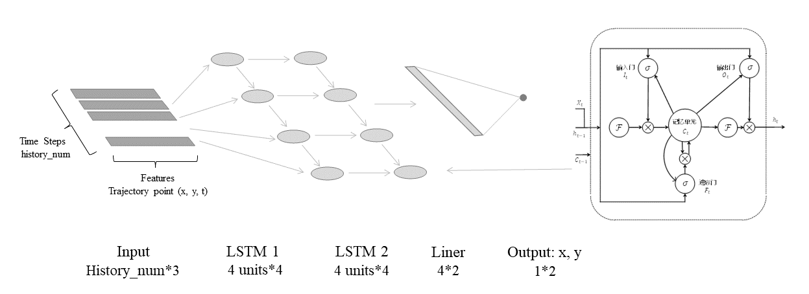
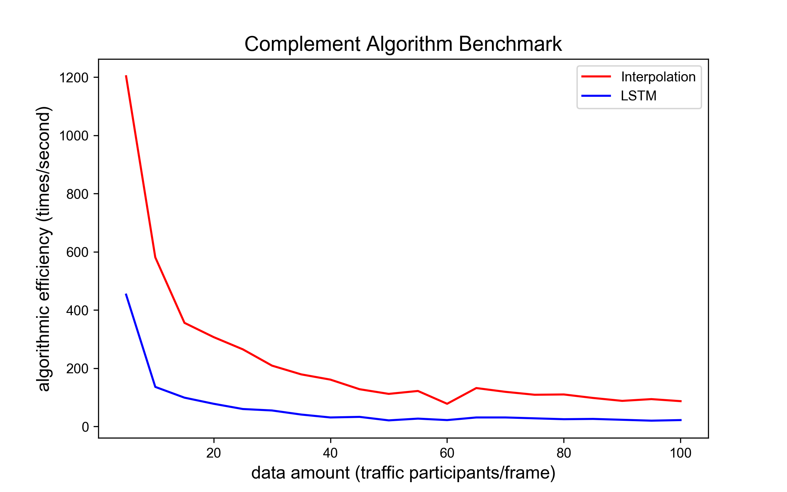
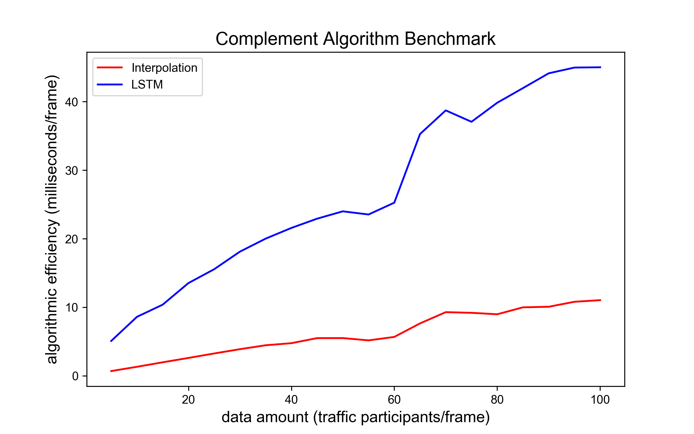

# 在线轨迹补全算法 (Complement)

## 概览

### _目录_

<!-- @import "[TOC]" {cmd="toc" depthFrom=1 depthTo=6 orderedList=false} -->

<!-- code_chunk_output -->

- [在线轨迹补全算法 (Complement)](#在线轨迹补全算法-complement)
  - [概览](#概览)
    - [_目录_](#目录)
    - [难点与挑战](#难点与挑战)
    - [实现概览](#实现概览)
    - [算法BenchMark](#算法benchmark)
  - [在线轨迹补全算法及其对应版本](#在线轨迹补全算法及其对应版本)
    - [继承关系](#继承关系)
    - [调用](#调用)
  - [在线轨迹补全代码流程及框架](#在线轨迹补全代码流程及框架)
  - [相关算法解析](#相关算法解析)
    - [1. 在线轨迹补全算法实现框架: run 函数](#1-在线轨迹补全算法实现框架-run-函数)
    - [2. 寻找需要补全帧的位置: _find_delay_secmark 函数](#2-寻找需要补全帧的位置-_find_delay_secmark-函数)
    - [3. 调用轨迹补全函数: _handle_lstm 函数和
      _handle_interpolation](#3-调用轨迹补全函数-_handle_lstm-函数和-_handle_interpolation)
    - [4. 对轨迹进行插值补全: _complement_obj 函数](#4-对轨迹进行插值补全-_complement_obj-函数)
    - [5. 对轨迹调用 LSTM 补全: _lstm_predict 函数](#5-对轨迹调用-lstm-补全-_lstm_predict-函数)
  - [附录](#附录)
    - [参考文献](#参考文献)
    - [Configuration](#configuration)

<!-- /code_chunk_output -->

### 难点与挑战

不同原因引起的轨迹断续特征各不相同，不同厂商的检测丢失特征也不相同，如何**适配不同厂商的检测精度**同时**实现对高频并发数据的在线处理**是补全算法的难点。

### 实现概览

目前的补全算法以插值补全和拟合补全为主，高度依赖车辆轨迹信息的准确性。在线插值轨迹补全算法通过牺牲 3-5 帧（12-20 ms）的实时性，获取车辆的历史轨迹点，实现对中间缺失值的差值补全。

LSTM模型采用 4 个隐藏层，每个隐藏层含 4 个神经元。训练过程使用数据3万条，覆盖多向车流直行、换道、交织等交通动作。LSTM 训练过程 30 epoches，测试 loss 采用
BCEloss，由 $0.02$ 降至 $5 * 10 ^ {-7}$ 测试实现预测精度较好。LSTM 结构图如图所示。



### 算法BenchMark

测试数据结构：每辆车及其 10 帧历史数据信息

主要影响变量：data amount，每一帧数据包含的车辆数，data amount 由 $1$ 增至 $100$， 插值补全算法 $1$ 秒内运算次数由 $1200$ 降至
$100$，运行单次算法耗时从 $2$ 增至 $10$ 毫秒。LSTM 补全算法 $1$ 秒内运算次数由 $500$ 降至 $80$，运行单次算法耗时从 $5$ 毫秒增至 $45$ 毫秒。
遍历车辆数据的历史数据过程随车辆数增加正比增长，导致运算速率下降。此算法满足在线要求。

 

## 在线轨迹补全算法及其对应版本

### 继承关系

Interpolation 和 LstmPredict 类继承 Base 类，用于防止类未定义调用情况下的报错。

```python
class Base:
    def run(
        self, context_frames: dict, current_frame: dict, last_timestamp: int
    ) -> tuple:
        raise NotImplementedError


class Interpolation(Base):
    ...


class LstmPredict(Base):
    ...
```

### 调用

主要描述在线轨迹补全算法如何创建和调用

① 初始化过程调用初始化函数，创建方式如下

```python
# 创建插值补全车辆轨迹
Inter_C = Interpolation(lag_time, max_speed_motor, max_speed_non_motor, max_speed_pedestrian)

# 创建LSTM补全车辆轨迹
LSTM_C = LstmPredict(model_path, const_stand, history_num, layers, hidden_sz, bidirectional, lag_time, coefficient, max_speed_motor, max_speed_non_motor, max_speed_pedestrian)
```

② 调用过程由run函数执行，调用方式如下

```python
# 调用插值补全车辆轨迹
updated_latest_frame = Inter_C.run(context_frames, current_frame, last_timestamp)

# 调用LSTM补全车辆轨迹
updated_latest_frame = LSTM_C。run(context_frames, current_frame, last_timestamp)
```

## 在线轨迹补全代码流程及框架

**输入**

| 数据类型     | 数据名称           | 数据格式 | 备注      |
| -------- | -------------- | ---- | ------- |
| **外部输入** | context_frames | dict | 历史轨迹信息  |
| **外部输入** | current_frame  | dict | 当前帧轨迹信息 |
| **外部输入** | last_timestamp | int  | 最新一帧时间戳 |

**过程**

- 差值补全算法（Interpolation Complement）

1. 基于当前的 `secMark`，向前推迟 `lag_time`，得到需要补全的 `delay_secMark` 时刻
2. 对于每一辆车，寻找是否具有 `delay_secMark` 刻的轨迹点数据，若缺失则进行补全
3. 通过 `delay_secMark` 前后两帧数据的坐标，进行差值处理
4. 若通过前后两帧坐标计算的速度大于所设阈值，则放弃补全

- AI补全算法（LSTM Complement)

1. 基于当前的 `secMark`，向前推迟 `lag_time`，得到需要补全的 `delay_secMark` 时刻
2. 对于每一辆车，寻找是否具有 `delay_secMark` 刻的轨迹点数据，若缺失则进行补全
3. 通过 `delay_secMark` 前 `history_num` 帧的数据调用 lstm 模型预测
4. 将预测结果作为补全点插入轨迹
5. 检验前后两帧车辆速度，若速度大于所设阈值，则放弃补全

**输出**

| 数据类型   | 数据名称                 | 数据格式 | 备注               |
| ------ | -------------------- | ---- | ---------------- |
| **输出** | updated_latest_frame | dict | 补全更新后的最后一帧车辆轨迹信息 |
| **输出** | last_timestamp       | int  | 更新后的最后一帧时间戳      |

**调控参数**

- 通用调控参数

| 数据类型     | 数据名称                 | 数据格式 | 备注           |
| -------- | -------------------- | ---- | ------------ |
| **调控参数** | lag_time             | int  | 补全滞后时长       |
| **调控参数** | max_speed_motor      | int  | 机动车的允许最大补全速度 |
| **调控参数** | max_speed_non_motor  | int  | 非动车的允许最大补全速度 |
| **调控参数** | max_speed_pedestrian | int  | 行人的允许最大补全速度  |

- LSTM补全调控参数

| 数据类型     | 数据名称          | 数据格式 | 备注                    |
| -------- | ------------- | ---- | --------------------- |
| **调控参数** | model_path    | str  | LSTM补全模型地址            |
| **调控参数** | history_num   | int  | 补全采用历史轨迹点个数，与模型训练保持一致 |
| **调控参数** | layers        | int  | 模型隐藏层层数，与模型训练保持一致     |
| **调控参数** | hidden_sz     | int  | 模型隐藏层特征维度，与模型训练保持一致   |
| **调控参数** | bidirectional | bool | 是否采用双向LSTM，与模型训练保持一致  |

## 相关算法解析

### 1. 在线轨迹补全算法实现框架: run 函数

- 数据预处理合并最新帧轨迹

```python
_, last_timestamp = utils.frames_combination(
    context_frames, current_frame, last_timestamp
)
```

- 处理断裂轨迹并返回

```python
# 处理断裂轨迹
return (
    self._handle_lstm(
        context_frames, self._find_delay_secmark(context_frames)
    ),
    last_timestamp,
)
```

### 2. 寻找需要补全帧的位置: _find_delay_secmark 函数

找到从最后一帧 `timeStamp` 退回延迟帧数 `self._lag_time` 的轨迹点时间戳 `delay_secmark`

```python
def _find_delay_sec_mark(self, frames: dict) -> int:
    # 找到 delay_sec_mark，并更新原 frames的 secmark
    max_sec = 0
    for objs_info in frames.values():
        max_sec_each_id = objs_info[-1]["timeStamp"]
        max_sec = max(max_sec_each_id, max_sec)
    delay_sec_mark = max_sec
    for objs_info in frames.values():
        for fr in objs_info:
            if fr["timeStamp"] > max_sec - self._lag_time:
                delay_sec_mark = min(fr["timeStamp"], delay_sec_mark)
                break
    return delay_sec_mark
```

### 3. 调用轨迹补全函数: _handle_lstm 函数和 _handle_interpolation

列出一条轨迹历史数据里所有的时间戳，找到与待补全时间戳最接近的，若非该轨迹时间戳序列的头尾，则对其调用补全函数。

注：补全函数有 `self._lstm_predict` 或 `self._complement_obj` 两种，其中 `self._lstm_predict` 是 LSTM
补全函数，`self._complement_obj` 是插值补全函数。

```python
def _handle_lstm(self, frames: dict, delay_sec_mark: int) -> dict:
    """pseudocode

    _handle_interpolation get history frame data and delay_secmark
    use for traverse historical data:
        list all sec_Mark numbers in history data
        find the closest frame number to be completed
        if this frame number is not at both ends:
            if this frame meets the completion requirements:
                do lstm completion or interpolation completion
        use for traverse the frame number after the calculation point:
            if the time is exceeded calculate time:
                delete the point that exceeds
        turn time back to secMark
    return frames
    """
    # 判断是否需要做补全，并调相应函数做补全处理
    updated_latest_frame = {}
    for objs_info in frames.values():
        sec_mark_list = [fr["timeStamp"] for fr in objs_info]
        index = self._find_nearest(sec_mark_list, delay_sec_mark)
        if index != 0 and index != len(sec_mark_list) - 1:
            if self._is_frame_valid(objs_info, index, delay_sec_mark):
                self._lstm_predict(objs_info, index, delay_sec_mark)
            for i in range(len(objs_info) - 1, -1, -1):
                if objs_info[i]["timeStamp"] == delay_sec_mark:
                    obj_id = objs_info[i]["global_track_id"]
                    updated_latest_frame[obj_id] = objs_info[i]
    return updated_latest_frame
```

### 4. 对轨迹进行插值补全: _complement_obj 函数

采用插值对断裂片段进行补全，补全差值如下式：

$$x_T=x_{k-1}+(x_{k+1} - x_{k-1})\times\frac{T - t_{k-1}}{t_{k+1}-t_{k-1}}$$

其中 $T$ 为待补全时间戳，即 `delay_sec_mark`，$x_{T}$ 表示补全位置结果，$x_{k-1}$、$x_{k-1}$ 为缺失时间前后帧位置,
$t_{k-1}$、$t_{k-1}$ 为缺失时间前后帧时间戳。

```python
def _complete_obj(
    self, objs_info: list, index: int, delay_sec_mark: int
) -> None:
    # 补全指定的帧号下指定 id的轨迹点
    objs_info.insert(index, objs_info[index].copy())
    for i in ("x", "y"):
        objs_info[index][i] = objs_info[index - 1][i] + (
            objs_info[index + 1][i] - objs_info[index - 1][i]
        ) * (delay_sec_mark - objs_info[index - 1]["timeStamp"]) / (
            objs_info[index + 1]["timeStamp"]
            - objs_info[index - 1]["timeStamp"]
        )
    objs_info[index]["timeStamp"] = delay_sec_mark
    objs_info[index]["secMark"] = delay_sec_mark % utils.MaxSecMark
```

### 5. 对轨迹调用 LSTM 补全: _lstm_predict 函数

采用 lstm 对轨迹段进行补全

- 生成 lstm 输入特征 feature

```python
def _lstm_predict(
    self, objs_info: list, index: int, delay_sec_mark: int
) -> None:
    # 补全指定的帧号下指定 id在idx除轨迹点xy
    objs_info.insert(index, objs_info[index].copy())
    features: Union[Any] = []
    for i in range(self._his_num - 1, -1, -1):
        row = []
        for k in ("x", "y", "timeStamp"):
            row.append(objs_info[index - i][k])
        features.append(row)
    features = np.array(features).astype(np.float64)
    start_time = int(features[0, 2])
    features[:, 2] = (features[:, 2] - start_time) * self.TimeRate
    features[:, 0:2] = features[:, 0:2] / self._const_stand
    features = features.reshape(1, -1)
    test_x = torch.from_numpy(features).type(
        torch.FloatTensor
    )
    ...
```

- 将 feature 送入模型得到预测点

```python
def _lstm_predict(
    self, objs_info: list, index: int, delay_sec_mark: int
) -> None:
    ...
    test_y = self._lstm_model(test_x)
    test_y = test_y.view(-1, self._out_feature).data.numpy()
    predict_pos = test_y[0] * self._const_stand
    objs_info[index]["x"], objs_info[index]["y"] = predict_pos
    objs_info[index]["x"] = float(objs_info[index]["x"])
    objs_info[index]["y"] = float(objs_info[index]["y"])
    objs_info[index]["timeStamp"] = delay_sec_mark
    objs_info[index]["secMark"] = delay_sec_mark % utils.MaxSecMark
```

## 附录

### 参考文献

- 冯汝怡，李志斌，吴启范等.航拍视频车辆检测目标关联与时空轨迹匹配[J]. 2021
- Feng R , Li Z , Fan C . Massive Trajectory Matching and Construction from Aerial Videos based on
  Frame-by-Frame Vehicle Detections[J]. arXiv e-prints, 2022
- Ip A , Irio L , Oliveira R . Vehicle Trajectory Prediction based on LSTM Recurrent Neural
  Networks[C]// 2021 IEEE 93rd Vehicular Technology Conference (VTC2021-Spring). IEEE, 2021.

### Configuration

- model name : Intel Core 6 i7 @ 2.6 GHz （x86_64）
- compiler: Python 3.7.4 [Clang 12.0.0 (clang-1200.0.32.29)] on darwin
