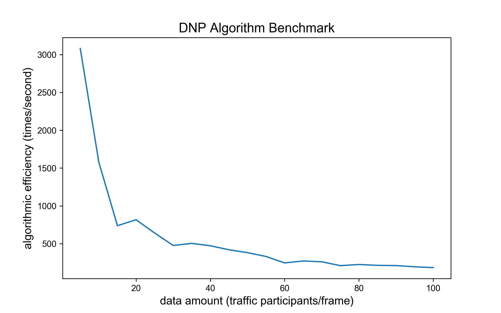
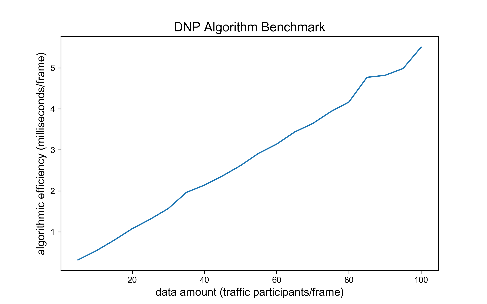

# 逆向超车预警(Do Not Pass Warning)

## 概览

### _目录_

<!-- @import "[TOC]" {cmd="toc" depthFrom=1 depthTo=6 orderedList=false} -->

<!-- code_chunk_output -->

- [逆向超车预警(Do Not Pass Warning)](#逆向超车预警do-not-pass-warning)
  - [概览](#概览)
    - [_目录_](#目录)
    - [难点与挑战](#难点与挑战)
    - [实现概览](#实现概览)
    - [算法 BenchMark](#算法-benchmark)
  - [逆向超车代码及其对应版本](#逆向超车代码及其对应版本)
    - [继承关系](#继承关系)
    - [调用](#调用)
  - [代码流程及框架](#代码流程及框架)
  - [相关算法解析](#相关算法解析)
    - [1. 逆向超车算法实现框架: run 函数](#1-逆向超车算法实现框架-run-函数)
    - [2. 检验逆向超车是否发生: __if_retrograde 函数](#2-检验逆向超车是否发生-__if_retrograde-函数)
    - [3. 对逆向超车车辆计算与目标车道车辆的最小 TTC: __potential_risk
      函数](#3-对逆向超车车辆计算与目标车道车辆的最小-ttc-__potential_risk-函数)
    - [4. 对逆向超车车辆生成诱导建议: __suggests_generation 函数](#4-对逆向超车车辆生成诱导建议-__suggests_generation-函数)
  - [附录](#附录)
    - [参考文献](#参考文献)
    - [Configuration](#configuration)

<!-- /code_chunk_output -->

### 难点与挑战

- 共享请求车辆的重定位：在具有一定通讯延时与处理延时的情况下，算法需通过请求数据，从检测目标中定位请求车辆。
- 在线风险判别：算法需仅根据有限的历史数据，在线研判车辆驾驶风险。

### 实现概览

逆向超车预警流程图待补充

逆向超车概览仅描述算法数据输入、算法处理逻辑、算法输出三步骤，其余将在代码流程中详细讲解。

1. 逆向超车预警指接收 OBU 的逆向超车请求，同时调取当前时刻车辆位置信息。
2. 车辆逆向换道意图将被假设发生，并研判该假设下逆向超车的完成的可行时段内是否存在碰撞风险
3. 若存在碰撞风险则返回预警信息，阻止车辆逆向超车行为

最后，逆向超车算法流程均在 `run` 函数中，之后对算法流程讲解都从 `run` 开始

### 算法 BenchMark

测试数据结构：每辆车及其 10 帧历史数据信息

主要影响变量：data amount，每一帧数据包含的车辆数，data amount 由 $1$ 增至 $100$， 算法 $1$ 秒内运算次数由 $3000$ 降至接近
$100$，运行单次算法耗时由 $0$ 毫秒增至 $6$ 毫秒。 导致耗时增加速率下降，主要由于车辆数增多，遍历对向车道车辆计算运算数指数增长。 此算法满足在线要求。

 

## 逆向超车代码及其对应版本

### 继承关系

Retrograde 类集成 Base 类，用于防止类未定义调用情况下的报错。

```python
lass Base:
    """Super class of DoNotPass class."""

    def run(
        self,
        context_frame: dict = {},
        latest_frame: dict = {},
        msg_VIR: dict = {},
    ) -> tuple:
        """External call function."""
        raise NotImplementedError
class Retrograde(Base)
    ...
```

### 调用

主要描述逆向超车算法如何创建和调用。

① 初始化过程直接采用类默认初始化函数，创建方式如下

```python
DNPW = Retrograde()
```

② 调用过程由 `run` 函数执行，调用方式如下

```python
msg_rsc, show = DNPW.run(his_pkg, curr_pkg, msg_VIR)
```

## 代码流程及框架

**输入**

| 数据类型     | 数据名称     | 数据格式 | 备注                    |
| -------- | -------- | ---- | --------------------- |
| **外部输入** | his_pkg  | AID  | 历史车辆轨迹信息              |
| **外部输入** | curr_pkg | AID  | 历史车辆轨迹信息              |
| **外部输入** | msg_VIR  | dict | 车辆驾驶行为请求标准 msg_VIR 消息 |

```json
msg_VIR : dict
-------
{
"msgCnt": "1",
"id": "215.0",
"refPos": {"lon": 319353414, "lat": 1188217928, "ele": 100},
"secMark": 49100,
"intAndReq": {
    "currentBehavior": 2,
    "reqs": {"reqID": 1,
                "status": 2,
                "targetRSU": "100001",
                "info": {
                    "laneChange": {
                    "upstreamNode":"",
                    "downstreamNode":"",
                    "targetLane": 2}},
                "lifeTime": 500,
                }
        }
}
```

**过程**

1. 根据车辆经纬度位置匹配主车 ID
2. 检查并计算主车换道意向的目标车道中最具碰撞风险车辆的最小 TTC
3. 判定此 TTC 下主车是否足够完成逆向超车，若不能，则返回风险信息

**输出**

| 数据类型   | 数据名称    | 数据格式    | 备注                                 |
| ------ | ------- | ------- | ---------------------------------- |
| **输出** | msg_rsc | msg_RSC | 逆向超车算法返回给OBU的路侧协调信息                |
| **输出** | show    | dict    | 逆向超车算法返回给前端展示的事件及位置信息标准 msg_RSC 消息 |

```json
msg_rsc : dict
-------
{
    "msgCnt": ,
    "id": ,
    "secMark": ,
    "refPos": {"lon": 319353414, "lat": 1188217928, "ele": 100},
    "coordinates": {
        "vehId": "1.0",
        "driveSuggestion": {"suggestion": 1, "lifeTime": 500},
        "pathGuidance":[{
            "pos":{"lon":, "lat":, "ele":},
            "speed": ,
            "heading": ,
            "estimatedTime":
            }, ...], # 预留100个点 0.1s一个点
        "info": 0  # cooperativeLaneChanging(0)
    }
}

show : dict
----
{
    "type": "DNP",
    "ego_point": {
        "x": 10.0,
        "y": 10.0,
    },
    "if_accept": True,
}
```

**算法内部参数设置**

- 通用超车所需时间：9 秒

```python
OVERTACKING_TIME = 9000
```

- 计算期望历史轨迹最小长度

```python
MIN_TRACK_LENGTH = 3
```

## 相关算法解析

### 1. 逆向超车算法实现框架: run 函数

- 参数初始化

```python
msg_rsc: Dict[str, Any] = {}
self.his_pkg = his_pkg
self.curr_pkg = curr_pkg
self.msg_VIR = msg_VIR
```

- 检验逆向超车是否发生

```python
rtg = self.__if_retrograde()  # rtg is retrograde: bool
if not rtg:  # 并非逆行
    return {}, msg_rsc
```

- 对计划发生逆向超车的车辆计算与目标车道车辆的最小 TTC: risk_ttc

```python
# 找到逆行车要去的车道的所有来向车，计算ttc
risk_veh, risk_ttc = self.__potential_risk()
operation = 1
effect = self.OVERTACKING_TIME
```

- 判断此时最小的 TTC 是否满足逆向超车要求

```python
# 判断ttc是否小于超车所需时间（9s），判断风险
if risk_ttc < self.OVERTACKING_TIME:
    operation = 0
    effect = risk_ttc
msg_rsc, show = self.__suggests_generation(effect, operation)
```

### 2. 检验逆向超车是否发生: __if_retrograde 函数

- 根据地图数据或车道走向预设判断当前车道与目标车道是否为逆向车道
- 若为逆向车道返回 True，否则返回 False

```python
def __if_retrograde(self):
    # 找到当前msg车辆车道
    # 找到目标车道
    # 判断是否是逆行超车
    self.veh_id = self.__id_get()
    if "lane" not in self.curr_pkg[self.veh_id]:
        return False
    c_lane = self.curr_pkg[self.veh_id]["lane"]
    a_lane = self.msg_VIR["intAndReq"]["reqs"]["info"]["retrograde"][
        "targetLane"
    ]
    if self.__direction_acqu(c_lane) * self.__direction_acqu(a_lane) < 0:
        self.aim_lane = a_lane
        return True
    return False
```

### 3. 对逆向超车车辆计算与目标车道车辆的最小 TTC: __potential_risk 函数

- 遍历当前车辆和目标车道所有车辆
- 判断目标车道车辆是否已经通过当前车辆位置
- 如果在当前车辆前方则根据两车距离计算 TTC
- 记录所有 TTC 中最小值作为 risk_ttc

```python
def __potential_risk(self) -> tuple:
    # 目标车道所有车辆，和当前车计算：
    # 判断前后，如果已通过则continue
    # 如果迎面，距离 -> TTC -> 记录TTC
    risk_veh = ""
    risk_ttc = 100000.0
    for veh_temp in self.curr_pkg:
        if self.curr_pkg[veh_temp]["ptcType"] != "motor":
            continue
        if self.curr_pkg[veh_temp]["lane"] == self.aim_lane:
            ttc = self.__ttc_predict(self.veh_id, veh_temp)
            if ttc < risk_ttc and ttc > 0:
                risk_veh = veh_temp
                risk_ttc = ttc
    return risk_veh, risk_ttc

def __ttc_predict(self, id1: str, id2: str) -> float:
    # 用于计算id1和id2车辆的TTC
    if_lead = 1
    x1 = self.curr_pkg[id1]["x"]
    y1 = self.curr_pkg[id1]["y"]
    x2 = self.curr_pkg[id2]["x"]
    y2 = self.curr_pkg[id2]["y"]
    vect = np.array([x1 - x2, y1 - y2])
    vec0 = np.array([0, -1])
    l_vect = np.sqrt(vect.dot(vect))
    l_vec0 = np.sqrt(vec0.dot(vec0))
    cos_ = (vect.dot(vec0)) / (l_vect * l_vec0)
    angle = np.arccos(cos_) * 180 / np.pi / 0.0125
    angle0 = self.curr_pkg[id1]["heading"]
    d_angle = abs(angle - angle0)
    if d_angle > 90 / 0.0125:  # 如果是锐角
        if_lead = -1
    dis = self.__distance(self.curr_pkg[id1], self.curr_pkg[id2])
    ttc = dis / (self.__get_v(id2) + self.__get_v(id1)) * (if_lead)
    return ttc * 1000

def __distance(self, veh1, veh2):
    # 用于计算veh1和veh2的距离
    dx = veh1["x"] - veh2["x"]
    dy = veh1["y"] - veh2["y"]
    return np.sqrt(dx**2 + dy**2)

def __get_v(self, ID):
    # 用于获取ID车的速度
    if len(self.his_pkg[ID]) < self.MIN_TRACK_LENGTH:
        return self.curr_pkg[ID]["speed"]
    dis = self.__distance(self.curr_pkg[ID], self.his_pkg[ID][-3])
    dt = self.curr_pkg[ID]["timeStamp"] - self.his_pkg[ID][-3]["timeStamp"]
    return dis / dt * 1000  # 米每秒
```

### 4. 对逆向超车车辆生成诱导建议: __suggests_generation 函数

- 将计算得到的结果和风险生成返回值格式

```python
def __suggests_generation(self, time, operation):
    operation_dic = {1: True, 0: False}
    show = {
        "type": "DNP",
        "ego_point": {
            "x": self.curr_pkg[self.veh_id]["x"],
            "y": self.curr_pkg[self.veh_id]["y"],
        },
        "if_accept": operation_dic[operation],
    }
    effect = time * 0.1
    msg_rsc = {}
    msg_rsc.update(
        {
            "msgCnt": self.msg_VIR["msgCnt"],
            "id": self.msg_VIR["id"],
            "secMark": self.msg_VIR["secMark"],
            "refPos": self.msg_VIR["refPos"],
            "coordinates": {
                "vehId": self.msg_VIR["id"],
                "driveSuggestion": {
                    "suggestion": operation,
                    "lifeTime": int(effect),
                },
                "pathGuidance": [],
                "info": 0,
            },
        }
    )
    return msg_rsc, show
```

## 附录

### 参考文献

- Li T, Wu J, Chan C Y, et al. A cooperative lane change model for connected and automated
  vehicles[J]. IEEE Access, 2020, 8: 54940-54951.

### Configuration

- model name : Intel Core 6 i7 @ 2.6 GHz （x86_64）
- compiler: Python 3.7.4 [Clang 12.0.0 (clang-1200.0.32.29)] on darwin
