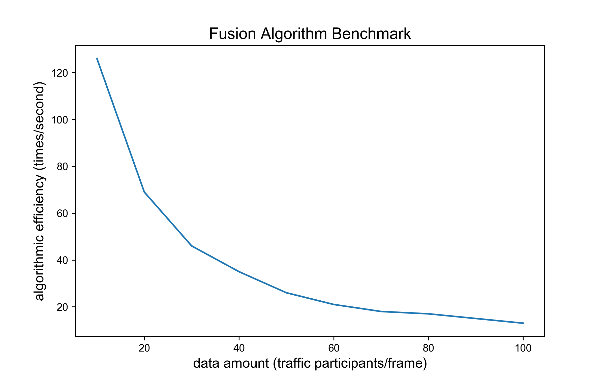
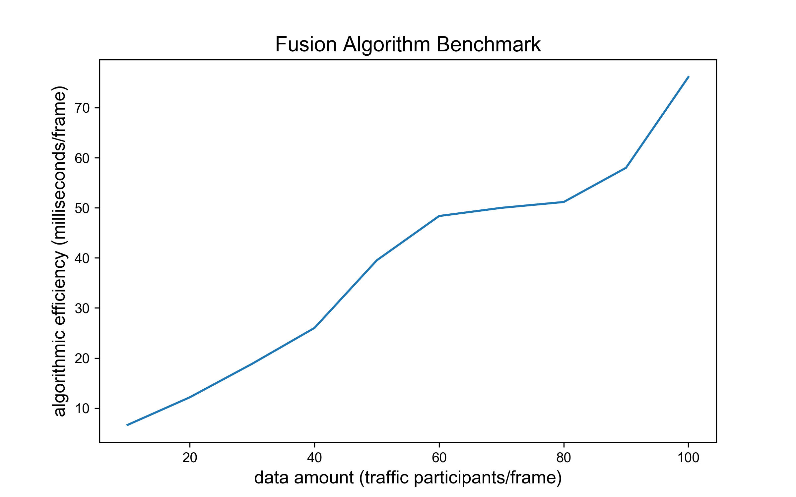

# 多源感知数据融合算法 (Fusion)

## 概览

### _目录_

<!-- @import "[TOC]" {cmd="toc" depthFrom=1 depthTo=6 orderedList=false} -->

<!-- code_chunk_output -->

- [多源感知数据融合算法 (Fusion)](#多源感知数据融合算法-fusion)
  - [概览](#概览)
    - [_目录_](#目录)
    - [难点与挑战](#难点与挑战)
    - [实现概览](#实现概览)
    - [算法BenchMark](#算法benchmark)
  - [相关代码及其对应版本](#相关代码及其对应版本)
    - [继承关系](#继承关系)
    - [调用](#调用)
  - [代码流程及框架](#代码流程及框架)
  - [相关算法解析](#相关算法解析)
    - [1. 车辆协同换道算法实现框架：run 函数](#1-车辆协同换道算法实现框架run-函数)
    - [2. 输入数据检查与融合格式整理: __format_trans 函数](#2-输入数据检查与融合格式整理-__format_trans-函数)
    - [3. 多源轨迹数据配对: __matching 函数](#3-多源轨迹数据配对-__matching-函数)
    - [4. 多源配对轨迹数据融合并返回值: __fusing 函数](#4-多源配对轨迹数据融合并返回值-__fusing-函数)
  - [附录](#附录)
    - [参考文献](#参考文献)
    - [Configuration](#configuration)

<!-- /code_chunk_output -->

### 难点与挑战

难点在于如下三点：

1. 不同源数据匹配精度低
2. 源数据噪声干扰导致融合数据质量差
3. 直接融合后数据失真与细节丢失

### 实现概览

本方案采用匈牙利匹配算法与卡尔曼滤波为内核，经过局部坐标系转换，并**融合丰富微观交通运动特征的时空轨迹历史数据，实现了同目标轨迹的精准匹配**，滤波过程较好的剔除异常值，在滤波过程中对轨迹点高频采样以保证融合结果的低延迟高精度。

对极短轨迹片段滤波过程可视轨迹片段为匀速运动，卡尔曼滤波内置预测采用速度恒定 $CV$ 模型，算子如式：

$$ X = \begin{bmatrix} x \\\ y \\\ v_x \\\ v_y \end{bmatrix} $$

$$ transitionMatrix = \begin{bmatrix} 1 & 0& \Delta t &0\\\ 0 & 1 & 0 & \Delta t \end{bmatrix} $$

$$ X_{k+1} = transitionMatrix \times X_k $$

其中 $x$, $y$, $v_{x}$, $v_{y}$ 为车辆沿横纵向的位置坐标与速度, $X_{k}$ 为当前帧车辆状态矩阵, $X_{k+1}$ 为未来 $1$ 帧车辆状态矩阵,
$transitionMatrix$ 为卡尔曼滤波状态转移矩阵。

### 算法BenchMark

测试数据结构：每辆车及其 10 帧历史数据信息

主要影响变量：data amount，每一帧数据包含的车辆数，data amount 由 $1增$ 至 $100$， 融合算法 $1$ 秒内运算次数由 $160$ 降至 $10$，运行单次算法耗时从
$5$ 增至 $90$ 毫秒。 融合算法需对各条轨迹进行 hungarian 及 kalman 滤波，运算时间正比增长。 此算法满足在线要求。

 

## 相关代码及其对应版本

### 继承关系

Fusion 类集成 Base 类，用于防止类未定义调用情况下的报错。

```python
class Base:
    def run(
        self,
        historical_frames: dict,
        latest_frame: dict,
        last_timestamp: int,
        matching_pairs: dict,
        fresh_interval: int,
    ) -> tuple:
        raise NotImplementedError


class Fusion(Base)
    ...
```

### 调用

主要描述多源感知数据融合算法如何创建和调用。

① 初始化过程直接采用类默认初始化函数，创建方式如下

```python
fusion = Fusion(dis_th, min_track_length)
```

② 调用过程由 run 函数执行，调用方式如下

```python
structured_source, last_timestamp, match_pairs = fusion.run(historical_frames, latest_frame, last_timestamp, matching_pairs, fresh_interval)
```

## 代码流程及框架

**输入**

| 数据类型     | 数据名称              | 数据格式 | 备注                                     |
| -------- | ----------------- | ---- | -------------------------------------- |
| **外部输入** | historical_frames | AID  | source: 0-6 (video, microwaveRadar...) |
| **外部输入** | latest_frame      | AID  | source: 0-6 (video, microwaveRadar...) |
| **外部输入** | last_timestamp    | int  | 最后一帧的时间戳                               |
| **外部输入** | matching_pairs    | dict | 过去配对的匹配字典                              |
| **外部输入** | fresh_interval    | int  | 设定融合数据刷新频率(100)                        |

```python
matching_pairs : dict
--------------
{
    ID1:[ID1, ID2, ID3],
    ID4:[ID4, ID5]
}
```

**过程**

1. 对传入数据 `_source_pkg` 规范格式：顺序处理 `secMark`、筛选需要融合的机动车目标
2. 最小二乘形式提取轨迹运动特征参数，存至矩阵 `pos_feature`
3. 逐个遍历 `source`，划定参数距离范围作为可匹配候选配对，将所有配对形式存入 `link`
4. 对 `link` 采用 hungarian 算法生成最优匹配
5. 按匹配对刷新目标 `ptcId`
6. 对同 `ptcId` 目标轨迹按时间序列排列，并送入 kalman 滤波融合，生成融合轨迹
7. 计算速度、车辆尺寸等其它融合参数
8. 取融合轨迹当前时刻点返回融合值

**输出**

| 数据类型   | 数据名称           | 数据格式 | 备注                     |
| ------ | -------------- | ---- | ---------------------- |
| **输出** | latest_frame   | AID  | source: 7 (integrated) |
| **输出** | last_timestamp | int  | 最新的时间戳                 |
| **输出** | match_pairs    | dict | 融合后更新的ID匹配字典           |

```python
match_pairs : dict
--------------
{
    ID1:[ID1, ID2, ID3],
    ID4:[ID4, ID5]
}
```

**调控参数**

| 数据类型     | 数据名称             | 数据格式 | 备注              |
| -------- | ---------------- | ---- | --------------- |
| **调控参数** | dis_threshold    | int  | 融合相同车辆判定范围，单位为m |
| **调控参数** | min_track_length | int  | 融合轨迹最小长度        |

## 相关算法解析

### 1. 车辆协同换道算法实现框架：run 函数

- 参数初始化

```python
start_time = time.time()
id_set, last_timestamp = utils.frames_combination(
    historical_frames, latest_frame, last_timestamp
)
self._max_time = last_timestamp
self._fresh_interval = fresh_interval
self._match_pairs = matching_pairs
self._structured_frame: Dict[str, Dict] = {}
```

- 输入数据检查与融合格式整理

```python
if historical_frames != {}:
    self._source_pkg = historical_frames
    self._format_trans(self._source_pkg)
else:
    print("No data input")
    return self._structured_frame, last_timestamp, self._match_pairs
```

- 多源轨迹数据配对

```python
if self._source_num > 1:
    self._matching()
elif self._source_num == 1:
    print("Only 1 source, normalized trajectroies has been sent back")
elif self._source_num == 0:
    print("No source data obtained")
    return self._structured_frame, last_timestamp, dict()
```

- 多源配对轨迹数据融合并返回值

```python
fused_frame = self._fusing()
self._struct(fused_frame)

end_time = time.time()
self._calc_time = end_time - start_time

return self._structured_frame, last_timestamp, self._match_pairs
```

### 2. 输入数据检查与融合格式整理: __format_trans 函数

- 检查数据源的 source 字段和设备经纬度，生成唯一字符串 tag: '(source, lon, lat)'
- 出现新 track，检验源 tag 是否已经存在，若不存在则添加新 tag，且更改数据源中 source 字段值，使其相对相同源唯一
- 将轨迹制成融合便于使用的新格式
- 判定数据源的数量

```python
def _format_trans(self, context_frames: dict) -> None:
        # 兼容多设备：增加dict，存储(source, lon, lat)的str = tag
        # 出现新track，检验源tag是否在dict里，如果在说明重复了。
        # 没重复就给dict添加key=tag: only_source = source + 8 * i++
        # 判断len(dict)
        i = 0
        frame_indicator: Dict[str, Dict] = {}  # {label: only_source}
        std_frame: Dict[str, dict] = {}
        for key in sorted(context_frames):  # key = OnlyId
            # non-moter object skip fusion
            # if key not in id_set:
            #     continue
            if context_frames[key][-1]["ptcType"] != "motor":
                self._structured_frame.update(
                    {key: context_frames[key][-1]}
                )  # only add last position
            else:
                track = context_frames[key]
                for refpos in ("refPos_lat", "refPos_lon"):
                    if refpos not in track[0]:
                        track[0][refpos] = 0
                tag = str(
                    (
                        track[0]["source"],
                        track[0]["refPos_lat"],
                        track[0]["refPos_lon"],
                    )
                )
                if tag not in frame_indicator:
                    only_source = track[0]["source"] + i * 8
                    i += 1
                    frame_indicator.update({tag: only_source})
                for row in track:
                    row.update({"typeIndi": 1})
                    for label in (
                        "timeStamp",
                        "secMark",
                        "ptcId",
                        "typeIndi",
                        "x",
                        "y",
                        "speed",
                        "heading",
                        "width",
                        "length",
                    ):
                        if key in std_frame:
                            if label in std_frame[key]:
                                std_frame[key][label].append(row[label])
                            else:
                                std_frame[key].update({label: [row[label]]})
                        else:
                            std_frame[key] = {label: [row[label]]}
                    std_frame[key].setdefault("source", [])
                    std_frame[key]["source"].append(frame_indicator[tag])
        self._source_num = len(frame_indicator)
        self._std_source = std_frame  # key = OnlyId
```

### 3. 多源轨迹数据配对: __matching 函数

- 获取每条轨迹用于匹配的参数：平均位置参数

```python
def _matching(self) -> None:
        # Aim to get ID-match_pairs in sources of track
        # ----Get Moving MTX----#
        pos_dict: Dict[int, list] = {}
        for key in self._std_source:
            track = self._std_source[key]
            if len(track["timeStamp"]) < self._min_track_length:
                continue
            pos_feature = self._pos_extract(track)  # 获得时空位置特征
            source_label = track["source"][0]
            pos_dict.setdefault(source_label, [])
            pos_dict[source_label].append([source_label, key] + pos_feature)
    ...
```

- 建立二分图调用匈牙利算法寻找最佳匹配

```python
def __matching(self) -> None:
    ...
   # ----Build 2-side Graph Link----#
        ref_param: List[float] = []  # ['ID', 'xParam', 'yParam','tParam']
        link: Dict[
            str, list
        ] = {}  # link={ID: [ptcID, ptcID],ID:[ptcID,ptcID,ptcID]}
        # -----Hungarian Solve-----#
        hungarian = Hungarian()
        for source_label in pos_dict:
            obj_group = pos_dict[source_label]
            if len(ref_param) == 0:
                for row in obj_group:
                    ref_param.append(row[1:5])
                    self._match_pairs[row[1]] = [row[1]]
                continue
            # source, OnlyId, a, b, t
            for obj0, obj1 in product(obj_group, ref_param):
                if self._eucli_dist(obj1, obj0) < self._dis_threshold:
                    link.setdefault(obj1[0], [])
                    link[obj1[0]].append(obj0[1])
            pairs = hungarian.run(link)
```

- 对当前帧匹配对更新 match_pairs

```python
def __matching(self) -> None:
        ...
        for obj in obj_group:
            unmatched = True
            for maj_id, sub_id in pairs.items():
                if maj_id in self._match_pairs:
                    unmatched = False
                    if sub_id in self._match_pairs:
                        self._add(maj_id, sub_id)
                        del self._match_pairs[sub_id]
                        continue
                    elif sub_id not in self._match_pairs[maj_id]:
                        self._match_pairs[maj_id].append(sub_id)
            if unmatched:
                is_candidate = False
                for key in self._match_pairs:
                    if obj[1] in self._match_pairs[key]:
                        is_candidate = True
                        break
                if is_candidate:
                    continue
                ref_param.append(obj[1:5])
                self._match_pairs.setdefault(obj[1], [])
                if obj[1] not in self._match_pairs[obj[1]]:
                    self._match_pairs[obj[1]].append(obj[1])
```

### 4. 多源配对轨迹数据融合并返回值: __fusing 函数

- 根据匹配字典 match_pairs 将现有轨迹重命名并组合相同轨迹

```python
def _fusing(self) -> list:
        # Unified ID and do kalman fusing
        self._std_source = self._rename_id()  # key=ID: [{ptcId: ptcId}]
    ...
```

- 调用 kalman 滤波采用速度恒定模型进行数据融合

```python
def __fusing(self) -> list:
    ...
    fused_frame = []
    for ID in sorted(self._std_source):
        track = self._std_source[ID]
        if len(track["timeStamp"]) > self._min_track_length:
            kalman = KalmanFilter()
            x, y, t = kalman.run(
                track["x"], track["y"], track["timeStamp"]
            )
            data_source = 7
        else:
            x, y = track["x"], track["y"]
            data_source = track["source"][-1]
        if track["timeStamp"][-1] < self._max_time - self._fresh_interval:
            continue
        ...
```

- 生成融合轨迹点格式

```python
def __fusing(self) -> list:
    ...
    for ID in sorted(self.std_source):
        ...
       width = np.mean(track["width"])
       length = np.mean(track["length"])
       heading = track["heading"][-1]
       speed = track["speed"][-1]
       fused_frame.append(
           [
               track["secMark"][-1],
               ID,
               data_source,
               1,
               x[-1],
               y[-1],
               speed,
               heading,
               width,
               length,
           ]
       )
```

## 附录

### 参考文献

- Kalman, R. E. A New Approach to Linear Filtering and Prediction Problems, Transactions of the
  ASME - Journal of Basic Engineering Vol. 82: pp. 35-45 (1960)
- Harold W. Kuhn, "The Hungarian Method for the assignment problem", Naval Research Logistics
  Quarterly, 2: 83–97, 1955. Kuhn's original publication.
- Chen Z, Zou H, Jiang H, et al. Fusion of WiFi, smartphone sensors and landmarks using the Kalman
  filter for indoor localization[J]. Sensors, 2015, 15(1): 715-732.

### Configuration

- model name : Intel Core 6 i7 @ 2.6 GHz （x86_64）
- compiler: Python 3.7.4 [Clang 12.0.0 (clang-1200.0.32.29)] on darwin
