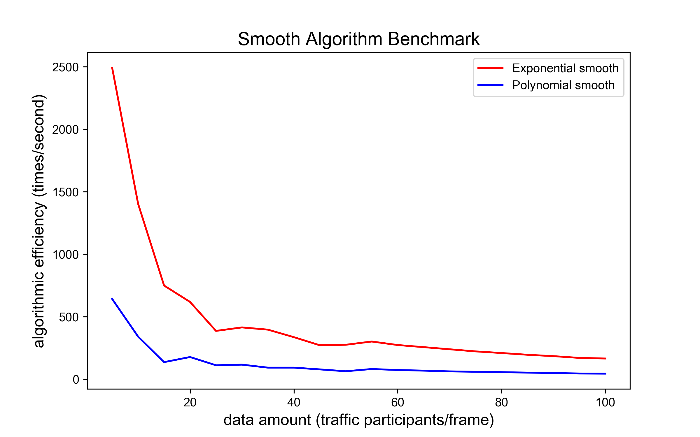
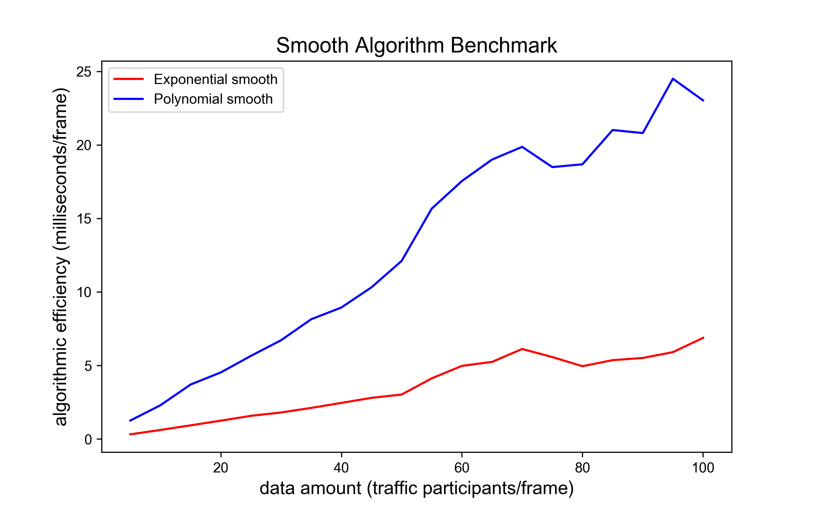

# 在线轨迹平滑算法 (Smooth)

## 概览

### _目录_

<!-- @import "[TOC]" {cmd="toc" depthFrom=1 depthTo=6 orderedList=false} -->

<!-- code_chunk_output -->

- [在线轨迹平滑算法 (Smooth)](#在线轨迹平滑算法-smooth)
  - [概览](#概览)
    - [_目录_](#目录)
    - [难点与挑战](#难点与挑战)
    - [实现概览](#实现概览)
    - [算法 BenchMark](#算法-benchmark)
  - [在线轨迹平滑代码及其对应版本](#在线轨迹平滑代码及其对应版本)
    - [继承关系](#继承关系)
    - [调用](#调用)
  - [代码流程及框架](#代码流程及框架)
    - [指数平滑算法（Exponential Smooth）](#指数平滑算法exponential-smooth)
    - [多项式平滑算法（Polynomial Smooth）](#多项式平滑算法polynomial-smooth)
  - [相关算法解析](#相关算法解析)
    - [1. 在线平滑算法实现框架: run 函数](#1-在线平滑算法实现框架-run-函数)
    - [2. 对单条轨迹指数平滑: _smooth_one 函数](#2-对单条轨迹指数平滑-_smooth_one-函数)
    - [3. 对单条轨迹多项式平滑算法: _smooth_one 函数](#3-对单条轨迹多项式平滑算法-_smooth_one-函数)
  - [附录](#附录)
    - [参考文献](#参考文献)
    - [Configuration](#configuration)

<!-- /code_chunk_output -->

### 难点与挑战

车辆检测产生的坐标抖动、偏移十分常见且很难避免。抖动产生的位置、速度等信息的偏差将直接引起多场景下风险研判效用的下降。如何**适配不同厂商的检测精度**同时**实现对高频并发数据的在线处理**是平滑算法的难点。

### 实现概览

本方案提供两种平滑算法，为指数平滑法和多项式拟合平滑法。

- 指数平滑

属于迭代类平滑，速度较快，根据上一时刻平滑后轨迹点以及当前时刻平滑前轨迹点即可计算当前时刻平滑后轨迹点，能调整历史数据与当前数据的权重比例，泛用性最好。

$$X_{st} = X_{t}\times SI + X_{st-1} \times(1-SI)$$

其中， $X_{st}$ 为平滑后的当前帧轨迹， $X_{t}$ 为平滑前当前帧轨迹， $X_{st-1}$ 为上一帧平滑后轨迹, $SI$ 为平滑参数。

- 多项式拟合平滑

拟合类平滑，根据末尾 `point_num` 个轨迹点时空位置进行多项式拟合 `np.polyfit` ，拟合次数由`fitting_times` 定义，拟合后按最后帧时刻取瞬时位置作为平滑后轨迹点。

拟合过程由最小二乘实现，最小二乘核心算子如式：

$$ \begin{bmatrix} x_i^k & x_i^{k-1} & ... & 1 \\\ x_{i-1}^k & x_{i-1}^{k-1} & ... & 1 \\\ ... & & &
... \\\ x_0^k & x_0^{k-1} & ... & 1 \end{bmatrix} \begin{bmatrix} a_k \\\ a_{k-1} \\\ ... \\\ a_0
\end{bmatrix}= \begin{bmatrix} y_i \\\ y_{i-1} \\\ ... \\\ y_0 \end{bmatrix} $$

令：

$$ A = \begin{bmatrix} x_i^k & x_i^{k-1} & ... & 1 \\\ x_{i-1}^k & x_{i-1}^{k-1} & ... & 1 \\\
... & & & ... \\\ x_0^k & x_0^{k-1} & ... & 1 \end{bmatrix} $$

$$ B = \begin{bmatrix} y_i \\\ y_{i-1} \\\ ... \\\ y_0 \end{bmatrix} $$

$$ x = \begin{bmatrix} a_k \\\ a_{k-1} \\\ ... \\\ a_0 \end{bmatrix} $$

易求解最小二乘系数 $x$ 为：

$$ x = (A^TA)^{-1}A^TB $$

### 算法 BenchMark

测试数据结构：每辆车及其 10 帧历史数据信息

主要影响变量：data amount，每一帧数据包含的车辆数，data amount 由 $1$ 增至 $100$， 指数平滑算法 $1$ 秒内运算次数由 $2500$ 降至接近
$200$，运行单次算法耗时由 $0$ 毫秒增至 $5$ 毫秒。 多项式平滑算法 $1$ 秒内运算次数由 $500$ 次降至 $80$ 次，运行单次算法耗时从 $0$ 毫秒增至 $25$ 毫秒。
逻辑判定过程可能导致平滑中耗时增加速率下降，主要由于车辆数增多，遍历配对运算正比增长。此算法满足在线要求。

 

## 在线轨迹平滑代码及其对应版本

### 继承关系

Exponential 和 Polynomial 类集成 Base 类，用于防止类未定义调用情况下的报错。

```python
class Base:
    """Super class of Exponential class and Polynomial class."""

    def run(
        self, context_frames: dict, current_frame: dict, last_timestamp: int
    ) -> tuple:
        """External call function."""
        raise NotImplementedError


class Exponential(Base):
    ...


class Polynomial(Base):
    ...
```

### 调用

主要描述在线轨迹平滑算法如何创建和调用

① 初始化过程调用初始化函数，创建方式如下

```python
# 创建指数在线平滑算法
Exp = Exponential(smooth_index, smooth_threshold)

# 创建多项式拟合在线平滑算法
Poly = Polynomial(polynomial_degree, points_num)
```

② 调用过程由 run 函数执行，调用方式如下

```python
# 调用指数在线平滑算法
current_frame, last_timestamp = Exp.run(
    context_frames, current_frame, last_timestamp
    )

# 调用多项式拟合在线平滑算法
current_frame, last_timestamp = Ploy.run(
    context_frames, current_frame, last_timestamp
    )
```

## 代码流程及框架

### 指数平滑算法（Exponential Smooth）

**输入**

| 数据类型     | 数据名称           | 数据格式 | 备注        |
| -------- | -------------- | ---- | --------- |
| **外部输入** | context_frames | dict | 轨迹历史数据信息  |
| **外部输入** | current_frame  | dict | 当前帧轨迹数据信息 |
| **外部输入** | last_timestamp | int  | 当前帧时间戳    |

**过程**

1. 对于每一辆车，获取其当前轨迹点以及历史多帧平滑后轨迹点
2. 判断当前轨迹点与历史轨迹点的时间间隔，若间隔过大则放弃平滑
3. 使用对应公式计算平滑结果

**输出**

| 数据类型   | 数据名称           | 数据格式 | 备注          |
| ------ | -------------- | ---- | ----------- |
| **输出** | current_frame  | AID  | 平滑后的当前帧轨迹数据 |
| **输出** | last_timestamp | int  | 更新后的当前帧时间戳  |

**调控参数**

| 数据类型     | 数据名称             | 数据格式  | 备注                          |
| -------- | ---------------- | ----- | --------------------------- |
| **调控参数** | smooth_index     | float | 平滑指数 （0-1）越大平滑效果越好，但滞后现象越明显 |
| **调控参数** | smooth_threshold | int   | 用于判断当前时刻是否与历史时刻存在过大时间间隔     |

### 多项式平滑算法（Polynomial Smooth）

**输入**

| 数据类型     | 数据名称           | 数据格式 | 备注        |
| -------- | -------------- | ---- | --------- |
| **外部输入** | context_frames | dict | 轨迹历史数据信息  |
| **外部输入** | current_frame  | dict | 当前帧轨迹数据信息 |
| **外部输入** | last_timestamp | int  | 当前帧时间戳    |

**过程**

1. 对于每一辆车，获取其当前轨迹点以及历史多帧轨迹点
2. 基于轨迹点，计算多项式拟合函数
3. 通过多项式拟合结果输出当前轨迹点的平滑结果

**输出**

| 数据类型   | 数据名称           | 数据格式 | 备注          |
| ------ | -------------- | ---- | ----------- |
| **输出** | current_frame  | AID  | 平滑后的当前帧轨迹数据 |
| **输出** | last_timestamp | int  | 更新后的当前帧时间戳  |

**调控参数**

| 数据类型     | 数据名称              | 数据格式 | 备注           |
| -------- | ----------------- | ---- | ------------ |
| **调控参数** | polynomial_degree | int  | 多项式拟合次数      |
| **调控参数** | points_num        | int  | 参与拟合的历史轨迹点个数 |

## 相关算法解析

指数平滑算法（Exponential Smooth）

### 1. 在线平滑算法实现框架: run 函数

- 数据预处理合并最新帧数据

```python
def run(
    self, context_frames: dict, current_frame: dict, last_timestamp: int
) -> tuple:
    latest_id_set, last_timestamp = utils.frames_combination(
        context_frames, current_frame, last_timestamp
    )
    ...
```

- 对每条轨迹调用平滑函数并返回最终帧

```python
def run(
    self, context_frames: dict, current_frame: dict, last_timestamp: int
) -> tuple:
    ...
    for obj_info in context_frames.values():
        self._smooth_one(obj_info, latest_id_set)
    return (
        utils.get_current_frame(context_frames, last_timestamp),
        last_timestamp,
    )
```

### 2. 对单条轨迹指数平滑: _smooth_one 函数

- 筛选在末尾帧仍然出现且在平滑阈值范围的轨迹进行处理

```python
def _smooth_one(self, obj_info: list, latest_id_set: set) -> list:
    try:
        current = obj_info[-1]
    except IndexError:
        return obj_info
    if any(
        [
            obj_info[-1]["global_track_id"] not in latest_id_set,
            len(obj_info) == 1,
        ]
    ):
        return obj_info
    last = obj_info[-2]
    delta_time = current["timeStamp"] - last["timeStamp"]
    if delta_time > self._smooth_threshold:
        return obj_info
    ...
```

- 对轨迹点进行指数平滑

```python
def _smooth_one(self, obj_info: list, latest_id_set: set) -> list:
    ...
    for j in ("x", "y"):
        current[j] = current[j] * self._smooth_index + last[j] * (
            1 - self._smooth_index
        )
    return obj_info
```

### 3. 对单条轨迹多项式平滑算法: _smooth_one 函数

- 检验轨迹所含点个数是否满足最短拟合要求

```python
def _smooth_one(self, obj_info: list, latest_id_set: set) -> list:
    # 至少需要POINT_NUM帧数据
    if len(obj_info) < self.points_num:
        return obj_info
    if obj_info[-1]["global_track_id"] in latest_id_set:
        return obj_info
    ...
```

- 对轨迹点的 x, y, timeStamp 进行多项式拟合

```python
def _smooth_one(self, obj_info: list, latest_id_set: set) -> list:
    ...
    # 把secmark，x，y列出来，
    track_t = np.zeros(self.points_num)
    track_x = np.zeros(self.points_num)
    track_y = np.zeros(self.points_num)
    for i, fr in enumerate(obj_info[-self.points_num :]):
        track_t[i], track_x[i], track_y[i] = (
            fr["timeStamp"],
            fr["x"],
            fr["y"],
        )
    # 分别对横纵坐标的历史数据进行多项式拟合
    fit = np.polyfit(  # type: ignore
        track_t, track_x, self.polynomial_degree
    )
    obj_info[-1]["x"] = float(np.polyval(fit, track_t[-1]))  # type: ignore
    fit = np.polyfit(  # type: ignore
        track_t, track_y, self.polynomial_degree
    )
    obj_info[-1]["y"] = float(np.polyval(fit, track_t[-1]))  # type: ignore
    return obj_info
```

## 附录

### 参考文献

- YAĞIMLI M. Real time trajectory tracking of moving objects using adaptive fuzzy time series and
  exponential smoothing forecasting techniques[J]. 2017.
- Savitzky A, Golay M J E. Smoothing and differentiation of data by simplified least squares
  procedures[J]. Analytical chemistry, 1964, 36(8): 1627-1639.

### Configuration

- model name : Intel Core 6 i7 @ 2.6 GHz （x86_64）
- compiler: Python 3.7.4 [Clang 12.0.0 (clang-1200.0.32.29)] on darwin
