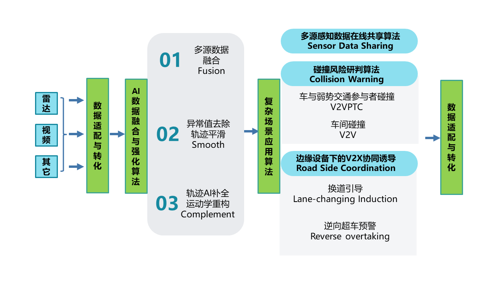
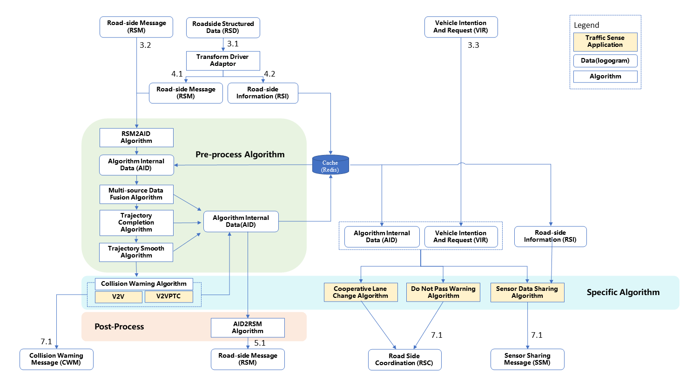

# OpenV2X 架构设计文档

## 1. 设计架构图

### 1.1 功能模块和部署架构图

### 1.2 系统软件要求

- CentOS-7 2009 / Ubuntu 20.04
- MySQL-5.7
- Redis-5.0
- RabbitMQ 3.9 / emqx v4.0.0

## 2 软件模块关系

### 2.1 All in One

#### 2.1.1 AIO 软件模块关系图

#### 2.1.2 AIO 推荐硬件

| 名称  |   配置    |
| :-: | :-----: |
| CPU | x64 4核心 |
| 内存  |   8G    |
| 磁盘  |  100G   |

### 2.2 生产环境：多节点，云边协同

#### 2.2.1 多节点软件模块关系图

#### 2.2.2 模块介绍

- 1）中心侧：
  - 统一管理界面 Omega：用于统一整合、管理和呈现所有边缘数据的中心管理平台
  - 中心侧 Dandelion：用于管理边缘节点
- 2） 5G MEC 边缘云 / 近边缘节点：
  - 边缘设备管理服务 Dandelion：部署都在 5G MEC 机房或近边路侧，用来管理路侧设备 RSE 的信息、状态和配置的服务
  - 边缘数据流式服务 Cerebrum：用来处理路侧信息融合、预警的数据处理模块、包含数据转换(Transsform Driver)、预处理算法（Pre-process
    Algorithm）、特定领域算法（Specific Algrithm）和后处理算法（Post-process Algorithm）四个插件式算法模块以及相应第三方驱动和算法库。
- 3） 模拟器：
  - 路侧设备结构化数据模拟器 Roadside Equipment Simulator： 用来模拟路侧雷视一体机、雷达、RSU 设备的模拟器，模拟路侧信息的上报、接收、多路模拟数据输入等能力。

### 2.2.3 边缘节点硬件

| 名称  |   配置    |
| :-: | :-----: |
| CPU | x64 4核心 |
| GPU |   T4    |
| 内存  |   8G    |
| 磁盘  |   1T    |

## 3. 算法模块设计

### 3.1 Beihai 版本算法模块的详细设计

### 3.2 Colombia 版本算法模块的设计原则

**简单、不绑定**：开源只做最小功能，不绑定具体平台和框架

1. 不和特定平台绑定，OpenV2X 应该能广泛适用于 K8S，Docker-Compose 技术栈，或非容器化部署
1. 不和特定框架绑定，比如 Nvidia Triton，Apache Flink

**可扩展**：要能支持广泛扩展

1. 适配不同的语言，C/C++，Java，Python，Golang 等
1. 适配新增各类算法，不同接口协议，不同数据格式，不同的类型（数据预处理、感知、融合、场景算法等）
1. 能适配各类平台和框架，简单封装即可应用；也能支持添加其他高级功能，比如认证，审计，监控，计量，计费等

### 3.3 Colombia 版本算法模块设计概要

Beihai 版本中，Cerebrum 中内置了**数据预处理**、**数据融合**、和各类**场景算法**。

Colombia 版本中，OpenV2X 基于“简单、可扩展”原则，对算法模块作如下设计：

1. 算法服务可以在中心端配置，下发到边缘（特定算法服务在特定边缘启动）
1. 在 Dandelion 中实现服务注册和服务发现 API
1. 服务对象字段包含：协议地址、服务名称、服务类型、服务描述、服务 ID，和可选属性：协议类型、认证方式、认证密钥等
1. 其他模块，比如 Cerebrum 需要调用外置算法时，可以先从 Dandelion 的服务发现 API 了解服务详情，然后再通过 Dandelion
   或者服务自身的接口完成自身流程中的算法选择，完成配置。
1. 当数据接入，Cerebrum 等模块会根据配置通过服务端点，将数据安装服务协议标准发送各个服务中（内嵌或外置）

### 3.4 模块架构图

