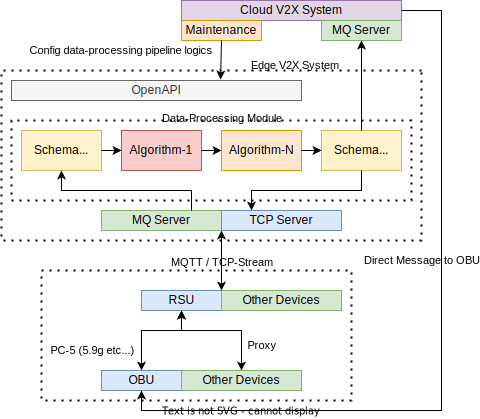

# OpenV2X 架构设计文档

## 1. 设计架构图

### 1.1 功能模块和部署架构图

### 1.2 详细设计

### 1.3 算法模块设计

## 2 软件模块关系

### 2.1 All in One

#### 2.1.1 AIO 软件模块关系图

#### 2.1.2 AIO 推荐硬件

| 名称  |   配置    |
| :-: | :-----: |
| CPU | x64 4核心 |
| 内存  |   8G    |
| 磁盘  |  100G   |

### 2.2 生产环境：多节点，云边协同

#### 2.2.1 多节点软件模块关系图

#### 2.2.2 模块介绍

- 1）中心侧：
  - 统一管理界面 Omega：用于统一整合、管理和呈现所有边缘数据的中心管理平台
  - 中心侧 Dandelion：用于管理边缘节点
- 2） 5G MEC 边缘云 / 近边缘节点：
  - 边缘设备管理服务 Dandelion：部署都在 5G MEC 机房或近边路侧，用来管理路侧设备 RSE 的信息、状态和配置的服务
  - 边缘数据流式服务 Cerebrum：用来处理路侧信息融合、预警的数据处理模块、包含数据转换(Transsform Driver)、预处理算法（Pre-process
    Algorithm）、特定领域算法（Specific Algrithm）和后处理算法（Post-process Algorithm）四个插件式算法模块以及相应第三方驱动和算法库。
- 3） 模拟器：
  - 路侧设备结构化数据模拟器 Roadside Equipment Simulator： 用来模拟路侧雷视一体机、雷达、RSU 设备的模拟器，模拟路侧信息的上报、接收、多路模拟数据输入等能力。

### 2.2.3 边缘节点硬件

| 名称  |   配置    |
| :-: | :-----: |
| CPU | x64 4核心 |
| GPU |   T4    |
| 内存  |   8G    |
| 磁盘  |   1T    |

## 3 软件要求

- CentOS-7 2009 / Ubuntu 20.04
- MySQL-5.7
- Redis-5.0
- RabbitMQ 3.9 / emqx v4.0.0
