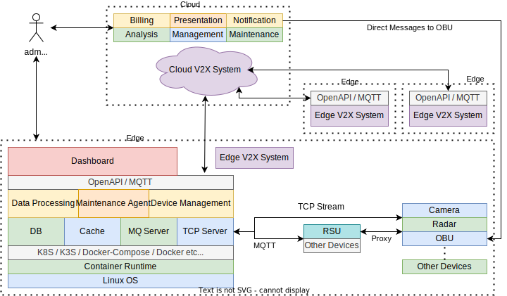
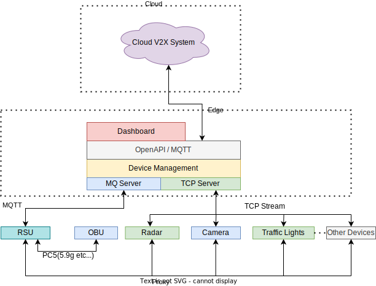

# OpenV2X 架构设计文档

## 1. 设计架构图

总体设计

详细设计

数据处理流程

设备管理

### 1.1 模块介绍

- 1）中心侧：
  - 统一管理界面：Central Portal: 用于统一整合、管理和呈现所有边缘数据的中心管理平台
- 2） 5G MEC 边缘侧：
  - 边缘管理界面 Edge Portal：用于单个5G MEC机房、覆盖区域性多个路口的二级管理界面
  - 边缘设备管理服务 Device Management ：部署都在单个5G MEC机房中，用来路侧设备RSE的信息、状态和配置的服务
  - 边缘数据流式服务 Data Processing Flow：用来处理路侧信息融合、预警的数据处理模块、包含数据转换(Transsform Driver)、预处理算法（Pre-process
    Algorithm）、特定领域算法（Specific Algrithm）和后处理算法（Post-process Algorithm）四个插件式算法模块以及相应第三方驱动和算法库。
  - 消息服务MQ Server：用来接收和处理RSE、RSU等结构化数据，数据遵循“新四跨”协议标准
  - TCP服务 TCP Server（规划中）：用来接收RSE路侧设备非结构化数据（裸数据，如原始视频流、原始雷达数据流等）的服务
  - 运维代理Maintenance Agent（规划中）: 支持系统监控和运维的服务，用以收集单个5G MEC机房中关键服务的健康状态。
  - 车载服务Car Service(规划中)：提供给车的按需增值生态服务
- 3） 模拟器：
  - 路侧设备模拟器 Roadside Equipment Simulator： 用来模拟路侧雷达、视频、RSU设备的模拟器，模拟路侧信息的上报、接收、多路模拟数据输入等能力。

### 1.2 后端(DEMO)推荐硬件

| 名称  |   配置    |
| :-: | :-----: |
| CPU | x64 2核心 |
| 内存  |   4G    |
| 磁盘  |  100G   |

### 1.3 算法(DEMO)推荐硬件

| 名称  |   配置    |
| :-: | :-----: |
| CPU | x64 4核心 |
| 内存  |   8G    |
| 磁盘  |  100G   |

### 1.4 后端(生产)推荐硬件

| 名称  |   配置    |
| :-: | :-----: |
| CPU | x64 4核心 |
| 内存  |   8G    |
| 磁盘  |   1T    |

### 1.5 算法(生产)推荐硬件

| 名称  | 配置  |
| :-: | :-: |
| CPU |  -  |
| 内存  |  -  |
| 磁盘  |  -  |

### 1.6 后端软件要求

- CentOS-7 2009
- MySQL-5.7
- Redis-5.0
- RabbitMQ 3.9 / emqx v4.0.0
