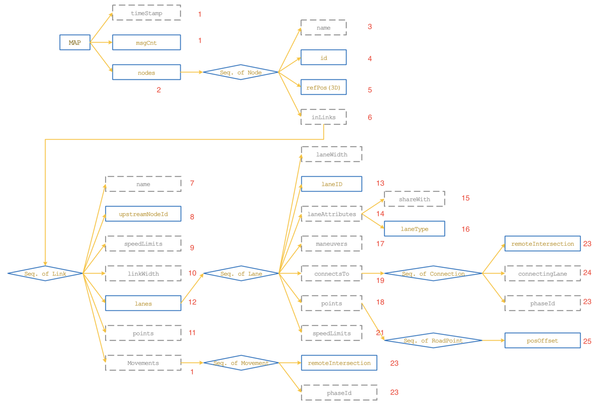
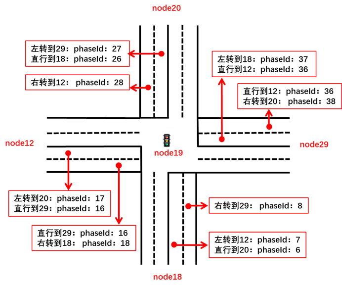

- V2X 地图
  - 定义：地图消息。由路侧单元广播，向车辆传递局部区域的地图信息。包括局部区域的路口信息、路段信息、车道信息，道路之间的连接关系等。单个地图消息可以包含多个路口或区域的地图数据。路口处的信号灯信息则在
    SPAT 消息中详细定义。

  - MAP 消息的主体结构，是一个层层嵌套的形式。其中实线框为必有项，虚线框为可选项。 

- 示例文件

  - ```json
    {
      "msgCnt": "1",
      // MsgCount
      "nodes": {
        "Node": [ // NodeList
          // Node
          {
            "name": "YiZhuang-QuanQu", // DescriptiveName
            "id": { //NodeReferenceID
              "region": "10", // RoadRegulatorID
              "id": "19" // NodeID
            },
            "refPos": { // Position3D
              "lat": "397870006", // Latitude
              "long": "1165119042", // Longitude
              "elevation": "0" // Elevation
            },
            "inLinks": {
              "Link": [ //LinkList
                // Link
                {
                  "name": "18-19", // DescriptiveName
                  "upstreamNodeId": { // NodeReferenceID
                    "region": "10",
                    "id": "18"
                  },
                  "speedLimits": {
                    "RegulatorySpeedLimit": [ // SpeedLimitList,
                      // RegulatorySpeedLimit
                      {
                      "type": { // SpeedLimitType
                        "vehicleMaxSpeed": null
                      },
                      "speed": "833" // Speed
                      }
                    ]
                  },
                  "linkWidth": "660", // LaneWidth
                  "points": {
                    "RoadPoint": [ // PointList
                      // RoadPoint
                      {
                        "posOffset": { // PositionOffsetLLV
                          "offsetLL": { //PositionOffsetLL
                            "position-LatLon": { // Position-LLmD-64b
                              "lon": "1165142774", // Longitude
                              "lat": "397841165" // Latitude
                            }
                          }
                        }
                      },
                      {
                        "posOffset": {
                          "offsetLL": {
                            "position-LatLon": {
                              "lon": "1165129744",
                              "lat": "397857197"
                            }
                          }
                        }
                      },
                      {
                        "posOffset": {
                          "offsetLL": {
                            "position-LatLon": {
                              "lon": "1165120283",
                              "lat": "397868872"
                            }
                          }
                        }
                      }
                    ]
                  },
                  "lanes": {
                    "Lane": [ // LaneList
                      // Lane
                      {
                        "laneID": "1", // LaneID
                        "laneWidth": "330", // LaneWidth
                        "laneAttributes": { // LaneAttributes
                          "shareWith": "0000000000", // LaneSharing
                          "laneType": { // LaneTypeAttributes
                            "vehicle": "00000000"
                          }
                        },
                        "maneuvers": "110000000000", // AllowedManeuvers
                        "connectsTo": {
                          "Connection": [ // ConnectsToList
                            // Connection
                            {
                              "remoteIntersection": { // NodeReferenceID
                                "region": "10",
                                "id": "12"
                              },
                              "connectingLane": { // ConnectingLane
                                "lane": "1", // LaneID
                                "maneuver": "010000000000" // AllowedManeuvers
                              },
                              "phaseId": "7" // PhaseID
                            },
                            {
                              "remoteIntersection": {
                                "region": "10",
                                "id": "20"
                              },
                              "connectingLane": {
                                "lane": "1",
                                "maneuver": "100000000000"
                              },
                              "phaseId": "6"
                            }
                          ]
                        },
                        "points": {
                          "RoadPoint": [
                            {
                              "posOffset": {
                                "offsetLL": {
                                  "position-LatLon": {
                                    "lon": "1165142774",
                                    "lat": "397841165"
                                  }
                                }
                              }
                            },
                            {
                              "posOffset": {
                                "offsetLL": {
                                  "position-LatLon": {
                                    "lon": "1165129744",
                                    "lat": "397857197"
                                  }
                                }
                              }
                            },
                            {
                              "posOffset": {
                                "offsetLL": {
                                  "position-LatLon": {
                                    "lon": "1165120283",
                                    "lat": "397868872"
                                  }
                                }
                              }
                            }
                          ]
                        }
                      },
                      {
                        "laneID": "2",
                        "laneWidth": "330",
                        "laneAttributes": {
                          "shareWith": "0000000000",
                          "laneType": {
                            "vehicle": "00000000"
                          }
                        },
                        "maneuvers": "001000000000",
                        "connectsTo": {
                          "Connection": {
                            "remoteIntersection": {
                              "region": "10",
                              "id": "29"
                            },
                            "connectingLane": {
                              "lane": "1",
                              "maneuver": "001000000000"
                            },
                            "phaseId": "8"
                          }
                        },
                        "points": {
                          "RoadPoint": [
                            {
                              "posOffset": {
                                "offsetLL": {
                                  "position-LatLon": {
                                    "lon": "1165142774",
                                    "lat": "397841165"
                                  }
                                }
                              }
                            },
                            {
                              "posOffset": {
                                "offsetLL": {
                                  "position-LatLon": {
                                    "lon": "1165129744",
                                    "lat": "397857197"
                                  }
                                }
                              }
                            },
                            {
                              "posOffset": {
                                "offsetLL": {
                                  "position-LatLon": {
                                    "lon": "1165120622",
                                    "lat": "397869034"
                                  }
                                }
                              }
                            }
                          ]
                        }
                      }
                    ]
                  }
                },
                {
                  "name": "12-19",
                  "upstreamNodeId": {
                    "region": "10",
                    "id": "12"
                  },
                  "speedLimits": {
                    "RegulatorySpeedLimit": {
                      "type": {
                        "vehicleMaxSpeed": null
                      },
                      "speed": "833"
                    }
                  },
                  "linkWidth": "800",
                  "points": {
                    "RoadPoint": [
                      {
                        "posOffset": {
                          "offsetLL": {
                            "position-LatLon": {
                              "lon": "1165093456",
                              "lat": "397857496"
                            }
                          }
                        }
                      },
                      {
                        "posOffset": {
                          "offsetLL": {
                            "position-LatLon": {
                              "lon": "1165102631",
                              "lat": "397862082"
                            }
                          }
                        }
                      },
                      {
                        "posOffset": {
                          "offsetLL": {
                            "position-LatLon": {
                              "lon": "1165117219",
                              "lat": "397869139"
                            }
                          }
                        }
                      }
                    ]
                  },
                  "lanes": {
                    "Lane": [
                      {
                        "laneID": "1",
                        "laneWidth": "400",
                        "laneAttributes": {
                          "shareWith": "0000000000",
                          "laneType": {
                            "vehicle": "00000000"
                          }
                        },
                        "maneuvers": "110000000000",
                        "connectsTo": {
                          "Connection": [
                            {
                              "remoteIntersection": {
                                "region": "10",
                                "id": "20"
                              },
                              "connectingLane": {
                                "lane": "1",
                                "maneuver": "010000000000"
                              },
                              "phaseId": "17"
                            },
                            {
                              "remoteIntersection": {
                                "region": "10",
                                "id": "29"
                              },
                              "connectingLane": {
                                "lane": "1",
                                "maneuver": "100000000000"
                              },
                              "phaseId": "16"
                            }
                          ]
                        },
                        "points": {
                          "RoadPoint": [
                            {
                              "posOffset": {
                                "offsetLL": {
                                  "position-LatLon": {
                                    "lon": "1165093456",
                                    "lat": "397857496"
                                  }
                                }
                              }
                            },
                            {
                              "posOffset": {
                                "offsetLL": {
                                  "position-LatLon": {
                                    "lon": "1165102631",
                                    "lat": "397862082"
                                  }
                                }
                              }
                            },
                            {
                              "posOffset": {
                                "offsetLL": {
                                  "position-LatLon": {
                                    "lon": "1165117219",
                                    "lat": "397869139"
                                  }
                                }
                              }
                            }
                          ]
                        }
                      },
                      {
                        "laneID": "2",
                        "laneWidth": "400",
                        "laneAttributes": {
                          "shareWith": "0000000000",
                          "laneType": {
                            "vehicle": "00000000"
                          }
                        },
                        "maneuvers": "101000000000",
                        "connectsTo": {
                          "Connection": [
                            {
                              "remoteIntersection": {
                                "region": "10",
                                "id": "29"
                              },
                              "connectingLane": {
                                "lane": "1",
                                "maneuver": "100000000000"
                              },
                              "phaseId": "16"
                            },
                            {
                              "remoteIntersection": {
                                "region": "10",
                                "id": "18"
                              },
                              "connectingLane": {
                                "lane": "1",
                                "maneuver": "001000000000"
                              },
                              "phaseId": "18"
                            }
                          ]
                        },
                        "points": {
                          "RoadPoint": [
                            {
                              "posOffset": {
                                "offsetLL": {
                                  "position-LatLon": {
                                    "lon": "1165093858",
                                    "lat": "397856990"
                                  }
                                }
                              }
                            },
                            {
                              "posOffset": {
                                "offsetLL": {
                                  "position-LatLon": {
                                    "lon": "1165102839",
                                    "lat": "397861774"
                                  }
                                }
                              }
                            },
                            {
                              "posOffset": {
                                "offsetLL": {
                                  "position-LatLon": {
                                    "lon": "1165117469",
                                    "lat": "397868830"
                                  }
                                }
                              }
                            }
                          ]
                        }
                      }
                    ]
                  }
                },
                {
                  "name": "20-19",
                  "upstreamNodeId": {
                    "region": "10",
                    "id": "20"
                  },
                  "speedLimits": {
                    "RegulatorySpeedLimit": {
                      "type": {
                        "vehicleMaxSpeed": null
                      },
                      "speed": "833"
                    }
                  },
                  "linkWidth": "660",
                  "points": {
                    "RoadPoint": [
                      {
                        "posOffset": {
                          "offsetLL": {
                            "position-LatLon": {
                              "lon": "1165095240",
                              "lat": "397899027"
                            }
                          }
                        }
                      },
                      {
                        "posOffset": {
                          "offsetLL": {
                            "position-LatLon": {
                              "lon": "1165105845",
                              "lat": "397885982"
                            }
                          }
                        }
                      },
                      {
                        "posOffset": {
                          "offsetLL": {
                            "position-LatLon": {
                              "lon": "1165117636",
                              "lat": "397871423"
                            }
                          }
                        }
                      }
                    ]
                  },
                  "lanes": {
                    "Lane": [
                      {
                        "laneID": "1",
                        "laneWidth": "330",
                        "laneAttributes": {
                          "shareWith": "0000000000",
                          "laneType": {
                            "vehicle": "00000000"
                          }
                        },
                        "maneuvers": "110000000000",
                        "connectsTo": {
                          "Connection": [
                            {
                              "remoteIntersection": {
                                "region": "10",
                                "id": "29"
                              },
                              "connectingLane": {
                                "lane": "1",
                                "maneuver": "010000000000"
                              },
                              "phaseId": "27"
                            },
                            {
                              "remoteIntersection": {
                                "region": "10",
                                "id": "18"
                              },
                              "connectingLane": {
                                "lane": "1",
                                "maneuver": "100000000000"
                              },
                              "phaseId": "26"
                            }
                          ]
                        },
                        "points": {
                          "RoadPoint": [
                            {
                              "posOffset": {
                                "offsetLL": {
                                  "position-LatLon": {
                                    "lon": "1165095240",
                                    "lat": "397899027"
                                  }
                                }
                              }
                            },
                            {
                              "posOffset": {
                                "offsetLL": {
                                  "position-LatLon": {
                                    "lon": "1165105845",
                                    "lat": "397885982"
                                  }
                                }
                              }
                            },
                            {
                              "posOffset": {
                                "offsetLL": {
                                  "position-LatLon": {
                                    "lon": "1165117636",
                                    "lat": "397871423"
                                  }
                                }
                              }
                            }
                          ]
                        }
                      },
                      {
                        "laneID": "2",
                        "laneWidth": "330",
                        "laneAttributes": {
                          "shareWith": "0000000000",
                          "laneType": {
                            "vehicle": "00000000"
                          }
                        },
                        "maneuvers": "001000000000",
                        "connectsTo": {
                          "Connection": {
                            "remoteIntersection": {
                              "region": "10",
                              "id": "12"
                            },
                            "connectingLane": {
                              "lane": "1",
                              "maneuver": "001000000000"
                            },
                            "phaseId": "28"
                          }
                        },
                        "points": {
                          "RoadPoint": [
                            {
                              "posOffset": {
                                "offsetLL": {
                                  "position-LatLon": {
                                    "lon": "1165095240",
                                    "lat": "397899027"
                                  }
                                }
                              }
                            },
                            {
                              "posOffset": {
                                "offsetLL": {
                                  "position-LatLon": {
                                    "lon": "1165105845",
                                    "lat": "397885982"
                                  }
                                }
                              }
                            },
                            {
                              "posOffset": {
                                "offsetLL": {
                                  "position-LatLon": {
                                    "lon": "1165117292",
                                    "lat": "397871274"
                                  }
                                }
                              }
                            }
                          ]
                        }
                      }
                    ]
                  }
                },
                {
                  "name": "129-19",
                  "upstreamNodeId": {
                    "region": "10",
                    "id": "29"
                  },
                  "speedLimits": {
                    "RegulatorySpeedLimit": {
                      "type": {
                        "vehicleMaxSpeed": null
                      },
                      "speed": "833"
                    }
                  },
                  "linkWidth": "780",
                  "points": {
                    "RoadPoint": [
                      {
                        "posOffset": {
                          "offsetLL": {
                            "position-LatLon": {
                              "lon": "1165153657",
                              "lat": "397887241"
                            }
                          }
                        }
                      },
                      {
                        "posOffset": {
                          "offsetLL": {
                            "position-LatLon": {
                              "lon": "1165136723",
                              "lat": "397878978"
                            }
                          }
                        }
                      },
                      {
                        "posOffset": {
                          "offsetLL": {
                            "position-LatLon": {
                              "lon": "1165120695",
                              "lat": "397871234"
                            }
                          }
                        }
                      }
                    ]
                  },
                  "lanes": {
                    "Lane": [
                      {
                        "laneID": "1",
                        "laneWidth": "390",
                        "laneAttributes": {
                          "shareWith": "0000000000",
                          "laneType": {
                            "vehicle": "00000000"
                          }
                        },
                        "maneuvers": "110000000000",
                        "connectsTo": {
                          "Connection": [
                            {
                              "remoteIntersection": {
                                "region": "10",
                                "id": "18"
                              },
                              "connectingLane": {
                                "lane": "1",
                                "maneuver": "010000000000"
                              },
                              "phaseId": "37"
                            },
                            {
                              "remoteIntersection": {
                                "region": "10",
                                "id": "12"
                              },
                              "connectingLane": {
                                "lane": "1",
                                "maneuver": "100000000000"
                              },
                              "phaseId": "36"
                            }
                          ]
                        },
                        "points": {
                          "RoadPoint": [
                            {
                              "posOffset": {
                                "offsetLL": {
                                  "position-LatLon": {
                                    "lon": "1165153657",
                                    "lat": "397887241"
                                  }
                                }
                              }
                            },
                            {
                              "posOffset": {
                                "offsetLL": {
                                  "position-LatLon": {
                                    "lon": "1165136723",
                                    "lat": "397878978"
                                  }
                                }
                              }
                            },
                            {
                              "posOffset": {
                                "offsetLL": {
                                  "position-LatLon": {
                                    "lon": "1165120695",
                                    "lat": "397871234"
                                  }
                                }
                              }
                            }
                          ]
                        }
                      },
                      {
                        "laneID": "2",
                        "laneWidth": "390",
                        "laneAttributes": {
                          "shareWith": "0000000000",
                          "laneType": {
                            "vehicle": "00000000"
                          }
                        },
                        "maneuvers": "101000000000",
                        "connectsTo": {
                          "Connection": [
                            {
                              "remoteIntersection": {
                                "region": "10",
                                "id": "12"
                              },
                              "connectingLane": {
                                "lane": "1",
                                "maneuver": "100000000000"
                              },
                              "phaseId": "36"
                            },
                            {
                              "remoteIntersection": {
                                "region": "10",
                                "id": "20"
                              },
                              "connectingLane": {
                                "lane": "1",
                                "maneuver": "001000000000"
                              },
                              "phaseId": "38"
                            }
                          ]
                        },
                        "points": {
                          "RoadPoint": [
                            {
                              "posOffset": {
                                "offsetLL": {
                                  "position-LatLon": {
                                    "lon": "1165153184",
                                    "lat": "397887780"
                                  }
                                }
                              }
                            },
                            {
                              "posOffset": {
                                "offsetLL": {
                                  "position-LatLon": {
                                    "lon": "1165136426",
                                    "lat": "397879247"
                                  }
                                }
                              }
                            },
                            {
                              "posOffset": {
                                "offsetLL": {
                                  "position-LatLon": {
                                    "lon": "1165120459",
                                    "lat": "397871540"
                                  }
                                }
                              }
                            }
                          ]
                        }
                      }
                    ]
                  }
                }
              ]
            }
          }
        ]
      }
    }
    ```

  - 上述示例中注释为数据类型，参考下述数据帧、数据元素

  - 根据示例，初步画出路口图为：

    - 

  - **问题**：目前根据标准无法确定如何画出弧形路口。

- 数据帧、数据元素

  - MinuteOfTheYear

    - 数值用来表示当前年份，已经过去的总分钟数（UTC时间）。其分辨率为1分钟。该数值配合DSecond数值，则可以表示以毫秒记的全年已过去的总时间。

    - ```ASN.1
      MinuteOfTheYear ::= INTEGER (0..527040)
      -- the value 527040 shall be used for invalid
      ```

  - DSecond

    - 定义1分钟内的毫秒级时刻。分辨率为1 ms，有效范围是0～59999。60000及以上表示未知或无效数值。

    - ```ASN.1
      DSecond ::= INTEGER (0..65535)
      -- units of milliseconds
      ```

  - MsgCount

    - 发送方为自己发送的同类消息，依次进行编号。编号数值为0～127，循环使用。该数据字段用于接收方对来自同一发送方的同一类消息，进行连续收包的监控和丢包的统计。

    - ```ASN.1
      MsgCount ::= INTEGER (0..127)
      ```

  - NodeList

    - 定义地图节点列表

    - ```ASN.1
      NodeList ::= SEQUENCE (SIZE(1..63)) OF Node
      ```

  - Node

    - 地图节点。节点是地图的最基本组成部分，可以是交叉路口，也可以是一个路段的端点。在地图上，顺序的两个节点确定一条有向路段。节点属性包括名称、ID、位置以及节点相连的上游路段集合。一个节点中包含的路段，均以该节点作为下游端点。而从该节点出发的路段，则归属于路段下游节点的数据中。Node数据帧中，refPos字段用来提供当前数据帧作用范围内的参考三维位置坐标，帧中所有的位置偏移量，均基于该参考坐标计算。真实位置坐标等于偏移量加上参考坐标。

    - ```ASN.1
      Node ::= SEQUENCE {
        -- Node can be an intersection, or a road endpoint
        name DescriptiveName OPTIONAL,
        -- Node name
        id NodeReferenceID,
        -- A globally unique value set,
        -- consisting of a regionID and
        -- node ID assignment
        refPos Position3D,
        -- 3D position of the center of this Node.
        -- This position is also the reference position for the elements inside
        inLinks LinkList OPTIONAL,
        -- all the links enter this Node
        ...
      }
      ```

  - DescriptiveName

    - 定义名称字符串类型。

    - ```ASN.1
      DescriptiveName ::= IA5String (SIZE(1..63))
      ```

  - NodeReferenceID

    - 定义节点ID。节点ID是由一个全局唯一的地区ID和一个地区内部唯一的节点ID组成。

    - ```ASN.1
      NodeReferenceID ::= SEQUENCE {
        region RoadRegulatorID OPTIONAL,
        -- a globally unique regional assignment value
        -- typical assigned to a regional DOT authority
        -- the value zero shall be used for testing needs
        id NodeID
        -- a unique mapping to the node
        -- in question within the above region of use
      }
      ```

  - RoadRegulatorID

    - 定义地图中各个划分区域的ID号。数值0仅用于测试。

    - ```ASN.1
      RoadRegulatorID ::= INTEGER (0..65535)
      -- The value zero shall be used for testing only
      ```

  - NodeID

    - 定义节点ID。路网最基本的构成即节点和节点之间连接的路段。节点可以是路口，也可以是一条路的端点。一个节点的ID在同一个区域内是唯一的。数值0～255预留为测试使用。

    - ```ASN.1
      NodeID ::= INTEGER (0..65535)
      -- The values zero through 255 are allocated for testing purposes
      -- Note that the value assigned to a node will be
      -- unique within a given regional ID only
      ```

  - Position3D

    - 三维的坐标位置，经纬度和高程。

    - ```ASN.1
      Position3D ::= SEQUENCE {
        lat Latitude,
        -- in 1/10th micro degrees
        long Longitude,
        -- in 1/10th micro degrees
        elevation Elevation OPTIONAL
        -- in 10 cm units
      }
      ```

  - Latitude

    - 定义纬度数值，北纬为正，南纬为负。分辨率1e-7°。

    - ```ASN.1
      Latitude ::= INTEGER (-900000000..900000001)
      -- Units of 1/10 micro degree
      -- Providing a range of plus-minus 90 degrees
      ```

  - Longitude

    - 定义经度数值。东经为正，西经为负。分辨率为1e-7°。

    - ```ASN.1
      Longitude ::= INTEGER (-1799999999..1800000001)
      -- Units of 1/10 micro degree
      -- Providing a range of plus-minus 180 degrees
      ```

  - Elevation

    - 定义车辆海拔高程。分辨率为0.1 m。数值-4096表示无效数值。

    - ```ASN.1
      Elevation ::= INTEGER (-4096..61439)
      -- In units of 10 cm steps above or below the reference ellipsoid
      -- Providing a range of -409.5 to + 6143.9 meters
      -- The value -4096 shall be used when Unknown is to be sent
      ```

  - LinkList

    - 定义路段列表

    - ```ASN.1
      LinkList ::= SEQUENCE (SIZE(1..32)) OF Link
      ```

  - Link

    - 定义路段。从一个节点到相邻另一个节点的道路称为一个有向路段。其属性包含名称、上游节点ID、限速集合、车道宽度，以及该路段包含的车道集合与交通标志标牌集合

    - ```ASN.1
      Link ::= SEQUENCE {
        name DescriptiveName OPTIONAL,
        -- Link name
        upstreamNodeId NodeReferenceID,
        -- this link is from upstreamNode to the Node it belongs to
        speedLimits SpeedLimitList OPTIONAL,
        -- List all the speed limits
        linkWidth LaneWidth OPTIONAL,
        -- Width of this link
        points PointList OPTIONAL,
        -- Define road points along the center of this link
        movements MovementList OPTIONAL,
        -- Define movements at intersection
        lanes LaneList,
        -- Lanes belong to this link
        ...
      }
      ```

  - SpeedLimitList

    - 定义路段或车道的限速列表

    - ```ASN.1
      SpeedLimitList ::= SEQUENCE (SIZE(1..9)) OF RegulatorySpeedLimit
      ```

  - RegulatorySpeedLimit

    - 定义限速属性。包括限速类型以及所规定的限制速度。

    - ```ASN.1
      RegulatorySpeedLimit ::= SEQUENCE {
        type SpeedLimitType,
        -- The type of regulatory speed which follows
        speed Speed
        -- The speed in units of 0.02 m/s
        -- See Section 11 for converting and translating
        -- speed expressed in mph into units of m/s
      }
      ```

  - SpeedLimitType

    - 定义限速类型，指示给出的限速大小对应的参考类型。

    - ```ASN.1
      SpeedLimitType ::= ENUMERATED {
        unknown, -- Speed limit type not available
        maxSpeedInSchoolZone, -- Only sent when the limit is active
        maxSpeedInSchoolZoneWhenChildrenArePresent, -- Sent at any time
        maxSpeedInConstructionZone, -- Used for work zones, incident zones, etc.
        -- where a reduced speed is present
        vehicleMinSpeed,
        vehicleMaxSpeed, -- Regulatory speed limit for general traffic
        vehicleNightMaxSpeed,
        truckMinSpeed,
        truckMaxSpeed,
        truckNightMaxSpeed,
        vehiclesWithTrailersMinSpeed,
        vehiclesWithTrailersMaxSpeed,
        vehiclesWithTrailersNightMaxSpeed,
        ...
      }
      ```

  - Speed

    - 车辆或其他交通参与者的速度大小。分辨率为0.02 m/s。数值8191表示无效数值

    - ```ASN.1
      Speed ::= INTEGER (0..8191)
      -- Units of 0.02 m/s
      -- The value 8191 indicates that
      -- speed is unavailable
      ```

  - LaneWidth

    - 定义车道宽度。分辨率为1 cm。

    - ```ASN.1
      LaneWidth ::= INTEGER (0..32767)
      -- units of 1 cm
      ```

  - PointList

    - 定义一个有向路段上的中间位置点列表，用来表达路段上截面或片段的特殊属性。列表中所有位置点需按上游至下游顺序排列。

    - ```ASN.1
      PointList ::= SEQUENCE (SIZE(2..31)) OF RoadPoint
      -- At least 2 points of 1 lane
      -- entry line and exit line
      -- points need to be listed sequentially
      -- from upstream to downstream
      ```

  - RoadPoint

    - 表示完整道路上标记的一个位置点属性。包括相对位置、位置点处路段截面的特殊属性集合、以及该位置点到下游相邻位置点之间局部路段的特殊属性集合。当位置点为路段最下游的点，则其包含的下游截取路段属性为无效数据。

    - ```ASN.1
      RoadPoint ::= SEQUENCE {
        posOffset PositionOffsetLLV,
        -- Position offset to the reference position
        ...
      }
      ```

  - PositionOffsetLLV

    - 定义三维的相对位置（相对经纬度和相对高程）。约定偏差值等于真实值减去参考值

    - ```ASN.1
      PositionOffsetLLV ::= SEQUENCE {
        offsetLL PositionOffsetLL,
        -- offset in lon/lat
        offsetV VerticalOffset OPTIONAL
        -- offset in elevation
      }
      ```

  - PositionOffsetLL

    - 经纬度偏差，来描述一个坐标点的相对位置。约定偏差值等于真实值减去参考值。提供了 7 种尺度的描述方式

    - ```ASN.1
      PositionOffsetLL ::= CHOICE {
        -- Locations with LL content Span at the equator when using a zoom of
        one:
        position-LL1 Position-LL-24B,
        -- within +- 22.634554 meters of the reference position
        position-LL2 Position-LL-28B,
        -- within +- 90.571389 meters of the reference position
        position-LL3 Position-LL-32B,
        -- within +- 362.31873 meters of the reference position
        position-LL4 Position-LL-36B,
        -- within +- 01.449308 Kmeters of the reference position
        position-LL5 Position-LL-44B,
        -- within +- 23.189096 Kmeters of the reference position
        position-LL6 Position-LL-48B,
        -- within +- 92.756481 Kmeters of the reference position
        position-LatLon Position-LLmD-64b
        -- node is a Lat/Lon absolute coordinates
        -- not a reference position
      }
      ```

  - Position-LL-24B

    - 24比特相对经纬度位置，表示当前位置点关于参考位置点的经纬度偏差。由两个12比特的经度、纬度偏差值组成。

    - ```ASN.1
      Position-LL-24B ::= SEQUENCE {
        -- ranges of +- 0.0002047 degrees
        -- ranges of +- 22.634554 meters at the equator
        lon OffsetLL-B12,
        lat OffsetLL-B12
      }
      ```

  - OffsetLL-B12

    - 12比特数值，表示当前位置点关于参考位置点的经纬度偏差。值得注意的是，根据纬度的不同，相同的经纬度偏差值对应的实际球面距离可能不同。关于参考点，向东或向北偏移，数值为正，反之为负。分辨率为1e-7°。

    - ```ASN.1
      OffsetLL-B12 ::= INTEGER (-2048..2047)
      -- A range of +- 0.0002047 degrees
      -- Units of 0.1 microdegrees
      ```

  - Position-LL-28B

    - 28比特相对经纬度位置，表示当前位置点关于参考位置点的经纬度偏差。由两个14比特的经度、纬度偏差值组成

    - ```ASN.1
      Position-LL-28B ::= SEQUENCE {
        -- ranges of +- 0.0008191 degrees
        -- ranges of +- 90.571389 meters at the equator
        lon OffsetLL-B14,
        lat OffsetLL-B14
      }
      ```

  - OffsetLL-B14

    - 14比特数值，表示当前位置点关于参考位置点的经纬度偏差。值得注意的是，根据纬度的不同，相同的经纬度偏差值对应的实际球面距离可能不同。关于参考点，向东或向北偏移，数值为正，反之为负。分辨率为1e-7°。

    - ```ASN.1
      OffsetLL-B14 ::= INTEGER (-8192..8191)
      -- A range of +- 0.0008191 degrees
      -- Units of 0.1 microdegrees
      ```

  - Position-LL-32B

    - 32比特相对经纬度位置，表示当前位置点关于参考位置点的经纬度偏差。由两个16比特的经度、纬度偏差值组成。

    - ```ASN.1
      Position-LL-32B ::= SEQUENCE {
        -- ranges of +- 0.0032767 degrees
        -- ranges of +- 362.31873 meters at the equator
        lon OffsetLL-B16,
        lat OffsetLL-B16
      }
      ```

  - OffsetLL-B16

    - 16比特数值，表示当前位置点关于参考位置点的经纬度偏差。值得注意的是，根据纬度的不同，相同的经纬度偏差值对应的实际球面距离可能不同。关于参考点，向东或向北偏移，数值为正，反之为负。分辨率为1e-7°。

    - ```ASN.1
      OffsetLL-B16 ::= INTEGER (-32768..32767)
      -- A range of +- 0.0032767 degrees
      -- Units of 0.1 microdegrees
      ```

  - Position-LL-36B

    - 36比特相对经纬度位置，表示当前位置点关于参考位置点的经纬度偏差。由两个18比特的经度、纬度偏差值组成。

    - ```ASN.1
      Position-LL-36B ::= SEQUENCE {
        -- ranges of +- 0.0131071 degrees
        -- ranges of +- 01.449308 Kmeters at the equator
        lon OffsetLL-B18,
        lat OffsetLL-B18
      }
      ```

  - OffsetLL-B18

    - 18比特数值，表示当前位置点关于参考位置点的经纬度偏差。值得注意的是，根据纬度的不同，相同的经纬度偏差值对应的实际球面距离可能不同。关于参考点，向东或向北偏移，数值为正，反之为负。分辨率为1e-7°。

    - ```ASN.1
      OffsetLL-B18 ::= INTEGER (-131072..131071)
      -- A range of +- 0.0131071 degrees
      -- Units of 0.1 microdegrees
      ```

  - Position-LL-44B

    - 44比特相对经纬度位置，表示当前位置点关于参考位置点的经纬度偏差。由两个22比特的经度、纬度偏差值组成

    - ```ASN.1
      Position-LL-44B ::= SEQUENCE {
        -- ranges of +- 0.2097151 degrees
        -- ranges of +- 23.189096 Kmeters at the equator
        lon OffsetLL-B22,
        lat OffsetLL-B22
      }
      ```

  - OffsetLL-B22

    - 22比特数值，表示当前位置点关于参考位置点的经纬度偏差。值得注意的是，根据纬度的不同，相同的经纬度偏差值对应的实际球面距离可能不同。关于参考点，向东或向北偏移，数值为正，反之为负。分辨率为1e-7°。

    - ```ASN.1
      OffsetLL-B22 ::= INTEGER (-2097152..2097151)
      -- A range of +- 0.2097151 degrees
      -- Units of 0.1 microdegrees
      ```

  - Position-LL-48B

    - 48比特相对经纬度位置，表示当前位置点关于参考位置点的经纬度偏差。由两个24比特的经度、纬度偏差值组成。

    - ```ASN.1
      Position-LL-48B ::= SEQUENCE {
        -- ranges of +- 0.8388607 degrees
        -- ranges of +- 92.756481 Kmeters at the equator
        lon OffsetLL-B24,
        lat OffsetLL-B24
      }
      ```

  - OffsetLL-B24

    - 24比特数值，表示当前位置点关于参考位置点的经纬度偏差。值得注意的是，根据纬度的不同，相同的经纬度偏差值对应的实际球面距离可能不同。关于参考点，向东或向北偏移，数值为正，反之为负。分辨率为1e-7°。

    - ```ASN.1
      OffsetLL-B24 ::= INTEGER (-8388608..8388607)
      -- A range of +- 0.8388607 degrees
      -- Units of 0.1 microdegrees
      ```

  - Position-LLmD-64b

    - 64比特经纬度位置。实际上，该尺度采用了真实经纬度数据进行描述，非相对位置。

    - ```ASN.1
      Position-LLmD-64b ::= SEQUENCE {
        -- a full 32b Lat/Lon range
        lon Longitude,
        lat Latitude
      }
      ```

  - VerticalOffset

    - 定义垂直方向位置偏差。提供了7种尺度范围的偏差表示方式。

    - ```ASN.1
      VerticalOffset ::= CHOICE {
        -- Vertical Offset
        -- All below in steps of 10cm above or below the reference ellipsoid
        offset1 VertOffset-B07, -- with a range of +- 6.3 meters vertical
        offset2 VertOffset-B08, -- with a range of +- 12.7 meters vertical
        offset3 VertOffset-B09, -- with a range of +- 25.5 meters vertical
        offset4 VertOffset-B10, -- with a range of +- 51.1 meters vertical
        offset5 VertOffset-B11, -- with a range of +- 102.3 meters vertical
        offset6 VertOffset-B12, -- with a range of +- 204.7 meters vertical
        elevation Elevation -- with a range of -409.5 to + 6143.9 meters
      }
      ```

  - MovementList

    - 描述一条路段与下游路段的连接关系列表。

    - ```ASN.1
      MovementList ::= SEQUENCE (SIZE(1..32)) OF Movement
      ```

  - Movement

    - 描述道路与下游路段的连接关系，以及该连接对应的本地路口处信号灯相位ID。此处的相位ID事实上也是MAP消息与SPAT消息的唯一关联。车辆在确定了转向行为后，能够通过该相位ID数据，查看到SPAT中对应的相位实时状态，从而获得行车过程中的信号灯数据辅助

    - ```ASN.1
      Movement ::= SEQUENCE {
        remoteIntersection NodeReferenceID,
        -- This entry indicates the downstream intersection of the link this lane connects to.
        -- This provides a means to create meshes of lanes
        phaseId PhaseID OPTIONAL
        -- The matching signal group send by
        -- the SPAT message for this lane/maneuver.
        -- Shall be present unless the connectingLane
        -- has no signal group (is un-signalized)
      }
      ```

  - LaneList

    - 定义一个路段中包含的车道列表。

    - ```ASN.1
      LaneList ::= SEQUENCE (SIZE(1..32)) OF Lane
      ```

  - Lane

    - 定义车道。包含ID、共享属性、车道出口的允许转向行为、车道与下游路段车道的连接关系列表以及车道中间点列表

    - ```ASN.1
      Lane ::= SEQUENCE {
        laneID LaneID,
        -- The unique ID number assigned
        -- to this lane object
        laneWidth LaneWidth OPTIONAL,
        laneAttributes LaneAttributes OPTIONAL,
        -- Define basic attribute of lane
        maneuvers AllowedManeuvers OPTIONAL,
        -- the permitted maneuvers for this lane
        connectsTo ConnectsToList OPTIONAL,
        -- connection to downsteam lanes
        speedLimits SpeedLimitList OPTIONAL,
        -- List all the speed limits
        points PointList OPTIONAL,
        -- Define road points and segments
        ...
      }
      ```

  - LaneWidth

    - 定义车道宽度。分辨率为1 cm。

    - ```ASN.1
      LaneWidth ::= INTEGER (0..32767)
      -- units of 1 cm
      ```

  - LaneAttributes

    - 定义车道属性。包括车道共享情况以及车道本身所属的类别特性

    - ```ASN.1
      LaneAttributes ::= SEQUENCE {
        shareWith LaneSharing OPTIONAL,
        laneType LaneTypeAttributes
      }
      ```

  - LaneSharing

    - 定义车道被共享的情况。在已有的车道属性定义基础上，该数据表示此车道还会有其他的交通参与者者出现，并可能拥有相同的路权。数据中每一位置“1”表示对应的车道共享属性生效

    - ```ASN.1
      LaneSharing ::= BIT STRING {
        -- With bits as defined:
        overlappingLaneDescriptionProvided (0),
        -- Assert when another lane object is present to describe the
        -- path of the overlapping shared lane
        -- this construct is not used for lane objects which simply cross
        multipleLanesTreatedAsOneLane (1),
        -- Assert if the lane object path and width details represents
        -- multiple lanes within it that are not further described
        -- Various modes and type of traffic that may share this lane:
        otherNonMotorizedTrafficTypes (2), -- horse drawn etc.
        individualMotorizedVehicleTraffic (3),
        busVehicleTraffic (4),
        taxiVehicleTraffic (5),
        pedestriansTraffic (6),
        cyclistVehicleTraffic (7),
        trackedVehicleTraffic (8),
        pedestrianTraffic (9)
      } (SIZE (10))
      -- All zeros would indicate 'not shared' and 'not overlapping
      ```

  - LaneTypeAttributes

    - 定义不同类别车道的属性集合。

    - ```ASN.1
      LaneTypeAttributes ::= CHOICE {
        vehicle LaneAttributes-Vehicle, -- motor vehicle lanes
        crosswalk LaneAttributes-Crosswalk, -- pedestrian crosswalks
        bikeLane LaneAttributes-Bike, -- bike lanes
        sidewalk LaneAttributes-Sidewalk, -- pedestrian sidewalk paths
        median LaneAttributes-Barrier, -- medians & channelization
        striping LaneAttributes-Striping, -- roadway markings
        trackedVehicle LaneAttributes-TrackedVehicle, -- trains and trolleys
        parking LaneAttributes-Parking, -- parking and stopping lanes
      ...
      }
      ```

  - LaneAttributes-Vehicle

    - 车辆行驶车道的属性定义。用来描述一条车用车道的特殊属性和其允许行驶的汽车种类。

    - ```ASN.1
      LaneAttributes-Vehicle ::= BIT STRING {
      -- With bits as defined:
        isVehicleRevocableLane (0),
        -- this lane may be activated or not based
        -- on the current SPAT message contents
        -- if not asserted, the lane is ALWAYS present
        isVehicleFlyOverLane (1),
        -- path of lane is not at grade
        hovLaneUseOnly (2),
        restrictedToBusUse (3),
        restrictedToTaxiUse (4),
        restrictedFromPublicUse (5),
        hasIRbeaconCoverage (6),
        permissionOnRequest (7) -- e.g. to inform about a lane for e-cars
      } (SIZE (8,...))
      ```

  - LaneAttributes-Crosswalk

    - 人行横道的属性定义。指示车道的一系列通过属性和人行辅助设施。

    - ```ASN.1
      LaneAttributes-Crosswalk ::= BIT STRING {
        -- With bits as defined:
        -- MUTCD provides no suitable "types" to use here
        crosswalkRevocableLane (0),
        -- this lane may be activated or not based
        -- on the current SPAT message contents
        -- if not asserted, the lane is ALWAYS present
        bicyleUseAllowed (1),
        -- The path allows bicycle traffic,
        -- if not set, this mode is prohibited
        isXwalkFlyOverLane (2),
        -- path of lane is not at grade
        fixedCycleTime (3),
        -- ped walk phases use preset times
        -- i.e. there is not a 'push to cross' button
        biDirectionalCycleTimes (4),
        -- ped walk phases use different SignalGroupID
        -- for each direction. The first SignalGroupID
        -- in the first Connection represents 'inbound'
        -- flow (the direction of travel towards the first
        -- node point) while second SignalGroupID in the
        -- next Connection entry represents the 'outbound'
        -- flow. And use of RestrictionClassID entries
        -- in the Connect follow this same pattern in pairs.
        hasPushToWalkButton (5),
        -- Has a demand input
        audioSupport (6),
        -- audio crossing cues present
        rfSignalRequestPresent (7),
        -- Supports RF push to walk technologies
        unsignalizedSegmentsPresent (8)
        -- The lane path consists of one of more segments
        -- which are not part of a signal group ID
        -- Bits 9~15 reserved and set to zero
      } (SIZE (16))
      ```

  - LaneAttributes-Bike

    - 自行车道的属性定义。

    - ```ASN.1
      LaneAttributes-Bike ::= BIT STRING {
        -- With bits as defined:
        bikeRevocableLane (0),
        -- this lane may be activated or not based
        -- on the current SPAT message contents
        -- if not asserted, the lane is ALWAYS present
        pedestrianUseAllowed (1),
        -- The path allows pedestrian traffic,
        -- if not set, this mode is prohibited
        isBikeFlyOverLane (2),
        -- path of lane is not at grade
        fixedCycleTime (3),
        -- the phases use preset times
        -- i.e. there is not a 'push to cross' button
        biDirectionalCycleTimes (4),
        -- ped walk phases use different SignalGroupID
        -- for each direction. The first SignalGroupID
        -- in the first Connection represents 'inbound'
        -- flow (the direction of travel towards the first
        -- node point) while second SignalGroupID in the
        -- next Connection entry represents the 'outbound'
        -- flow. And use of RestrictionClassID entries
        -- in the Connect follow this same pattern in pairs.
        isolatedByBarrier (5),
        unsignalizedSegmentsPresent (6)
        -- The lane path consists of one of more segments
        -- which are not part of a signal group ID
        -- Bits 7~15 reserved and set to zero
      } (SIZE (16))
      ```

  - LaneAttributes-Sidewalk

    - 人行道的属性定义。

    - ```ASN.1
      LaneAttributes-Sidewalk ::= BIT STRING { -- With bits as defined:
        sidewalk-RevocableLane (0),
        -- this lane may be activated or not based
        -- on the current SPAT message contents
        -- if not asserted, the lane is ALWAYS present
        bicyleUseAllowed (1),
        -- The path allows bicycle traffic,
        -- if not set, this mode is prohibited
        isSidewalkFlyOverLane (2),
        -- path of lane is not at grade
        walkBikes (3)
        -- bike traffic must dismount and walk
        -- Bits 4~15 reserved and set to zero
      } (SIZE (16))
      ```

  - LaneAttributes-Barrier

    - 车道隔离的属性定义。主要指示车道隔离的物理形式。

    - ```ASN.1
      LaneAttributes-Barrier ::= BIT STRING {
        -- With bits as defined:
        median-RevocableLane (0),
        -- this lane may be activated or not based
        -- on the current SPAT message contents
        -- if not asserted, the lane is ALWAYS present
        median (1),
        whiteLineHashing (2),
        stripedLines (3),
        doubleStripedLines (4),
        trafficCones (5),
        constructionBarrier (6),
        trafficChannels (7),
        lowCurbs (8),
        highCurbs (9) -- Bits 10~15 reserved and set to zero
      } (SIZE (16))
      ```

  - LaneAttributes-Striping

    - 标线车道的属性定义。指示了车道上网纹或者标志标线所传达的道路信息，如禁行、路线标识等，辅助驾驶员通过一些复杂的路口或路段，提高驾驶安全性。

    - ```ASN.1
      LaneAttributes-Striping ::= BIT STRING {
        -- With bits as defined:
        stripeToConnectingLanesRevocableLane (0),
        -- this lane may be activated or not activated based
        -- on the current SPAT message contents
        -- if not asserted, the lane is ALWAYS present
        stripeDrawOnLeft (1),
        stripeDrawOnRight (2),
        -- which side of lane to mark
        stripeToConnectingLanesLeft (3),
        stripeToConnectingLanesRight (4),
        stripeToConnectingLanesAhead (5)
        -- the stripe type should be
        -- presented to the user visually
        -- to reflect stripes in the
        -- intersection for the type of
        -- movement indicated
        -- Bits 6~15 reserved and set to zero
      } (SIZE (16))
      ```

  - LaneAttributes-TrackedVehicle

    - 轨道车辆车道的属性定义。用来描述一条轨道车辆车道的特殊属性和其允许行驶的车辆种类。

    - ```ASN.1
      LaneAttributes-TrackedVehicle ::= BIT STRING {
        -- With bits as defined:
        spec-RevocableLane (0),
        -- this lane may be activated or not based
        -- on the current SPAT message contents
        -- if not asserted, the lane is ALWAYS present
        spec-commuterRailRoadTrack (1),
        spec-lightRailRoadTrack (2),
        spec-heavyRailRoadTrack (3),
        spec-otherRailType (4) -- Bits 5~15 reserved and set to zero
      } (SIZE (16))
      ```

  - LaneAttributes-Parking

    - 停车车道的属性定义。指示车道允许停车的种类和停靠方式。

    - ```ASN.1
      LaneAttributes-Parking ::= BIT STRING {
        -- With bits as defined:
        -- Parking use details, note that detailed restrictions such as
        -- allowed hours are sent by way of ITIS codes in the TIM message
        parkingRevocableLane (0),
        -- this lane may be activated or not based
        -- on the current SPAT message contents
        -- if not asserted, the lane is ALWAYS present
        parallelParkingInUse (1),
        headInParkingInUse (2),
        doNotParkZone (3),
        -- used to denote fire hydrants as well as
        -- short disruptions in a parking zone
        parkingForBusUse (4),
        parkingForTaxiUse (5),
        noPublicParkingUse (6)
        -- private parking, as in front of
        -- private property
        -- Bits 7~15 reserved and set to zero
      } (SIZE (16))
      ```

  - AllowedManeuvers

    - 定义一个（机动车）车道的允许转向行为。

    - ```ASN.1
      AllowedManeuvers ::= BIT STRING {
        -- With bits as defined:
        -- Allowed maneuvers at path end (stop line)
        -- All maneuvers with bits not set are therefore prohibited
        -- A value of zero shall be used for unknown, indicating no Maneuver
        76
        T/CSAE 53—2020
        maneuverStraightAllowed (0),
        -- a Straight movement is allowed in this lane
        maneuverLeftAllowed (1),
        -- a Left Turn movement is allowed in this lane
        maneuverRightAllowed (2),
        -- a Right Turn movement is allowed in this lane
        maneuverUTurnAllowed (3),
        -- a U turn movement is allowed in this lane
        maneuverLeftTurnOnRedAllowed (4),
        -- a Stop, and then proceed when safe movement
        -- is allowed in this lane
        maneuverRightTurnOnRedAllowed (5),
        -- a Stop, and then proceed when safe movement
        -- is allowed in this lane
        maneuverLaneChangeAllowed (6),
        -- a movement which changes to an outer lane
        -- on the egress side is allowed in this lane
        -- (example: left into either outbound lane)
        maneuverNoStoppingAllowed (7),
        -- the vehicle should not stop at the stop line
        -- (example: a flashing green arrow)
        yieldAllwaysRequired (8),
        -- the allowed movements above are not protected
        -- (example: an permanent yellow condition)
        goWithHalt (9),
        -- after making a full stop, may proceed
        caution (10),
        -- proceed past stop line with caution
        reserved1 (11)
        -- used to align to 12 Bit Field
      } (SIZE(12))
      ```

  - ConnectsToList

    - 定义路段中每条车道，在下游路口处与下游路段中车道的转向连接关系列表。

    - ```ASN.1
      ConnectsToList ::= SEQUENCE (SIZE(1..16)) OF Connection
      ```

  - Connection

    - 定义当前车道与下游路段中车道的连接关系。包括下游路段出口节点ID、连接的下游路段车道基本信息以及对应的信号灯相位号。在车道连接中定义的相位号，是对DF_Movement中定义转向的相位号的一个补充。当某一些车道在转向时需要参考一些特殊的信号灯相位（而不是DF_Movement中定义的默认相位），则应该将其定义在本数据帧中。

    - ```ASN.1
      Connection::= SEQUENCE {
        remoteIntersection NodeReferenceID,
        -- This entry indicates the downstream intersection of the link this lane connects to.
        -- This provides a means to create meshes of lanes
        connectingLane ConnectingLane OPTIONAL,
        -- The index of the connecting lane and also
        -- the maneuver from the current lane to it
        -- When we want to list the allowed lanes of the next link
        -- this lane can lead to, we use this entry
        phaseId PhaseID OPTIONAL
        -- The matching signal group send by
        -- the SPAT message for this lane/maneuver.
        -- Shall be present unless the connectingLane
        -- has no signal group (is un-signalized)
      }
      ```

  - ConnectingLane

    - 用于定位上游车道转向连接的下游车道。包括下游车道ID以及该转向的允许行驶行为，下游车道ID的作用范围是该车道所在的路段。

    - ```ASN.1
      ConnectingLane ::= SEQUENCE {
        lane LaneID,
        -- Index of the connecting lane
        maneuver AllowedManeuvers OPTIONAL
        -- The Maneuver between
        -- the enclosing lane and this lane
        -- at the stop line to connect them
      }
      ```

  - PhaseID

    - 定义信号灯相位ID。数值0表示无效ID。

    - ```ASN.1
      PhaseID ::= INTEGER (0..255)
      -- The value 0 shall be used when the ID is not available or not known
      ```

参考标准：CSAE 53-2020 合作式智能运输系统 车用通信系统应用层及应用数据交互标准（第一阶段）
