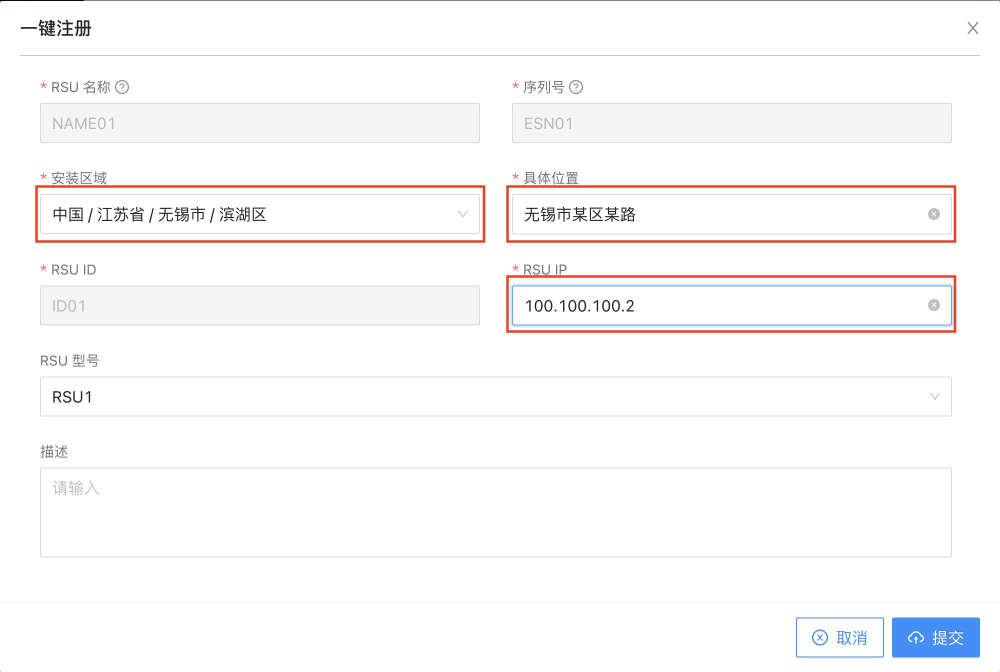
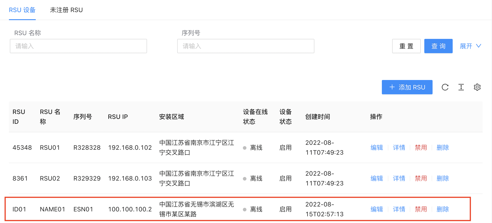
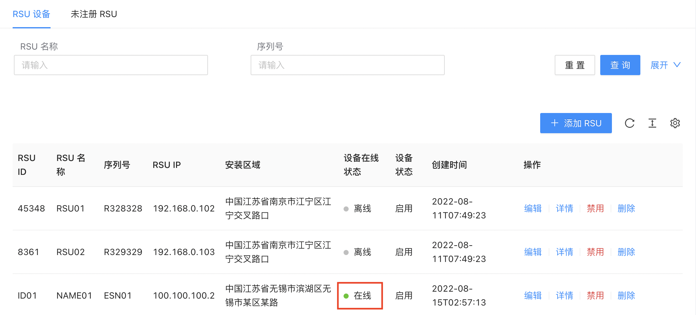
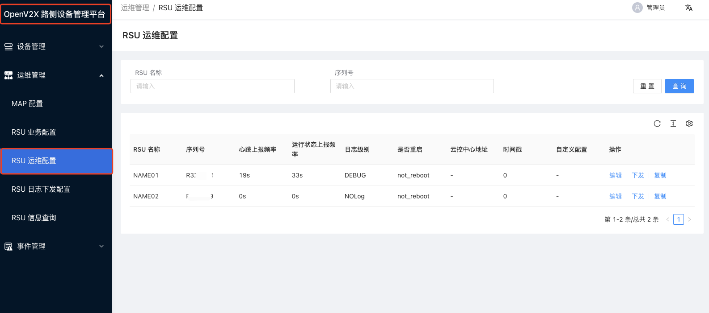

# OpenV2X 中心云控平台用户快速操作手册

## 1. 登录 OpenV2X 中心云控平台（Central Omega Portal）

OpenV2X 中心云控平台网址：`http://{center-node-host}:2288/user/login` 输入正确的用户名、密码(username: admin password:
dandelion)可登录平台。下拉框内选择任意边缘站点：

## 2. RSU 的快速注册和配置

本部分主要描述如果将部署好的 RSU 设备接入 OpenV2X 中心云控平台，以及接入后可对 RSU 设备进行相关配置等操作。

若您尚未实际部署 RSU 设备，仅仅是想体验 OpenV2X 中心云控平台系统，您也可以直接下拉到‘RSE 模拟器操作’部分，我们为您提供了 RSE 模拟器，您可通过模拟器体验 RSU
设备的一些数据上传、下发的操作及数据展示信息。

### 2.1 RSU 设备快速接入

在云控平台添加 RSU 设备时，需先完成以下工作：

- RSU 设备完成现场部署后，获取 RSU 设备信息，其中设备序列号信息必须和 RSU 设备一致，否则 RSU 无法完成接入。
- 获取云控平台设备侧接入地址及端口，并在 RSU 上完成配置。

如果您想使用 RSE 模拟器部署一个虚拟 RSU，可以通过以下步骤实现:

1. 打开 RSE 模拟器: `http://{edge-node-host}:6688`

2. 在 Connection 模块，点击 ‘Connect’，连接 MQTT 服务器。

  若连接成功，则红色未连接标识 ‘disconnected’
会变为绿色连接标识‘connected’，此时代表您已成功连接 MQTT 服务器。

Connection：该部分主要为 MQTT 服务器的相关信息，若您自己有服务器，输入服务器对应的信息。

| 字段        | 释义     |
| --------- | ------ |
| Host      | 服务器地址  |
| Path      |        |
| Port      |        |
| ClientID  |        |
| Username  | 服务器用户名 |
| Password  | 服务器密码  |
| KeepAlive |        |

3. 在 Subscriptions 中添加监听主题 V2X/RSU/INFO/UP，点击 Subscribe 进行监听。

| 字段    | 释义       |
| ----- | -------- |
| Topic | 主题，可修改   |
| Qos   | 服务质量水平   |
| Color | 主题颜色，可选择 |

4. 点击 RSU_INFO 中 preview 查看数据，将数据复制到 publish 的 message 中，修改 rsuEsn 字段，点击 publish 发送数据。

注意：用 RSE 模拟器发送消息，需要先订阅消息主题。

| 字段      | 释义                     |
| ------- | ---------------------- |
| Topic   | 主题，需符合新四跨协议，中间用 ‘/’ 间隔 |
| Qos     | 服务质量水平                 |
| Retain  | 消息是否会被保存               |
| Message | 消息内容，需符合新四跨协议          |

5. 查看中心云控平台 RSU 设备，此时在设备管理页面 RSU 设备中查看，应能发现新增未注册 RSU 数据。可以通过一键注册按钮进行注册，并仅需填入：经度、纬度、IP
   这三个必要信息。录入信息后，点击提交，注册成功后，会在设备管理页面中查看到注册成功的提示。

6. 使用 RSE 模拟器模拟 RSU 心跳上报。首先在 Connection 模块中点击 ‘Disconnect’ 断开之前的连接，将 ClientID 替换成刚注册的 RSU 的 Esn
   编码，然后点击 ‘Connect’，连接 MQTT 服务器。

接下来在 Heartbeat 模块，可修改设置 RSU 心跳频率，点击 ‘Start’，开始发送设置的心跳频率，并可查看每次发送成功的时间；点击 ‘Pause’，停止发送心跳频率。

最后可以在RSU 设备界面上看到 RSU 设备在线状态为“在线”

RSU 接入步骤：

1. 进入 OpenV2X 中心云控平台，在左侧栏选择“设备管理-RSU 设备->添加 RSU”。

2. 在添加页面需录入以下信息：

- “RSU 名称”：仅支持中文、字母、数字、下划线、中划线，名称长度阈值为 64 个字符。

- “RSU 序列号”：即 RSU 的 ESN。仅支持字母、数字、下划线，长度阈值为 64 个字符。

- "RSU ID"：输入RSU的实际 ID 号。

- “RSU IP”：输入RSU的实际 IP 号。

- “经度”：该 RSU 实际部署位置的经度。

- “纬度”：该 RSU 实际部署位置的纬度。

- “RSU 型号”：下拉列表，选择新增的 RSU 设备的型号。型号选择数据需要提前在设备类型配置中进行 RSU 类型配置。

- “描述”：针对该 RSU 的描述。字符不限制。

3. 点击“提交”，完成 RSU 设备的注册接入。回到 RSU 设备列表中，当设备列表中 RSU 设备状态为“在线”时，表示该 RSU 设备接入成功。

### 2.2 RSU 业务配置

添加参数模板：

1. 进入 OpenV2X 中心云控平台，点击“运维管理-> RSU 业务配置->添加配置”；

2. 在添加页面需录入以下信息：

 

**基本信息**

- “配置名称”：仅支持中文、字母、数字、下划线、中划线，名称长度阈值为 64 个字符。

**参数配置模板**

BsmConfig(车辆基本安全消息配置)：

- “采样方式”：仅支持单选，选项分为全局采样、按 ID 采样。

- “采样率”：仅支持输入 0 及以上的正整数。0 表示不需要转发。

- “上行转发上限”：仅支持输入 0 及以上的正整数。0 表示不需要转发。

- “过滤规则”：可输入需要过滤的规则，输入规则后，只有满足这个条件的数据才转发上报。

RsiConfig(路侧单元信息配置)：

- “过滤规则”：可输入需要过滤的规则，输入规则后，只有满足这个条件的数据才转发上报。

RsmConfig(周边交通参与者基本安全状态信息配置)：

- “上行转发上限”：仅支持输入 0 及以上的正整数。0 表示不需要转发。

- “过滤规则”：可输入需要过滤的规则，输入规则后，只有满足这个条件的数据才转发上报。

MapConfig(地图消息配置)：

- “上行转发上限”：仅支持输入 0 及以上的正整数。0 表示不需要转发。

- “过滤规则”：可输入需要过滤的规则，输入规则后，只有满足这个条件的数据才转发上报。

SpatConfig(信号灯消息配置)：

- “上行转发上限”：仅支持输入 0 及以上的正整数。0 表示不需要转发。

- “过滤规则”：可输入需要过滤的规则，输入规则后，只有满足这个条件的数据才转发上报。

**参数配置适用的 RSU**

- 将已创建的未配置的参数的 RSU 以列表形式展示，可勾选符合本次参数配置要求的 RSU 设备。

3. 点击“提交”，完成 RSU 参数模板的配置，并根据勾选的 RSU 将配置的参数信息更新进相应的 RSU 设备。

### 2.3 RSU 运维配置

可对设备进行远程配置，包括心跳上报频率、运行状态上报频率等。

1. 进入 OpenV2X 中心云控平台，点击“运维管理-> RSU 运维配置->运维列表->操作‘编辑’”；

2. 在编辑页面需修改以下信息：

- “心跳上报频率”：默认展示 0s，可输入 0 及大于 0 的正整数。

- “运行状态上报频率”：默认展示 0s，可输入 0 及大于 0 的正整数。

- “日志级别”：根据新四跨协议选项分为DEBUG、INFO、WARN、ERROR、NOlog，根据需要选择对应的日志级别。

- “是否重启”：根据新四跨协议选项分为重启、不重启，根据需要可选择或者不选择。

- “云控中心地址”：若有，则填入对应的地址。

- “时间戳”：默认展示 0s，表示立即生效。可输入 0 及大于 0 的正整数。

- “自定义配置”：可输入配置名、配置值，用于统一管理。

3. 在编辑页面修改相应的信息后，点击“确定”，完成配置信息的修改。

### 2.4 RSU 日志下发配置

添加下发配置：

1. 进入 OpenV2X 中心云控平台，点击“运维管理-> RSU 日志上报配置下发->添加配置”

2. 在添加页面需录入以下信息：

- “日志上传地址”：输入该日志上传的地址。

- “日志服务器的用户名”：输入实际的用户名，符号、字符不限。

- “日志服务器的密码”：输入实际的密码，符号、字符不限。

- “服务器类型”：下拉选项，目前选项为：http/https/ftp/sftp/other。

- “关联 RSU”：选择配置下发的 RSU。

3. 点击“提交”，完成日志下发配置。

### 2.5 RSU 信息查询

1. 进入 OpenV2X 中心云控平台，点击“运维管理-> RSU 信息查询->查询指令”

2. 在下发查询指令对话框需选择以下信息：

- “查询信息列类型”：下拉选择，单选，选项为：‘RSU 运行状态信息’、‘V2X 数据统计信息’、‘接入 RSU 的设备信息’。

- “查询信息时间区间”：下拉选项，单选，选项为：‘一小时之内’、‘一天之内’、‘一周之内’、‘系统开机到现在’。

- “查询的 RSU”：下拉选项，可多选，选项展示所有已注册的 RSU 设备名称。

3. 点击“确定”，完成查询指令的下发。回到信息查询列表中，在列表的操作栏点击‘详情’，可查看对应设备响应的信息。

## 3. 进入交通大屏

1. 进入 OpenV2X 中心云控平台，点击“交通大屏”

2. 使用 RSE 模拟器发送交通信息，在 RSE 模拟器的 DataSet 模块中，主要模拟的是 RSU 设备采集到的交通路口车辆协同、碰撞等信息上传至 OpenV2X
   云控平台后的展示。我们已为您内置了一些数据集信息（暂不支持修改），您可点击‘Preview’ 进行预览；也可选择一些数据，点击 ‘Publish’，发送消息。

勾选需要模拟的车辆轨迹数据，可在 OpenV2X 云控中心平台查看模拟的车辆行驶轨迹展示。具体路径： 步骤1：勾选车辆轨迹模拟数据，如`CLC_track`、`msg_VIR_CLC`等；
步骤2：点击 ‘Publish’；

步骤3：进入交通大屏，查看车辆轨迹模拟展示。

步骤4：在 Send Messages 模块，可查看发送消息的代码。

---

详细使用说明，请参考用户手册: [OpenV2X 用户手册](./v2x-user-manual.md)

关于 RSE 模拟器的详细使用说明，请参考 [RSE 模拟器使用说明](./v2x_rse_simulator_instruction.md)
