# 基础组件

在 OpenV2X 项目中主要涉及三个基础组件服务，分别为：MQTT 消息服务（EMQX）、非关系型数据库服务（Redis）和 关系型数据库服务（MariaDB）。

## 1. MQTT 消息服务

### 1.1 MQTT Broker 简介

MQTT Broker 也称为 MQTT 消息服务器，它可以是运行了 MQTT 消息服务器软件的一台服务器或一个服务器集群。MQTT Broker
负责接收来自客户端的网络连接，并处理客户端的订阅/取消订阅（Subscribe/Unsubscribe）、消息发布（Publish）请求，同时也会将客户端发布的消息转发给其他订阅者。

MQTT Broker 广泛应用于：电力、新能源、智慧城市、智能家居、智能抄表、车联网、金融与支付、运营商等行业。

### 1.2 MQTT 发布订阅模式简述

MQTT 是基于 发布（Publish）/订阅（Subscribe） 模式来进行通信及数据交换的，与 HTTP 的 请求（Request）/应答（Response） 的模式有本质的不同。

订阅者（Subscriber） 会向 消息服务器（Broker） 订阅一个 主题（Topic） 。成功订阅后，消息服务器会将该主题下的消息转发给所有的订阅者。

主题（Topic）以 ‘/’ 为分隔符区分不同的层级。包含通配符 ‘+’ 或 ‘#’ 的主题又称为 主题过滤器（Topic Filters），不含通配符的称为 主题名（Topic Names）
。例如:

```shell
sensor/1/temperature

sensor/1/#

sensor/+/temperature
```

### 1.3 常见开源 MQTT Broker

- [EMQX](https://github.com/emqx/emqx) - EMQX 基于 Erlang/OTP 平台开发，是开源社区中最流行的 MQTT 消息服务器。除了 MQTT
  协议之外，EMQX 还支持 MQTT-SN、CoAP、LwM2M、STOMP 等协议。目前，EMQX 在全球市场已有 5000+ 企业用户，20+ 世界五百强合作伙伴。
- [Eclipse Mosquitto](https://github.com/eclipse/mosquitto) - Mosquitto 是开源时间较早的 MQTT Broker，它包含了一个
  C/C ++ 的客户端库，以及用于发布和订阅的 `mosquitto_pub`、`mosquitto_sub` 命令行客户端。Mosquitto
  比较轻量，适合在从低功耗单板计算机到完整服务器的所有设备上使用。
- [VerneMQ](https://github.com/vernemq/vernemq) - VerneMQ 基于 Erlang/OTP 平台开发，是高性能的分布式 MQTT
  消息代理。它可以在硬件上水平和垂直扩展，以支持大量并发客户端，同时保持较低的延迟和容错能力。
- [HiveMQ CE](https://github.com/hivemq/hivemq-community-edition) - HiveMQ CE 是基于 Java 的开源 MQTT
  消息服务器，它完全支持 MQTT 3.x 和 MQTT 5，是 HiveMQ 企业版消息连接平台的基础。

### 1.4 涉及模块

在 OpenV2X 中有四个模块使用 MQTT 服务，分别是 Cerebrum、Dandelion、Centerview 和 Roadmocker。MQTT 服务作为中间件，用来支持 RSI、RSE
结构化数据、RSM、RSU配置/心跳/状态等消息的转发。


## 2. 非关系型数据库服务

### 2.1 Redis 简介

Redis 是现在最受欢迎的 NoSQL 数据库之一，Redis 是一个使用 ANSI C 编写的开源、包含多种数据结构、支持网络、基于内存、可选持久性的键值对存储数据库，其具备如下特性：

- 基于内存运行，性能高效
- 支持分布式，理论上可以无限扩展
- key-value 存储系统
- 开源的使用 ANSI C 语言编写、遵守 BSD 协议、支持网络、可基于内存亦可持久化的日志型、Key-Value 数据库，并提供多种语言的 API

相比于其他数据库类型，Redis 具备的特点是：

- C/S 通讯模型
- 单进程单线程模型
- 丰富的数据类型
- 操作具有原子性
- 持久化
- 高并发读写
- 支持 lua 脚本

### 2.2 涉及模块

在 OpenV2X 中有两个模块使用 Redis 服务，分别是 Cerebrum 和 Dandelion。在 Cerebrum 中主要用于 Road-side Infomation (RSI) 和
Algorithm Internal Data（AID）的缓存。在 Dandelion 中主要用于一些临时数据的缓存。


## 3. 关系型数据库服务

### 3.1 MariaDB 简介

MariaDB 是由 MySQL 的原始开发人员创建的 MySQL 的流行分支。 它源于与 MySQL 收购 Oracle 有关的问题。 它支持小数据处理任务和企业需求。 它旨在成为 MySQL
的替代，只需要简单的卸载 MySQL 和安装 MariaDB。 MariaDB 提供与 MySQL 等相同的功能。

### 3.2 MariaDB 的主要特性

- 所有 MariaDB 都在 GPL，LGPL 或 BSD 下。

- MariaDB 包括各种存储引擎，包括高性能存储引擎，用于与其他 RDBMS 数据源一起工作。

- MariaDB 使用标准和流行的查询语言。

- MariaDB 在多个操作系统上运行，并支持各种各样的编程语言。

- MariaDB 提供对 PHP 的支持，PHP 是最流行的 Web 开发语言之一。

- MariaDB 提供 Galera 集群技术。

- MariaDB 还提供了许多在 MySQL 中不可用的操作和命令，并消除/取代影响性能的功能。

### 3.3 涉及模块

在 OpenV2X 中有两个模块使用 MariaDB 服务，分别是 Cerebrum 和 Dandelion。主要用于设备信息的存储以支持增删查改操作，以及各种配置信息，如：MAP 配置、RSU
业务配置、RSU 运维配置等的存储。还会用来存储一些临时的数据，如：设备状态、设备告警、RSI 事件等。



## 4 服务安装

上述的三个服务都可以通过 all-in-one 安装脚本 `install.sh` 来安装。对应的 docker-compose 文件如下：

```yaml
version: '2.4'
services:
 mariadb:
  image: 'mariadb:10.5.5'
  container_name: 'mariadb'
  restart: 'always'
  environment:
   MYSQL_USER: 'dandelion'
   MYSQL_PASSWORD: 'your-username'
   MYSQL_ROOT_PASSWORD: 'your-password'
   TZ: 'Asia/Shanghai'
  ports:
   - '3306:3306'
  volumes:
   - '/data/mariadb/:/var/lib/mysql'
   - '/log/mariadb/:/var/log/mysql'
   - '/data/mysql/init:/docker-entrypoint-initdb.d/'
 emqx:
  container_name: 'emqx'
  image: 'emqx/emqx:v4.0.0'
  restart: 'always'
  shm_size: '1G'
  environment:
   EMQX_LOADED_PLUGINS: 'emqx_auth_username,emqx_dashboard,emqx_management,emqx_recon,emqx_retainer,emqx_rule_engine'
   TZ: 'Asia/Shanghai'
   EMQX_ALLOW_ANONYMOUS: 'false'
   EMQX_AUTH__USER__1__USERNAME: 'your-username'
   EMQX_AUTH__USER__1__PASSWORD: 'your-password'
   EMQX_AUTH__USER__PASSWORD_HASH: 'plain'
  ports:
   - '1883:1883'
   - '8081:8081'
   - '15675:8083'
   - '8883:8883'
   - '8084:8084'
   - '18083:18083'
  logging:
   driver: 'json-file'
   options:
    max-size: '100M'
 redis:
  image: 'redis:6.2.4-alpine'
  container_name: 'redis'
  restart: 'always'
  environment:
    TZ: 'Asia/Shanghai'
  command: 'redis-server --requirepass your-password'
  volumes:
   - '/config/redis/conf/:/usr/redis/'
   - '/data/:/data/'
  ports:
   - '6379:6379'
```
