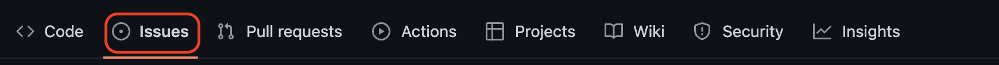
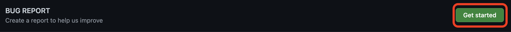
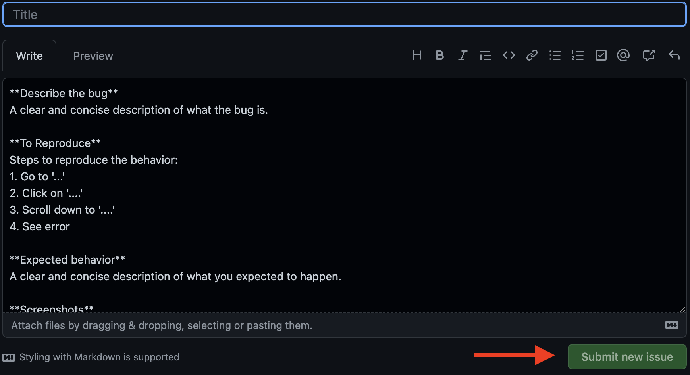
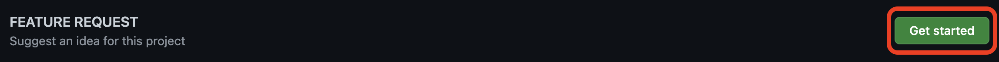
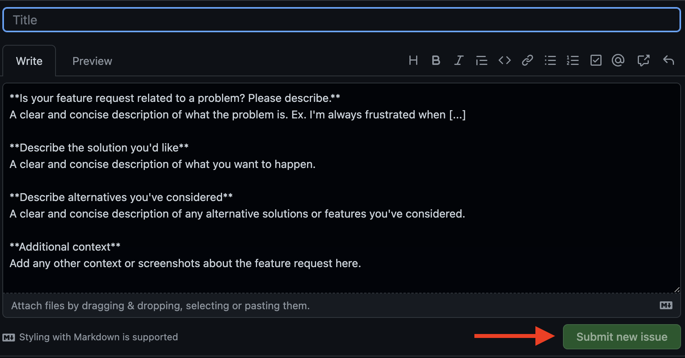
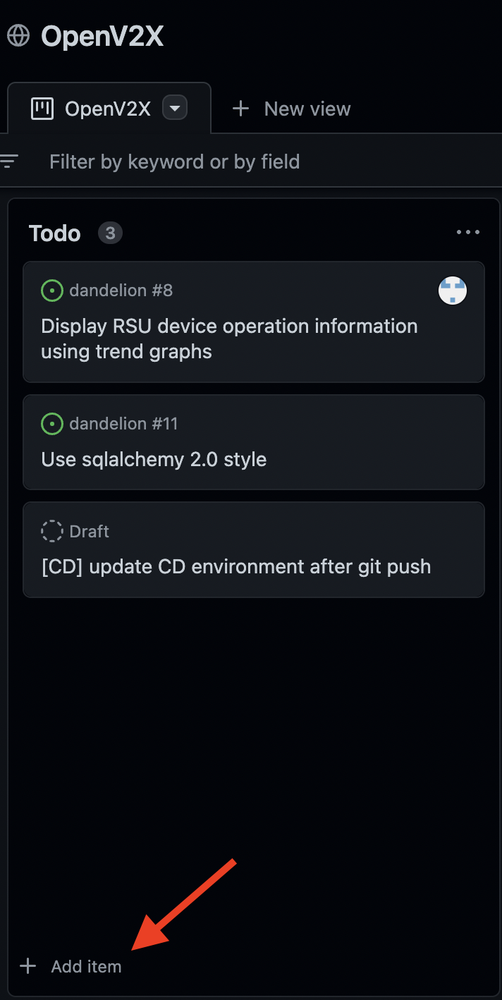
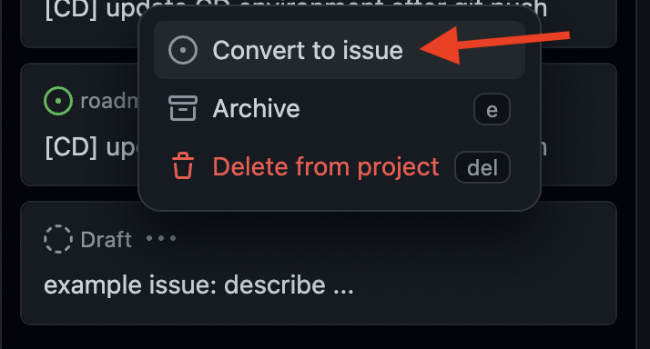
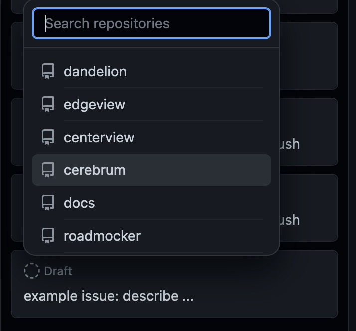
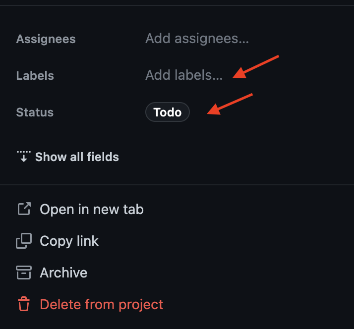

# Contributing to OpenV2X

English | [简体中文](./v2x_contribution-zh_CN.md)

The OpenV2X team is glad to accept contributions from anybody willing to collaborate. There are
different ways to contribute to the project, depending on the capabilities of the contributor. The
team will work as much as possible so that contributions are successfully integrated in OpenV2X.

Take a look and don't hesitate!

- [Contributing to OpenV2X](#contributing-to-openv2x)
  - [Report bugs](#report-bugs)
  - [Request features](#request-features)
  - [Project issue board](#project-issue-board)
  - [Code contributions](#code-contributions)
    - [Before getting started](#before-getting-started)
    - [Coding standard](#coding-standard)
    - [Submission](#submission)
    - [Checklist](#checklist)
  - [Docs contributions](#docs-contributions)

## Report bugs

Issues can be reported in the issue section on GitHub. For different repositories, their issue
sections are seperately as [centerview](https://github.com/open-v2x/centerview/issues),
[cerebrum](https://github.com/open-v2x/cerebrum/issues),
[dandelion](https://github.com/open-v2x/dandelion/issues),
[edgeview](https://github.com/open-v2x/edgeview/issues) and
[roadmocker](https://github.com/open-v2x/roadmocker/issues). Before reporting a new bug, make sure
to do some checkups.

**1. Check if the bug has been reported.** Look it up in that same issue section on GitHub.

**2. Read the docs.** Make sure that the issue is a bug, not a misunderstanding on how is OpenV2X
supposed to work.

**3. Follow the template requirements to submit bugs.** Please follow the template requirements to
fill in the necessary information.  

## Request features

Ideas for new features are also a great way to contribute. Any suggestion that could improve the
users' experience can be submitted in the corresponding GitHub section. These sections are totally
same as the issue sections mentioned above. Please click the **feature request** button and follow
the template requirements to fill in the necessary information. 
 

## Project issue board

If you are not sure which module the bug or feature you want to report belongs to, you can choose to
add the bug or feature to the Todo list in the
[project issue board](https://github.com/orgs/open-v2x/projects/3), and then convert the bug or
feature to the issue in the corresponding repository after confirming the module. You can also set
the status(Todo/In Progress/Done) and label(Bug/Feature) of this issue after converting.

**example of converting draft to issue:**

**example of setting status and label:**

## Code contributions

Before starting hands-on on coding, please check out the **issue board** to check what is the team
already working on, to avoid overlapping. In case of doubt or to discuss how to proceed, please
contact one of us (or send an email to contact@openv2x.org).

In order to start working, fork the **corresbonding OpenV2X repository**, and clone said fork in
your computer. Remember to
[keep your fork in sync](https://docs.github.com/en/enterprise/2.13/user/articles/syncing-a-fork)
with the original repository.

**Rerfer to: [Developer Guide](v2x_developer_guide.md)**

### Before getting started

Check out the [OpenV2X Architectural Design document](v2x-architectural-design.md) to get an idea on
the different modules that compose OpenV2X. Choose the most appropriate one to hold the new feature.
Feel free to contact the team in case any doubt arises during the process.

### Coding standard

Follow the current coding standard when submitting new code.

### Submission

First commit your patch to your forked repo. Once the contribution is ready, submit a pull-request
from your forked repo. Please
[link your **pull request** to the cooresponding
issue](https://docs.github.com/en/issues/tracking-your-work-with-issues/linking-a-pull-request-to-an-issue),
you can either link a pull request to an issue using a keyword or manually link a pull request to an
issue. For more details about `pull request`, please refer to the
[Pull Request Standard](./v2x_pull_request_standard-zh_CN.md). Note that there are some checks that
the new code is required to pass before merging. The checks are automatically run by the continuous
integration system. A green tick mark will appear if the checks are successful. If a red mark,
please correct the code accordingly.

### Checklist

- Your branch is up-to-date with the `dev` branch and tested with latest changes.
- Extended the README/documentation, if necessary.
- Code compiles correctly.
- All tests passing with `tox` or `npm test`.

## Docs contributions

If some documentation is missing, vague or imprecise, it can be reported as with any other bug (read
the previous section on [how to report bugs](#report-bugs)). However, users can contribute by
writing documentation. To submit docs contributions, follow the same workflow explained right above
in [code contributions](#code-contributions). To sum up, contributions are made in a child branch
from `dev` and merged to said branch.
