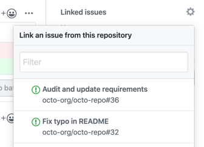

# OpenV2X Pull-Request 规范

## 概述

Pull Request（以下用 pr 代称） 需要严格遵循以下原则**：

- 一个 pr 只围绕一件事
- 避免过大的 pr

### 一个 pr 只围绕一件事

一个 pr 应该只负责一件事，这遵循设计模式中的**单一职责原则**

如何定义_一件事_：

- 处理了一个 issue
- 解决了一个 bug
- 新增了一个组件或功能
- 重构代码实现了某**一个**目的

> **一个 pr 可以包含多个 commit，但要注意尺度，保证 pr 不要过大**

### 避免过大的 pr

> 该条规则对于新增组件的 pr 例外

一个 pr 的文件改变最好少于**12个文件**（排除 build 产生的文件）

## 信息填写

### Title

#### pr 仅包含一个 commit

直接使用 Github 默认填写的信息，即 Title 为 commit msg 的 subject 部分，Content 为 commit msg 的 body 部分

#### pr 包含多个 commit

描述清楚这个 pr 所做的事情。

例如：

- 修复 cerebrum 无法连接 redis 的问题
- 新增 dandelion API lidar 设备增删改查功能
- 删除 Makefile 文件
- 更新 README 文件

> 注意英文单词左右添加一个空格方便阅读

动词建议从下列选项中选取：

- Add（组件、属性、API）

- Fix (bug)

- Modify

- Delete

### Content

如果 title 已经描述清楚了此次 pr 的目的，则 Content 可以留空，否则应该对此次 pr 进行详细的描述

## 其他规则

### 连接 issue

如果这个 pr 解决了某个 issue 提出的 bug 或者 feature，则应在 pr 中将此 issue 关联起来

参考:
<https://docs.github.com/cn/issues/tracking-your-work-with-issues/linking-a-pull-request-to-an-issue>

在 pr 描述中 使用如下关键字可将 issue 关联起来：

- close
- closes
- closed
- fix
- fixes
- fixed
- resolve
- resolves
- resolved

示例： close #756

然后在下图中设置关联issue：

> 关联 issue 的好处：

> - 可以在 issue 界面快速跳转到这个 pr，查看修复的情况
> - 在该 pr 被合并进 master 分支后，对应 issue 会被自动 close。所以连接了 pr 的 issue 不需要手动 close
