**OpenV2X 路测设备模拟器(RSE Simulator)功能使用说明**

**RSE Simulator 功能使用说明**

**1、RSE Simulator 应用范围**

RSE Simulator 为开发者在未部署实际 RSU 的情况下，可使用 RSE 模拟器来模拟 RSU 设备发送消息。如下图为可联调测试的消息类别及提供的 DataSet，除了默认提供的
DataSet 外，开发者也可自定义消息进行测试。

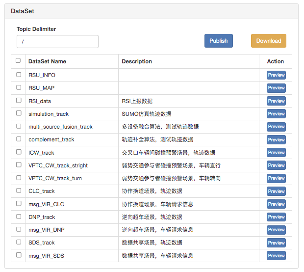

**2、RSE Simulator 使用方法**

2.1 RSU 的 DataSet 消息发布操作步骤

在浏览器输入 RSE Simulator 地址 http://\<ip-address\>:6688，进入 RSE 模拟器页面。

在 Connetion 的面板中填写 MQTT 和 RSU 的信息，点击 connect 创建连接。

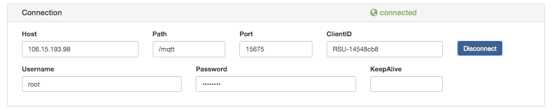

在 Heartbeat 的面板中创建 RSU 的心跳连接，输入 Rate 的数值，点击 Start。

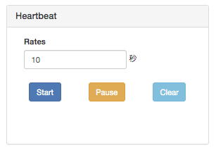

在 DataSet 的面板中勾选要测试的 DataSetName ，点击 publis 进行发布。

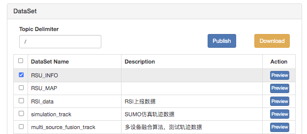

其中 RSU_INFO ,RSU_MAP ,RSI_data，可登录 Open V2X 路侧设备管理平台的所在地址
http://\<ip-address\>，在管理平台的界面中查看消息测试发布的情况。对于这三者之外的其他 DataSet 消息，需要登录 Open V2X Cental Portal
云控中心大屏所在的地址 http://\<ip-address\>:8080 查看 。

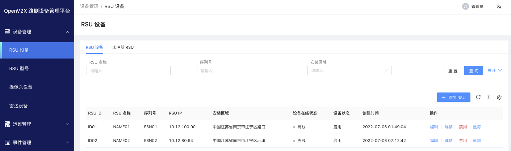

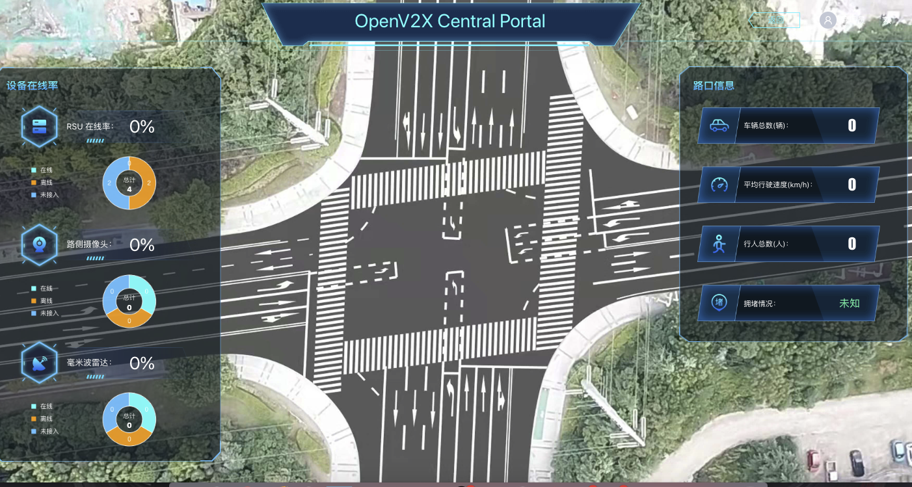

2.2 RSU 的自定义消息发布操作步骤

在 Publish 的面板中输入对应的 Topic，和 message，选择 Qos 以及 Retain，点击 publish 按钮可对自定义消息进行发布。

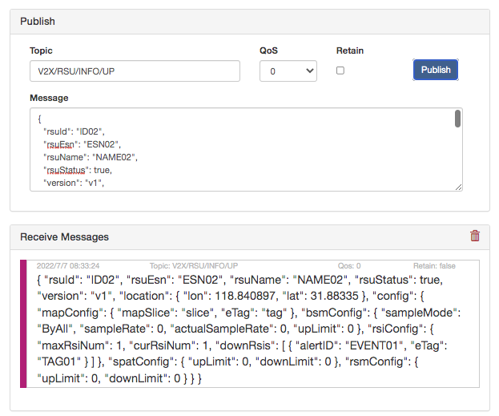

若在 Subscriptions 中输入 Topic，点击 Subscribe 订阅了相应的消息，则可如上图看到 Receive Messags 的相应内容。

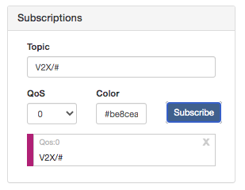

**3、RSE Simulator 的模拟消息测试详细说明**

下面将针对 DataSet 中每一种消息的模拟测试做分项说明。

**3.1 OpenV2X 路侧设备管理平台的消息调试**

**3.1.1 RSU_INFO**

【RSU_INFO 概述】

路侧设备 RSU 向路侧管理平台上报自身的 RSU_INFO 信息。上报的信息中除了 rsuId 等基本信息，还包括 map、bsm、rsi、spat、rsm
的配置信息。当配置信息修改的时候，在模拟器中会监听到该改动。

【模拟器操作】

（1）创建 MQ 和 RSU 的连接，设置心跳连接。

（2）在 DataSet 中勾选 RSU_INFO，点击 publish，在路侧管理平台查看消息的界面效果。

【路侧管理平台效果】

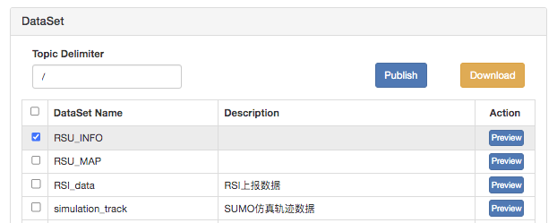

在路侧管理平台\>设备管理\> RSU 设备\>未注册 RSU 下，可以查看平台接收的 RSU_INFO 消息界面效果。

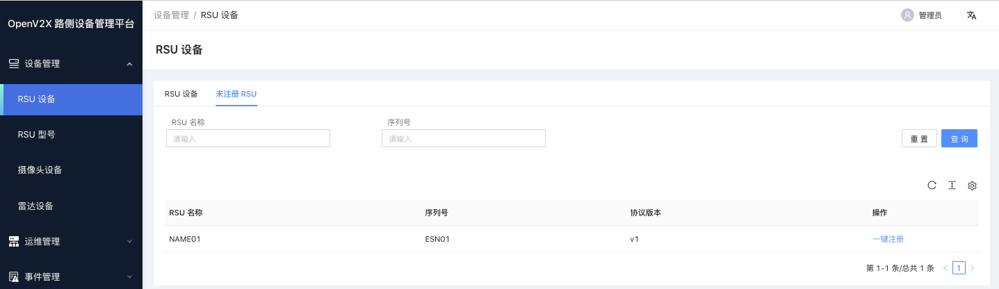

**3.1.2 RSU_MAP**

【RSU_MAP 概述】

路侧设备 RSU 路侧管理平台上报局部区域的地图信息可以包含多个路口和区域的地图数据。在路侧管理平台的 Map 配置中可以查看上报的 Map 信息。

【模拟器操作】

（1）创建 MQ 和 RSU 的连接，设置 ClientID 为 ESN01，设置心跳连接。

（2）在 DataSet 中勾选 RSU_MAP，点击 publish，在路侧管理平台查看消息的界面效果。

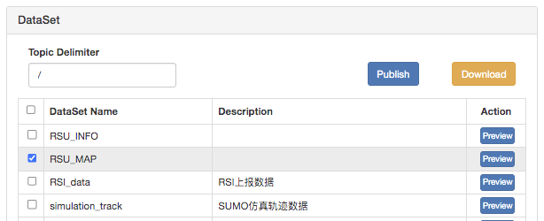

【路侧管理平台效果】

在路侧管理平台\>运维管理\> MAP配置下，可以查看到平台接收的 RSU_MAP 消息的界面效果。

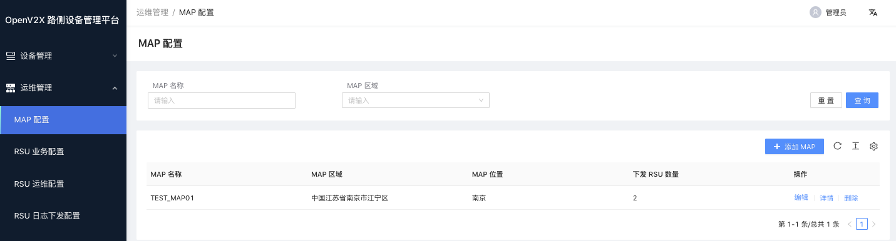

**3.1.3 RSI_data**

【RSI_data 概述】

当车辆 A 在驾驶在遇到恶劣天气、异常路况、异常车况等事件信息，路侧感知设备比如雷达、摄像头将感知信息传输到 RSU 设备，通过 RSU 设备传输到 5G MEC 边缘平台，在 5G MEC
边缘平台的计算单元将感知信息进行计算处理，解析出的 RSI 的数据消息，该 RSI 消息通过 MQTT 上报到路侧管理平台。在路侧管理平台的路侧单元信息（RSI）中可以查看不同的事件类型 RSI
信息。

【模拟器操作】

（1）创建 MQ 和 RSU 的连接，设置 ClientID 为 ESN01，设置心跳连接。

（2）在 DataSet 中勾选 RSI_data，点击 publish，在路侧管理平台查看界面效果。

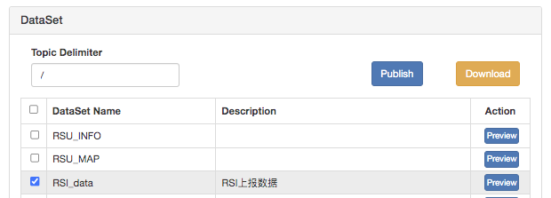

【路侧管理平台效果】

在路侧管理平台\>事件管理\>路侧单元信息（RSI）配置下，可以查看到平台接收的 RSI_data 消息的界面效果。【没有数据显示】

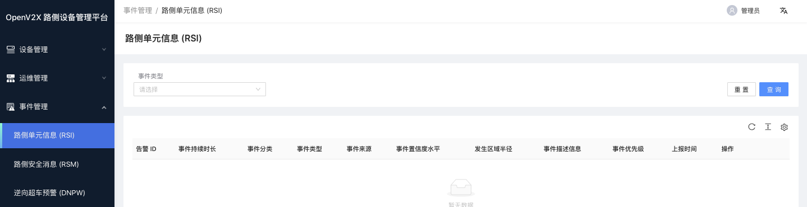

**3.2 OpenV2X Central Portal 算法消息调试**

**3.2.1 simulation_track**

【simulation_track 概述】

利用开源仿真软件 SUMO，构建多个车辆仿真轨迹数据，将这些轨迹数据传输到 RSU，通过 RSU 设备传输到 5G MEC 边缘平台，在 5G MEC
边缘平台的计算单元对多车轨迹数据进行计算处理，解析出的 RSM 的数据消息，在 Central Portal 展示路口的多个车辆驾驶轨迹。

【模拟器操作】

（1）创建 MQ 和 RSU 的连接，设置 ClientID 为 R328328，设置心跳连接。

（2）在 DataSet 中勾选 simulation_track，点击 publish。

（3）在地址栏输入地址时，esn=R328328，在 Central Portal 平台查看界面效果。

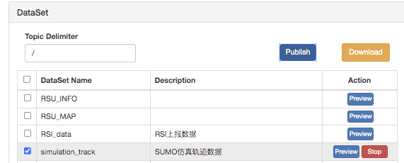

【OpenV2X Central Portal 平台效果】

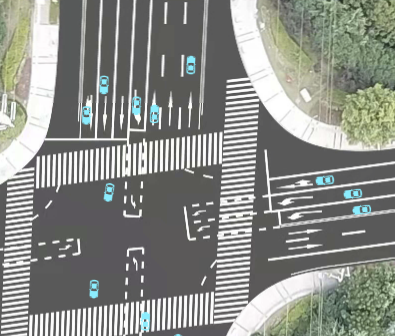

**3.2.2 multi_source_fusion_track**

【multi_source_fusion_track 概述】

适用于城市道路的多源感知融合。

驾驶在道路中的车辆 A，通过多个路侧感知设备比如雷达、摄像头将感知信息传输到 RSU 设备，通过 RSU 设备传输到 5G MEC 边缘平台，从多个来源的感知设备会产生不同多源数据，在 5G MEC
边缘平台的计算单元对多源感知信息进行计算处理，通过对多源数据进行配对和融合，结合运动的轨迹历史数据，在 Central Portal 展示该车辆 A 应用多源感知融合算法生成的精准轨迹。

【模拟器操作】

（1）创建 MQ 和 RSU 的连接，设置 ClientID 为 R328328，设置心跳连接。

（2）在 DataSet 中勾选 multi_source_fusion_track，点击 publish。

（3）在 Publish 中输入 Topic 和 Message，点击 publish。

（4）在地址栏输入地址时，esn=R328328，在 Central Portal 平台查看界面效果。

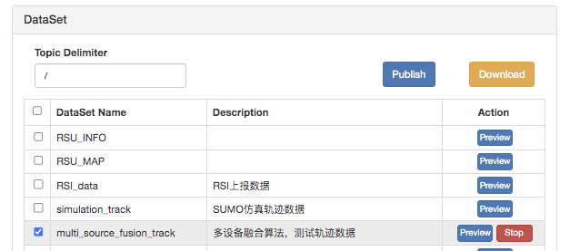

【OpenV2X Central Portal 平台效果】

未融合前

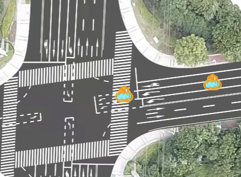

融合后

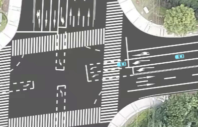

**3.2.3 complement_track**

【 complement_track 概述】

适用于城市道路的轨迹补全。

驾驶在道路中的车辆 A，通过多个路侧感知设备比如雷达、摄像头将感知信息传输到 RSU 设备，通过 RSU 设备传输到 5G MEC边缘平台，由于在车辆A运动中获得的感知信息存在轨迹点缺失的现象，通过
5G MEC 边缘平台计算单元对轨迹进行补全，在 Central Portal 展示该车辆 A 补全后的运动轨迹。

【模拟器操作】

（1）创建 MQ 和 RSU 的连接，设置 ClientID 为 R328328，设置心跳连接。

（2）在 DataSet 中勾选 complement_track，点击 publish。

（3）在地址栏输入地址时，esn=R328328，在 Central Portal 平台查看界面效果。

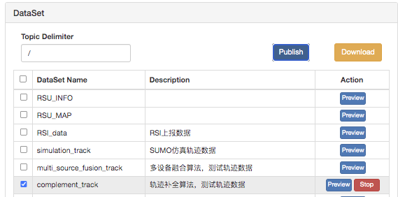

【OpenV2X Central Portal 平台效果】

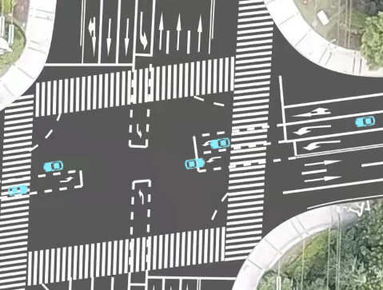

**3.2.4 ICW_track**

【 ICW_track 概述】

适用于城市道路交叉路口的碰撞预警。

车辆 A 在交叉路口直行起步准备驶入路口时，与驶入的侧向来车 B 存在碰撞的危险，在 Central Portal 展示该碰撞预警场景，对可能发生碰撞的车辆 A 和车辆 B
进行预警，预警时在车辆周身出现橙色标识，车顶出现警告标志，更直观的展示可能发生碰撞的车辆及过程。

【模拟器操作】

（1）创建 MQ 和 RSU 的连接，设置 ClientID 为 R328328，设置心跳连接。

（2）在 DataSet 中勾选 ICW_track，点击 publish。

（3）在地址栏输入地址时，esn=R328328，在 Central Portal 平台查看界面效果。

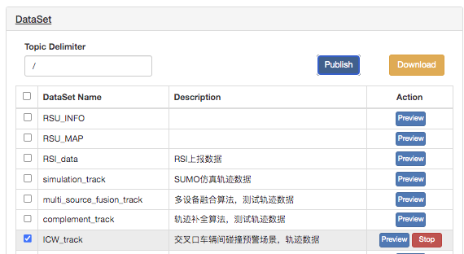

【OpenV2X Central Portal 平台效果】

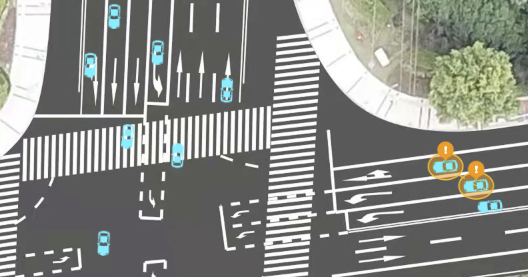

**3.2.5 VPTC_CW_track_stright**

【 VPTC_CW_track_stright 概述】

适用于城市道路的弱势交通参与者碰撞预警。

车辆 A 直行时，行人 P 和非机动车 N 从侧前方出现，检测到可能发生碰撞的危险，在 Central Portal 展

示该碰撞预警场景，对可能发生碰撞的车辆和行人、非机动车周身出现橙色标识，车顶出现警告标志，

更直观的展示可能发生碰撞的车辆和弱势交通参与者及过程。

【模拟器操作】

（1）创建 MQ 和 RSU 的连接，设置 ClientID 为 R328328，设置心跳连接。

（2）在 DataSet 中勾选 VPTC_CW_track_stright，点击 publish。

（3）在 Publish 中输入 Topic 和 Message，点击 publish。

（4）在地址栏输入地址时，esn=R328328，在 Central Portal 平台查看界面效果。

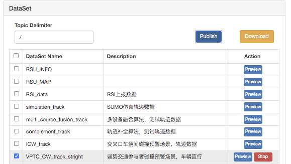

【OpenV2X Central Portal 平台效果】

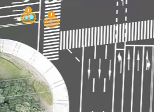 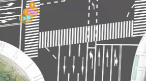

**3.2.6 VPTC_CW_track_turn**

【 VPTC_CW_track_turn 概述】

适用于城市道路的弱势交通参与者碰撞预警。

车辆 A 拐弯时，行人 P 和非机动车 N 从侧前方出现，检测到可能发生碰撞的危险，在 Central Portal 展

示该碰撞预警场景，对可能发生碰撞的车辆和行人、非机动车周身出现橙色标识，车顶出现警告标志，

更直观的展示可能发生碰撞的车辆和弱势交通参与者及过程。

【模拟器操作】

（1）创建 MQ 和 RSU 的连接，设置 ClientID 为 R328328，设置心跳连接。

（2）在 DataSet 中勾选 VPTC_CW_track_turn，点击 publish。

（3）在 Publish 中输入 Topic 和 Message，点击 publish。

（4）在地址栏输入地址时，esn=R328328，在 Central Portal 平台查看界面效果。

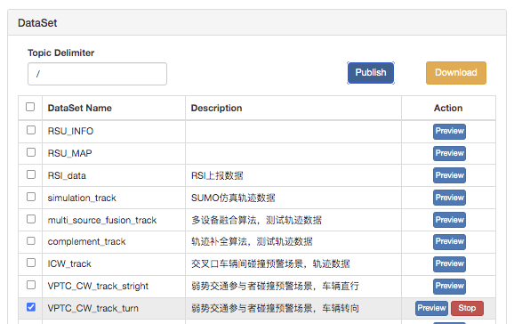

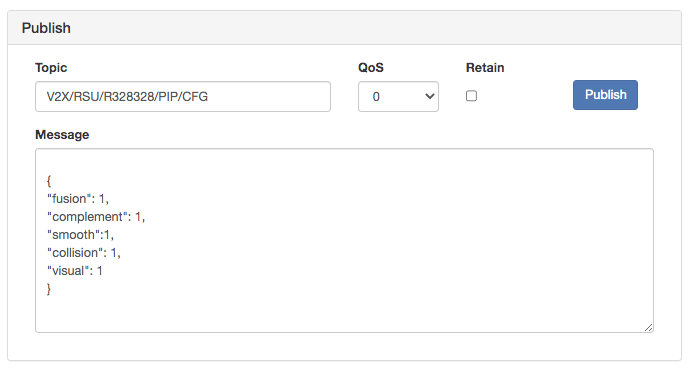

【OpenV2X Central Portal 平台效果】

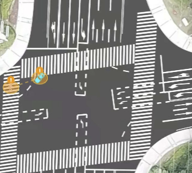 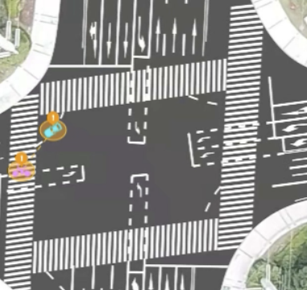

**3.2.7 CLC_track&msg_VIR_CLC**

【CLC_track&msg_VIR_CLC 概述】

适用于城市道路的车辆协作换道。

车辆 A 驾驶过程中，当前车道出现障碍车辆时，触发车辆换道意图，检测车辆 A 是否与相邻车存在换道风险，当不存在换道风险的时候，车辆 A 从当前车道，变道至目标车道，实现变道。Central
Portal 同时展示该协作换道场景，对要进行换道的车辆周身出现橙色标识，并显示换道的引导线来引导车辆 A 完成换道，更直观的展示进行协作换道的车辆及过程。

【模拟器操作】

（1）创建 MQ 和 RSU 的连接，设置 ClientID 为 R328328，设置心跳连接。

（2）在 DataSet 中同时勾选 CLC_track 和 msg_VIR_CLC，点击 publish。

（3）在地址栏输入地址时，esn=R328328，在 Central Portal 平台查看界面效果。

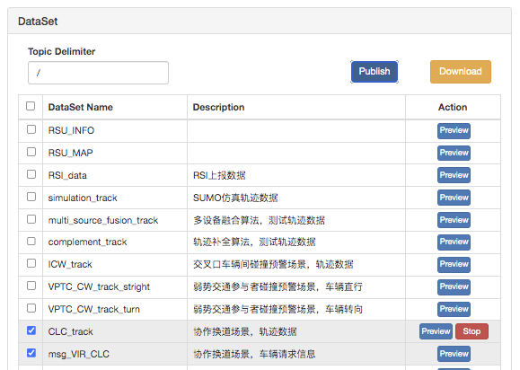

【OpenV2X Central Portal 平台效果】

【效果图显示待开发优化】

**3.2.8 DNP_track&msg_VIR_DNP**

【 DNP_track&msg_VIR_DNP 概述】

适用于城市道路的逆向超车预警。

车辆 A 驾驶过程中，当前车道出现障碍车辆时，触发逆向超车意图，检测车辆 A 是否满足超车条件，当存在逆向超车风险时进行预警。当不存在逆向超车风险的时候，车辆 A
从当前车道，驾驶到对向车道再回到当前车道来超越前车，实现车辆 A 的逆向超车。在 Central Portal 展示该逆向超车场景的预警提示。超车车辆 A
周身出现绿色标识，表示可以进行逆向超车，出现橙色标识，对车辆 A 逆向超车进行预警，不建议超车。

【模拟器操作】

（1）创建 MQ 和 RSU 的连接，设置 ClientID 为 R328328，设置心跳连接。

（2）在 DataSet 中同时勾选 DNP_track 和 msg_VIR_DNP，点击 publish。

（3）在地址栏输入地址时，esn=R328328，在 Central Portal 平台查看界面效果。

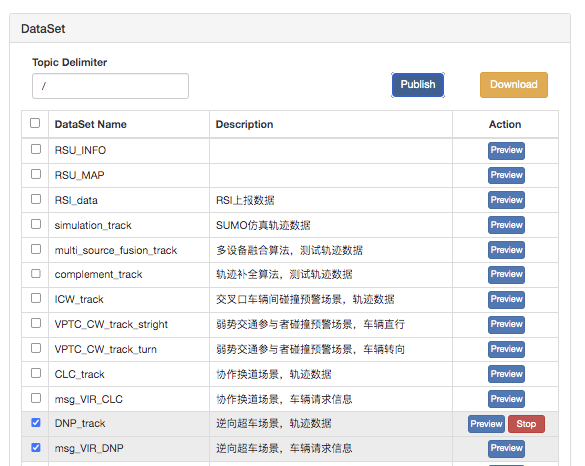

【OpenV2X Central Portal 平台效果】

【效果图显示待开发优化】

**3.2.9 SDS_track&msg_VIR_SDS**

【 SDS_track&msg_VIR_SDS 概述】

适用于城市通道路的车辆感知共享。

当车辆 A 发出感知共享请求，希望获得邻近车辆的共享信息，比如共享信息为障碍物或者弱势交通参与者。在 Central Portal 展示感知共享场景，当前感知共享请求车辆 A
周身出现紫色标识，邻近范围的接收车辆周身出现橙色标识，展示车辆 A 与邻近的车辆进行感知共享。

【模拟器操作】

（1）创建 MQ 和 RSU 的连接，设置 ClientID 为 R328328，设置心跳连接。

（2）在 DataSet 中同时勾选 SDS_track 和 msg_VIR_SDS，点击 publish。

（3）在地址栏输入地址时，esn=R328328，在 Central Portal 平台查看界面效果。

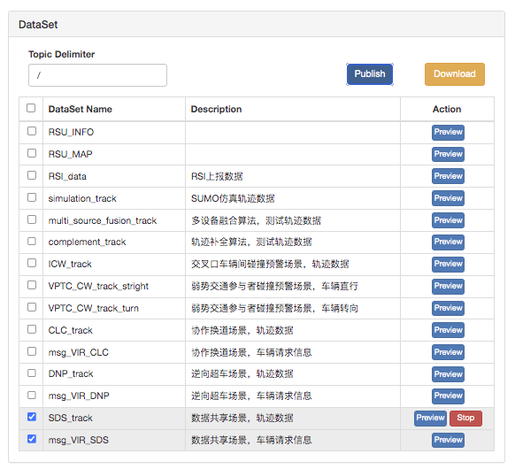

【OpenV2X Central Portal 平台效果】

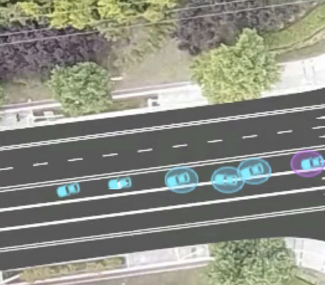
