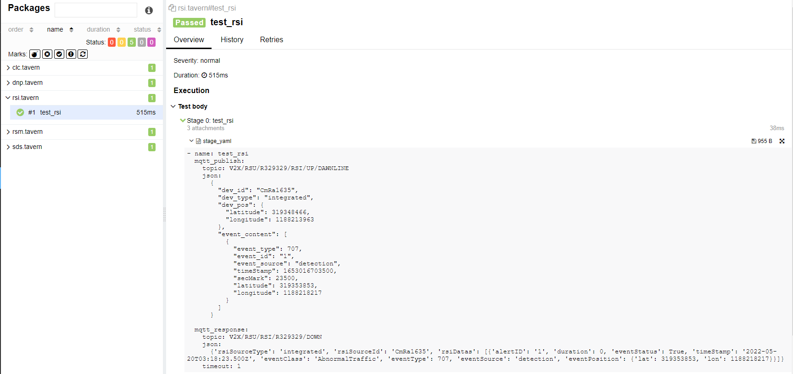
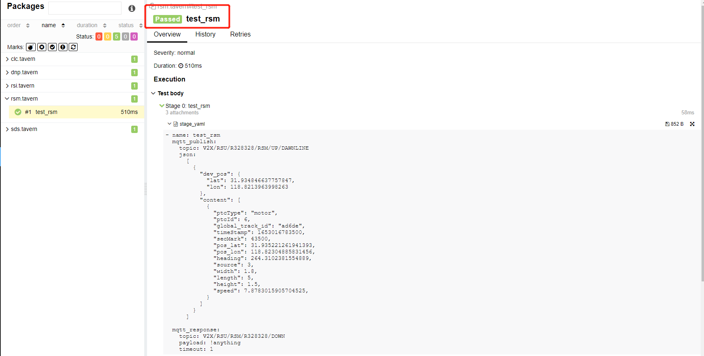
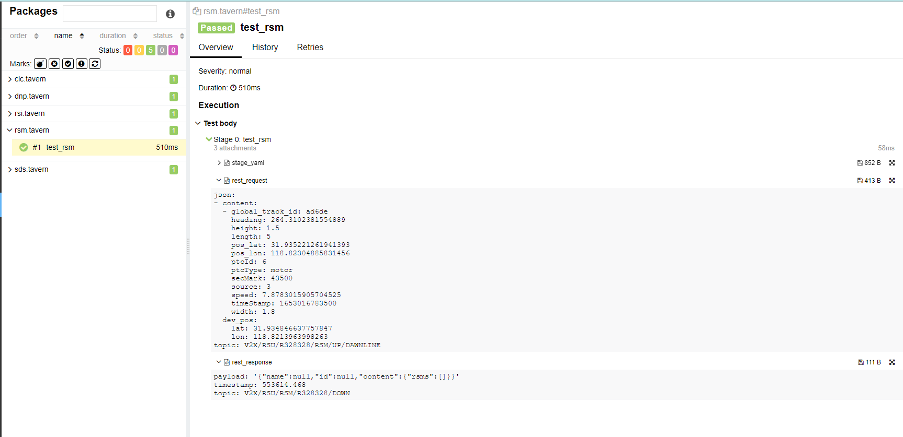
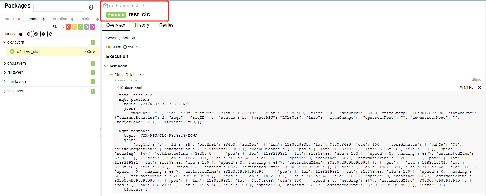
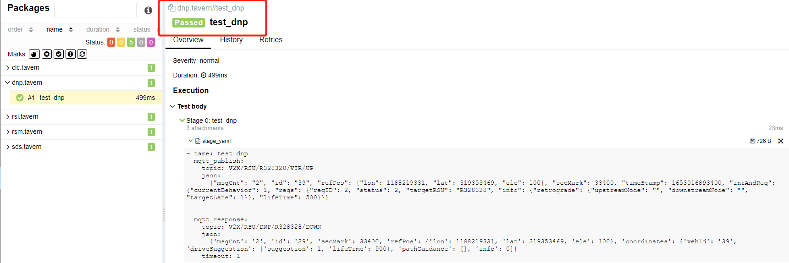
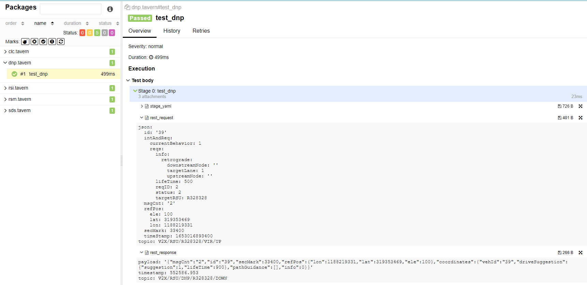
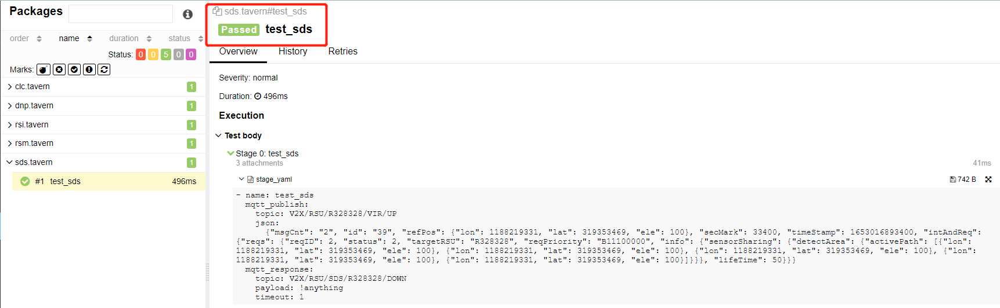
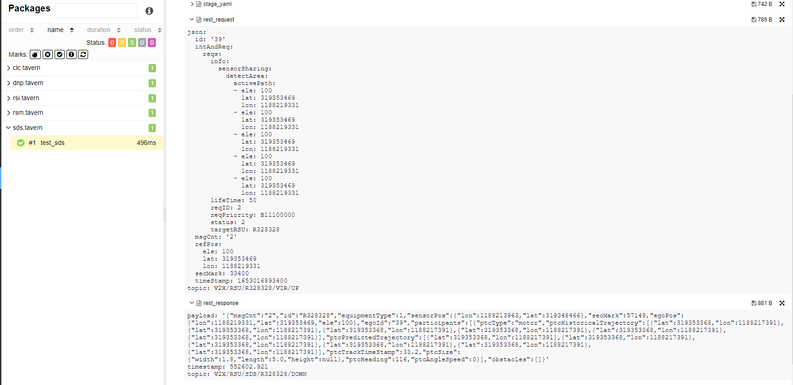

# 算法功能测试

根据架构图以及算法整体调用逻辑，整体分为3大部分(数据适配与转换，数据融合与强化，场景应用)对算法功能进行测试。

①.3.1 -> 4.2

非标准rsi数据转标准rsi数据

②.3.1 -> 4.1 -> 5.1

非标准rsm数据转标准rsm数据后，经过预处理算法（融合、补全、平滑、碰撞）

③.3.3 -> 6.1/7.1

场景算法功能测试（逆向超车、协同变道、感知数据共享）

测试工具：tavern+pytest+allure

## 1、3.1 -> 4.2 （test_rsi）

### ①.测试配置

```yaml
host: 106.15.193.98
port: 1883
Username: root
Password: abc@1234
Publish Topic:  V2X/RSU/R329329/RSI/UP/DAWNLINE
Subscribe Topic:  V2X/RSU/RSI/R329329/DOWN
```

### ②.测试数据

```
Publish:
{
"dev_id": "CmRa1635",
"dev_type": "integrated",
"dev_pos": {
"latitude": 319348466,
"longitude": 1188213963
},
"event_content": [
{
"event_type": 707,
"event_id": "1",
"event_source": "detection",
"timeStamp": 1653016703500,
"secMark": 23500,
"latitude": 319353853,
"longitude": 1188218217
}
]
}
Subscribe:
        {'rsiSourceType': 'integrated', 'rsiSourceId': 'CmRa1635', 'rsiDatas': [{'alertID': '1', 'duration': 0, 'eventStatus': True, 'timeStamp': '2022-05-20T03:18:23.500Z', 'eventClass': 'AbnormalTraffic', 'eventType': 707, 'eventSource': 'detection', 'eventPosition': {'lat': 319353853, 'lon': 1188218217}}]}
```

### ③.测试脚本(rsi.tavern.yaml)

```yaml
test_name: test_rsi
paho-mqtt:
  client:
    transport: tcp
    client_id: rsi
  connect:
    host: 106.15.193.98
    port: 1883
    timeout: 3
  auth:
    username: root
    password: abc@1234

stages:
  - name: test_rsi
    mqtt_publish:
      topic: V2X/RSU/R329329/RSI/UP/DAWNLINE
      json:
        {
          "dev_id": "CmRa1635",
          "dev_type": "integrated",
          "dev_pos": {
            "latitude": 319348466,
            "longitude": 1188213963
          },
          "event_content": [
            {
              "event_type": 707,
              "event_id": "1",
              "event_source": "detection",
              "timeStamp": 1653016703500,
              "secMark": 23500,
              "latitude": 319353853,
              "longitude": 1188218217
            }
          ]
        }

    mqtt_response:
      topic: V2X/RSU/RSI/R329329/DOWN
      json:
        {'rsiSourceType': 'integrated', 'rsiSourceId': 'CmRa1635', 'rsiDatas': [{'alertID': '1', 'duration': 0, 'eventStatus': True, 'timeStamp': '2022-05-20T03:18:23.500Z', 'eventClass': 'AbnormalTraffic', 'eventType': 707, 'eventSource': 'detection', 'eventPosition': {'lat': 319353853, 'lon': 1188218217}}]}
      timeout: 1
```

### ④.测试结果




## 2、3.1 -> 4.1 -> 5.1（test_rsm）

### ①.测试配置

```yaml
host: 106.15.193.98
port: 1883
Username: root
Password: abc@1234
Publish Topic:  V2X/RSU/R328328/RSM/UP/DAWNLINE
Subscribe Topic:  V2X/RSU/RSM/R328328/DOWN
```

### ②.测试数据

```
Publish:
[
{
"dev_pos": {
"lat": 31.934846637757847,
"lon": 118.8213963998263
},
"content": [
{
"ptcType": "motor",
"ptcId": 6,
"global_track_id": "ad6de",
"timeStamp": 1653016783500,
"secMark": 43500,
"pos_lat": 31.935221261941393,
"pos_lon": 118.82304885831456,
"heading": 264.3102381554889,
"source": 3,
"width": 1.8,
"length": 5,
"height": 1.5,
"speed": 7.8783015905704525,
}
]
}
]
```

### ③.测试脚本(rsm.tavern.yaml)

```yaml
test_name: test_rsm
paho-mqtt:
  client:
    transport: tcp
    client_id: rsm
  connect:
    host: 106.15.193.98
    port: 1883
    timeout: 3
  auth:
    username: root
    password: abc@1234

stages:
  - name: test_rsm
    mqtt_publish:
      topic: V2X/RSU/R328328/RSM/UP/DAWNLINE
      json:
        [
          {
            "dev_pos": {
              "lat": 31.934846637757847,
              "lon": 118.8213963998263
            },
            "content": [
              {
                "ptcType": "motor",
                "ptcId": 6,
                "global_track_id": "ad6de",
                "timeStamp": 1653016783500,
                "secMark": 43500,
                "pos_lat": 31.935221261941393,
                "pos_lon": 118.82304885831456,
                "heading": 264.3102381554889,
                "source": 3,
                "width": 1.8,
                "length": 5,
                "height": 1.5,
                "speed": 7.8783015905704525,
              }
            ]
          }
        ]

    mqtt_response:
      topic: V2X/RSU/RSM/R328328/DOWN
      payload: !anything
      timeout: 1
```

### ④.测试结果





## 3、3.3 -> 6.1/7.1 (test_scenario)

### 3.1 (test_clc)

#### ①.测试配置

```yaml
host: 106.15.193.98
port: 1883
Username: root
Password: abc@1234
Publish Topic:  V2X/RSU/R328328/VIR/UP
Subscribe Topic:  V2X/RSU/CLC/R328328/DOWN
```

#### ②.测试数据

```
Publish:
        {"msgCnt": "2", "id": "39", "refPos": {"lon": 1188219331, "lat": 319353469, "ele": 100}, "secMark": 33400, "timeStamp": 1653016893400, "intAndReq": {"currentBehavior": 2, "reqs": {"reqID": 2, "status": 2, "targetRSU": "R328328", "info": {"laneChange": {"upstreamNode": "", "downstreamNode": "", "targetLane": 1}}, "lifeTime": 500}}}     
Subscribe:
        { 'msgCnt': '2', 'id': '39', 'secMark': 33400, 'refPos': { 'lon': 1188219331, 'lat': 319353469, 'ele': 100 }, 'coordinates': { 'vehId': '39', 'driveSuggestion': { 'suggestion': 2, 'lifeTime': 800 }, 'pathGuidance': [ { 'pos': { 'lon': 1188219331, 'lat': 319353468, 'ele': 100 }, 'speed': 0, 'heading': 6677, 'estimatedTime': 33200.0 }, { 'pos': { 'lon': 1188219331, 'lat': 319353468, 'ele': 100 }, 'speed': 0, 'heading': 6677, 'estimatedTime': 33200.1 }, { 'pos': { 'lon': 1188219331, 'lat': 319353468, 'ele': 100 }, 'speed': 0, 'heading': 6677, 'estimatedTime': 33200.2 }, { 'pos': { 'lon': 1188219331, 'lat': 319353468, 'ele': 100 }, 'speed': 0, 'heading': 6677, 'estimatedTime': 33200.299999999996 }, { 'pos': { 'lon': 1188219331, 'lat': 319353468, 'ele': 100 }, 'speed': 0, 'heading': 6677, 'estimatedTime': 33200.399999999994 }, { 'pos': { 'lon': 1188219331, 'lat': 319353468, 'ele': 100 }, 'speed': 0, 'heading': 6677, 'estimatedTime': 33200.49999999999 }, { 'pos': { 'lon': 1188219331, 'lat': 319353468, 'ele': 100 }, 'speed': 0, 'heading': 6677, 'estimatedTime': 33200.59999999999 }, { 'pos': { 'lon': 1188219331, 'lat': 319353468, 'ele': 100 }, 'speed': 0, 'heading': 6677, 'estimatedTime': 33200.69999999999 }, { 'pos': { 'lon': 1188219331, 'lat': 319353468, 'ele': 100 }, 'speed': 0, 'heading': 6677, 'estimatedTime': 33200.79999999999 }, { 'pos': { 'lon': 1188219331, 'lat': 319353468, 'ele': 100 }, 'speed': 0, 'heading': 6677, 'estimatedTime': 33200.89999999999 } ], 'info': 0 } }
```

#### ③.测试脚本(clc.tavern.yaml)

```yaml
test_name: test_clc
paho-mqtt:
  client:
    transport: tcp
    client_id: clc
  connect:
    host: 106.15.193.98
    port: 1883
    timeout: 3
  auth:
    username: root
    password: abc@1234

stages:
  - name: test_clc
    mqtt_publish:
      topic: V2X/RSU/R328328/VIR/UP
      json:
        {"msgCnt": "2", "id": "39", "refPos": {"lon": 1188219331, "lat": 319353469, "ele": 100}, "secMark": 33400, "timeStamp": 1653016893400, "intAndReq": {"currentBehavior": 2, "reqs": {"reqID": 2, "status": 2, "targetRSU": "R328328", "info": {"laneChange": {"upstreamNode": "", "downstreamNode": "", "targetLane": 1}}, "lifeTime": 500}}}

    mqtt_response:
      topic: V2X/RSU/CLC/R328328/DOWN
      json:
        { 'msgCnt': '2', 'id': '39', 'secMark': 33400, 'refPos': { 'lon': 1188219331, 'lat': 319353469, 'ele': 100 }, 'coordinates': { 'vehId': '39', 'driveSuggestion': { 'suggestion': 2, 'lifeTime': 800 }, 'pathGuidance': [ { 'pos': { 'lon': 1188219331, 'lat': 319353468, 'ele': 100 }, 'speed': 0, 'heading': 6677, 'estimatedTime': 33200.0 }, { 'pos': { 'lon': 1188219331, 'lat': 319353468, 'ele': 100 }, 'speed': 0, 'heading': 6677, 'estimatedTime': 33200.1 }, { 'pos': { 'lon': 1188219331, 'lat': 319353468, 'ele': 100 }, 'speed': 0, 'heading': 6677, 'estimatedTime': 33200.2 }, { 'pos': { 'lon': 1188219331, 'lat': 319353468, 'ele': 100 }, 'speed': 0, 'heading': 6677, 'estimatedTime': 33200.299999999996 }, { 'pos': { 'lon': 1188219331, 'lat': 319353468, 'ele': 100 }, 'speed': 0, 'heading': 6677, 'estimatedTime': 33200.399999999994 }, { 'pos': { 'lon': 1188219331, 'lat': 319353468, 'ele': 100 }, 'speed': 0, 'heading': 6677, 'estimatedTime': 33200.49999999999 }, { 'pos': { 'lon': 1188219331, 'lat': 319353468, 'ele': 100 }, 'speed': 0, 'heading': 6677, 'estimatedTime': 33200.59999999999 }, { 'pos': { 'lon': 1188219331, 'lat': 319353468, 'ele': 100 }, 'speed': 0, 'heading': 6677, 'estimatedTime': 33200.69999999999 }, { 'pos': { 'lon': 1188219331, 'lat': 319353468, 'ele': 100 }, 'speed': 0, 'heading': 6677, 'estimatedTime': 33200.79999999999 }, { 'pos': { 'lon': 1188219331, 'lat': 319353468, 'ele': 100 }, 'speed': 0, 'heading': 6677, 'estimatedTime': 33200.89999999999 } ], 'info': 0 } }
      timeout: 1
```

#### ④.测试结果




### 3.2 (test_dnp)

#### ①.测试配置

```yaml
host: 106.15.193.98
port: 1883
Username: root
Password: abc@1234
Publish Topic:  V2X/RSU/R328328/VIR/UP
Subscribe Topic:  V2X/RSU/DNP/R328328/DOWN
```

#### ②.测试数据

```
Publish:
        {"msgCnt": "2", "id": "39", "refPos": {"lon": 1188219331, "lat": 319353469, "ele": 100}, "secMark": 33400, "timeStamp": 1653016893400, "intAndReq": {"currentBehavior": 1, "reqs": {"reqID": 2, "status": 2, "targetRSU": "R328328", "info": {"retrograde": {"upstreamNode": "", "downstreamNode": "", "targetLane": 1}}, "lifeTime": 500}}}
Subscribe:      
        {'msgCnt': '2', 'id': '39', 'secMark': 33400, 'refPos': {'lon': 1188219331, 'lat': 319353469, 'ele': 100}, 'coordinates': {'vehId': '39', 'driveSuggestion': {'suggestion': 1, 'lifeTime': 900}, 'pathGuidance': [], 'info': 0}}
```

#### ③.测试脚本(dnp.tavern.yaml)

```yaml
test_name: test_dnp
paho-mqtt:
  client:
    transport: tcp
    client_id: rsi
  connect:
    host: 106.15.193.98
    port: 1883
    timeout: 3
  auth:
    username: root
    password: abc@1234

stages:
  - name: test_dnp
    mqtt_publish:
      topic: V2X/RSU/R328328/VIR/UP
      json:
        {"msgCnt": "2", "id": "39", "refPos": {"lon": 1188219331, "lat": 319353469, "ele": 100}, "secMark": 33400, "timeStamp": 1653016893400, "intAndReq": {"currentBehavior": 1, "reqs": {"reqID": 2, "status": 2, "targetRSU": "R328328", "info": {"retrograde": {"upstreamNode": "", "downstreamNode": "", "targetLane": 1}}, "lifeTime": 500}}}
    mqtt_response:
      topic: V2X/RSU/DNP/R328328/DOWN
      json:
        {'msgCnt': '2', 'id': '39', 'secMark': 33400, 'refPos': {'lon': 1188219331, 'lat': 319353469, 'ele': 100}, 'coordinates': {'vehId': '39', 'driveSuggestion': {'suggestion': 1, 'lifeTime': 900}, 'pathGuidance': [], 'info': 0}}
      timeout: 1
```

#### ④.测试结果





### 3.3 (test_sds)

#### ①.测试配置

```yaml
host: 106.15.193.98
port: 1883
Username: root
Password: abc@1234
Publish Topic:  V2X/RSU/R328328/VIR/UP
Subscribe Topic:  V2X/RSU/SDS/R328328/DOWN
```

#### ②.测试数据

```
Publish:
        {"msgCnt": "2", "id": "39", "refPos": {"lon": 1188219331, "lat": 319353469, "ele": 100}, "secMark": 33400, "timeStamp": 1653016893400, "intAndReq": {"reqs": {"reqID": 2, "status": 2, "targetRSU": "R328328", "reqPriority": "B11100000", "info": {"sensorSharing": {"detectArea": {"activePath": [{"lon": 1188219331, "lat": 319353469, "ele": 100}, {"lon": 1188219331, "lat": 319353469, "ele": 100}, {"lon": 1188219331, "lat": 319353469, "ele": 100}, {"lon": 1188219331, "lat": 319353469, "ele": 100}, {"lon": 1188219331, "lat": 319353469, "ele": 100}]}}}, "lifeTime": 50}}}
```

#### ③.测试脚本(sds.tavern.yaml)

```yaml
test_name: test_sds
paho-mqtt:
  client:
    transport: tcp
    client_id: rsi
  connect:
    host: 106.15.193.98
    port: 1883
    timeout: 3
  auth:
    username: root
    password: abc@1234

stages:
  - name: test_sds
    mqtt_publish:
      topic: V2X/RSU/R328328/VIR/UP
      json:
        {"msgCnt": "2", "id": "39", "refPos": {"lon": 1188219331, "lat": 319353469, "ele": 100}, "secMark": 33400, "timeStamp": 1653016893400, "intAndReq": {"reqs": {"reqID": 2, "status": 2, "targetRSU": "R328328", "reqPriority": "B11100000", "info": {"sensorSharing": {"detectArea": {"activePath": [{"lon": 1188219331, "lat": 319353469, "ele": 100}, {"lon": 1188219331, "lat": 319353469, "ele": 100}, {"lon": 1188219331, "lat": 319353469, "ele": 100}, {"lon": 1188219331, "lat": 319353469, "ele": 100}, {"lon": 1188219331, "lat": 319353469, "ele": 100}]}}}, "lifeTime": 50}}}
    mqtt_response:
      topic: V2X/RSU/SDS/R328328/DOWN
      payload: !anything
      timeout: 1
```

#### ④.测试结果





## 4.测试结论

根据allure报告可得出结论，返回的数据符合新四跨协议标准，算法各功能测试都通过。
