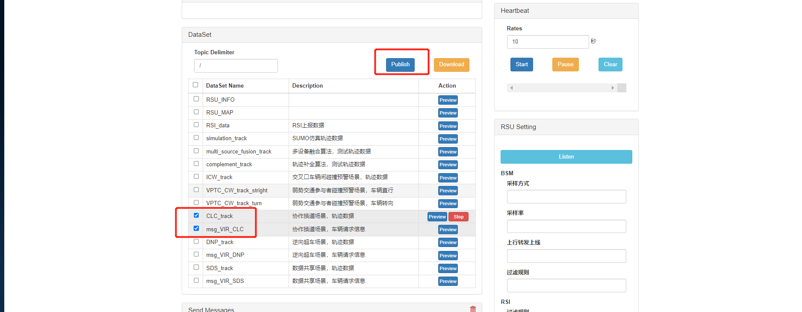
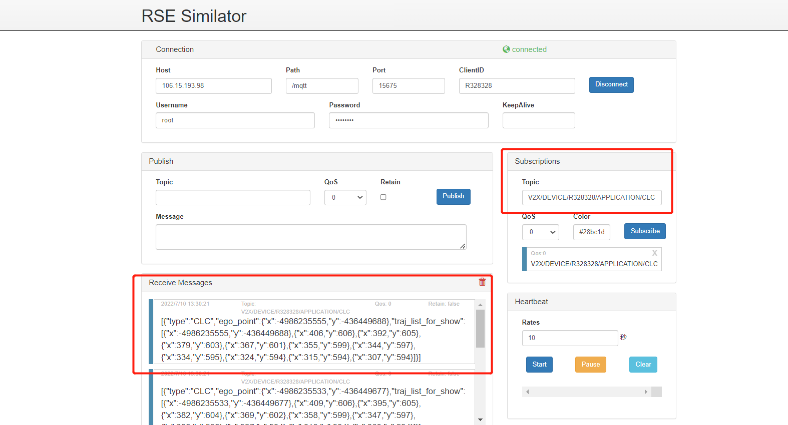
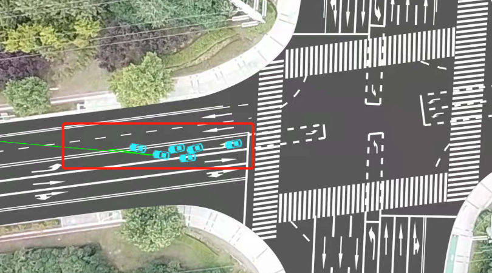

# 协作换道场景

## 1. 测试工具

RSU模拟器

## 2. 配置

```yaml
Host:  106.15.193.98
Path:  /mqtt
Port:  15675
ClientID:  R328328
Username:  root
Password: abc@1234
Publish1 Topic:  V2X/RSU/R328328/RSM/UP/DAWNLINE
Publish2 Topic:  V2X/RSU/R328328/VIR/UP
Subscribe Topic:  V2X/DEVICE/R328328/APPLICATION/CLC
```

## 3. 测试数据

test_data/CLC_track.json

test_data/msg_VIR_CLC.json

## 4. 测试过程

    1. 打开 rsu 模拟器，填入配置，点击 connect 连接设备
    2. 填入 Subscribe Topic，点击 Subscribe 按钮，下方出现已连接窗口
    3. 选择数据共享场景，轨迹数据 和 数据共享场景，车辆请求信息，再点击Publish
    4. 观察Receive Messages 是否收到数据
    5. 观察云控大屏展示效果







## 5.返回数据(例)

```
[{"type":"CLC","ego_point":{"x":-4986234455,"y":-436449844},"traj_list_for_show":[{"x":-4986234455,"y":-436449844},{"x":501,"y":594},{"x":483,"y":599},{"x":465,"y":606},{"x":448,"y":613},{"x":432,"y":621},{"x":415,"y":629},{"x":399,"y":636},{"x":382,"y":643},{"x":364,"y":648},{"x":347,"y":651}]}]
```

## 6. 测试结论

本测试模拟协作换道场景，由于测试数据的原因，导致车辆未行驶在正确的车道上，但是通过云控大屏显示可知，当车辆发起协作换道请求后，云控大屏出现一条绿色的线指引协作换道，所以协作换道功能测试通过。
