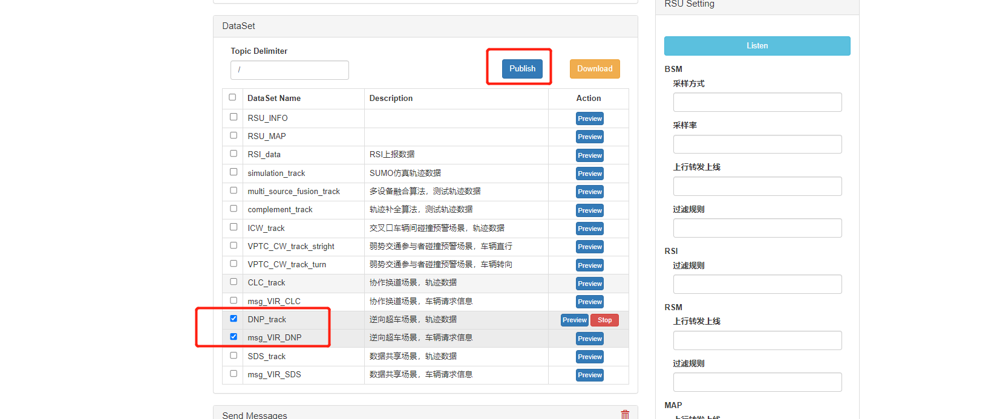
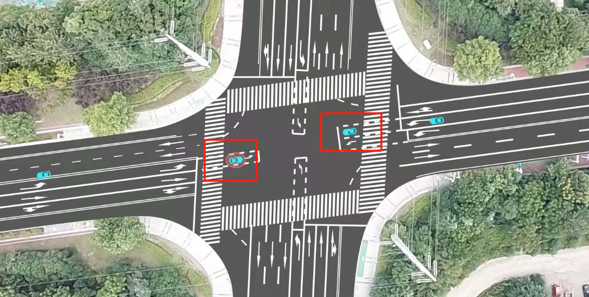

# 逆向超车场景

## 1. 测试工具

RSU模拟器

## 2. 配置

```yaml
Host:  106.15.193.98
Path:  /mqtt
Port:  15675
ClientID:  R328328
Username:  root
Password: abc@1234
Publish1 Topic:  V2X/RSU/R328328/RSM/UP/DAWNLINE
Publish2 Topic:  V2X/RSU/R328328/VIR/UP
Subscribe Topic:  V2X/DEVICE/R328328/APPLICATION/DNP
```

## 3. 测试数据

test_data/DNP_track.json

test_data/msg_VIR_DNP.json

## 4. 测试过程

    1. 打开 rsu 模拟器，填入配置，点击 connect 连接设备
    2. 填入 Subscribe Topic，点击 Subscribe 按钮，下方出现已连接窗口
    3. 选择逆向超车场景，轨迹数据 和 逆向超车场景，车辆请求信息，再点击Publish
    4. 观察Receive Messages 是否收到数据
    5. 观察云控大屏展示效果







## 5.返回数据(例)

```
[{"type":"DNP","ego_point":{"x":282,"y":627},"if_accept":false}]
[{"type":"DNP","ego_point":{"x":360,"y":581},"if_accept":true}]
```

## 6. 测试结论

本测试模拟双车道逆向超车，通过云控大屏显示可知，当对向车道没有车驶来时，超车车辆底下有绿圈亮起，代表可以逆向超车，对向车道有车驶来时，超车车辆底下有红圈亮起，代表不可以逆向超车，功能测试通过。
