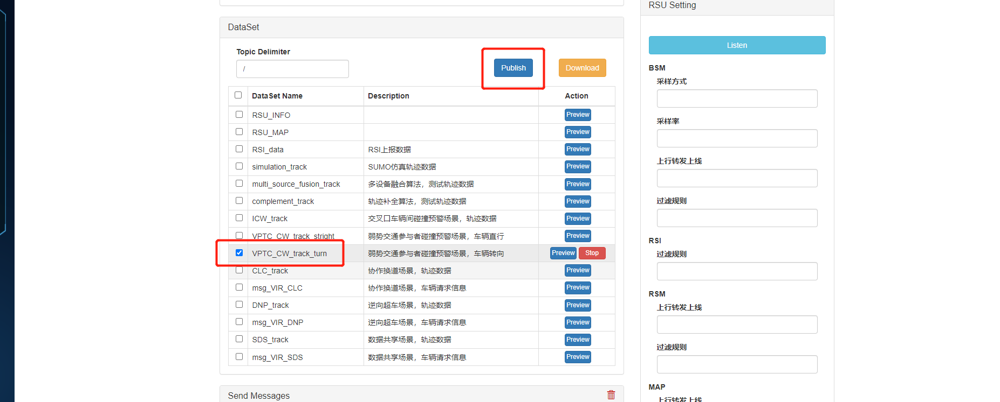
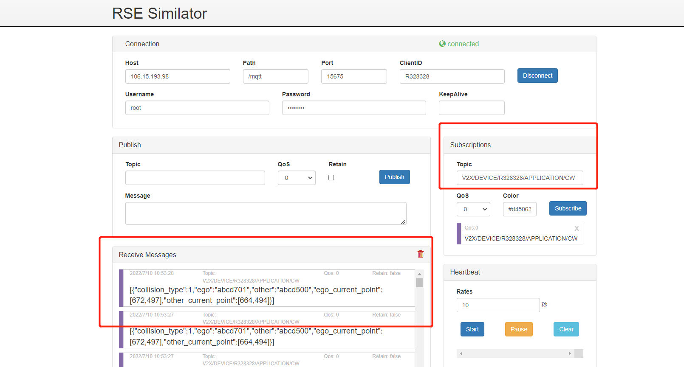

# 弱势交通参与者碰撞预警场景

## 1. 测试工具

RSU模拟器

## 2. 配置

```yaml
Host:  106.15.193.98
Path:  /mqtt
Port:  15675
ClientID:  R328328
Username:  root
Password: abc@1234
Publish Topic:  V2X/RSU/R328328/RSM/UP/DAWNLINE
Subscribe Topic:  V2X/DEVICE/R328328/APPLICATION/CW
```

## 3. 测试数据

test_data/VPTC_CW_track_turn.json

## 4. 测试过程

    1. 打开 rsu 模拟器，填入配置，点击 connect 连接设备
    2. 填入 Subscribe Topic，点击 Subscribe 按钮，下方出现已连接窗口
    3. 选择弱势交通参与者碰撞预警场景，车辆转向，再点击Publish
    4. 观察Receive Messages 是否收到数据
    5. 观察云控大屏展示效果






## 5.返回数据(例)

```
[{"collision_type":1,"ego":"abcd701","other":"abcd500","ego_current_point":[672,497],"other_current_point":[664,494]}]
```

## 6. 测试结论

本测试模拟弱势交通参与者碰撞预警场景， 云控大屏展示正常，弱势交通碰撞提示正常，弱势交通参与者碰撞预警功能测试通过。
