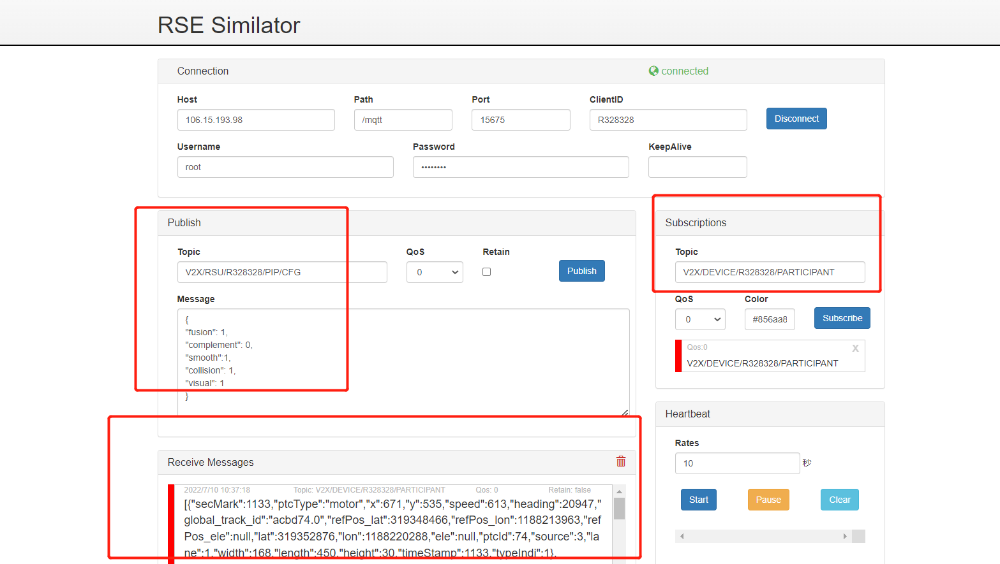

# 轨迹补全算法

## 1. 测试工具

RSU模拟器

## 2. 配置

```yaml
Host:  106.15.193.98
Path:  /mqtt
Port:  15675
ClientID:  R328328
Username:  root
Password: abc@1234
Publish1 Topic:  V2X/RSU/R328328/RSI/UP/DAWNLINE
Publish2 Topic:	 V2X/RSU/R328328/PIP/CFG
Subscribe Topic:  V2X/DEVICE/R328328/PARTICIPANT
```

## 3. 测试数据

test_data/complement_track.json

```
Publish2 :
{
"fusion": 1,
"complement": 0,
"smooth":1,
"collision": 1,
"visual": 1
}
```

## 4. 测试过程

    1. 打开 rsu 模拟器，填入配置，点击 connect 连接设备
    2. 填入 Subscribe Topic，点击 Subscribe 按钮，下方出现已连接窗口
    3. 选择轨迹补全算法，测试轨迹数据，再点击Publish
    4. 观察Receive Messages 是否收到数据
    5. 观察云控大屏展示效果
    6. 发布开融合配置文件，在执行步骤3
    7. 观察云控大屏展示效果





## 5.返回数据(例)

```
[{"secMark":3500,"ptcType":"motor","x":314,"y":588,"speed":613,"heading":20964,"global_track_id":"acbd74.0","refPos_lat":319348466,"refPos_lon":1188213963,"refPos_ele":null,"lat":319353260,"lon":1188216883,"ele":null,"ptcId":74,"source":7,"lane":1,"width":168,"length":450,"height":30,"timeStamp":3500,"typeIndi":1},{"secMark":3500,"ptcType":"motor","x":996,"y":527,"speed":736,"heading":6540,"global_track_id":"acbd86.0","refPos_lat":319348466,"refPos_lon":1188213963,"refPos_ele":null,"lat":319352833,"lon":1188223381,"ele":null,"ptcId":86,"source":7,"lane":2,"width":138,"length":390,"height":30,"timeStamp":3500,"typeIndi":1},{"secMark":3500,"ptcType":"motor","x":734,"y":531,"speed":626,"heading":20933,"global_track_id":"acbd88.0","refPos_lat":319348466,"refPos_lon":1188213963,"refPos_ele":null,"lat":319352838,"lon":1188220897,"ele":null,"ptcId":88,"source":7,"lane":1,"width":174,"length":408,"height":30,"timeStamp":3500,"typeIndi":1},{"secMark":3500,"ptcType":"motor","x":665,"y":577,"speed":364,"heading":6522,"global_track_id":"acbd92.0","refPos_lat":319348466,"refPos_lon":1188213963,"refPos_ele":null,"lat":319353202,"lon":1188220233,"ele":null,"ptcId":92,"source":7,"lane":2,"width":168,"length":384,"height":30,"timeStamp":3500,"typeIndi":1},{"secMark":3500,"ptcType":"motor","x":508,"y":597,"speed":368,"heading":6551,"global_track_id":"acbd93.0","refPos_lat":319348466,"refPos_lon":1188213963,"refPos_ele":null,"lat":319353351,"lon":1188218740,"ele":null,"ptcId":93,"source":7,"lane":2,"width":156,"length":432,"height":30,"timeStamp":3500,"typeIndi":1},{"secMark":3500,"ptcType":"motor","x":1048,"y":488,"speed":736,"heading":20946,"global_track_id":"acbd96.0","refPos_lat":319348466,"refPos_lon":1188213963,"refPos_ele":null,"lat":319352517,"lon":1188223890,"ele":null,"ptcId":96,"source":7,"lane":1,"width":174,"length":455,"height":30,"timeStamp":3500,"typeIndi":1},{"secMark":3500,"ptcType":"motor","x":333,"y":622,"speed":364,"heading":6551,"global_track_id":"acbd101.0","refPos_lat":319348466,"refPos_lon":1188213963,"refPos_ele":null,"lat":319353533,"lon":1188217085,"ele":null,"ptcId":101,"source":7,"lane":2,"width":150,"length":420,"height":30,"timeStamp":3500,"typeIndi":1},{"secMark":3500,"ptcType":"motor","x":1320,"y":447,"speed":613,"heading":20931,"global_track_id":"acbd104.0","refPos_lat":319348466,"refPos_lon":1188213963,"refPos_ele":null,"lat":319352211,"lon":1188226472,"ele":null,"ptcId":104,"source":7,"lane":1,"width":174,"length":413,"height":30,"timeStamp":3500,"typeIndi":1}]
```

## 6. 测试结论

本测试模拟轨迹补全，默认是带有轨迹补全的，因轨迹补全前后需看云控大屏显示效果对比，无法通过截图来展示，但大屏可以看出，没有开轨迹补全算法时，轨迹有点不连续，车会出现明显闪烁情况，开轨迹补全算法后，车的轨迹很连贯，轨迹补全功能测试通过。
