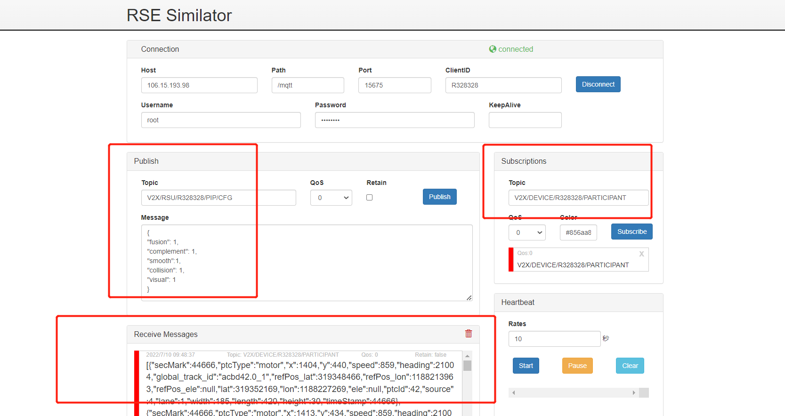
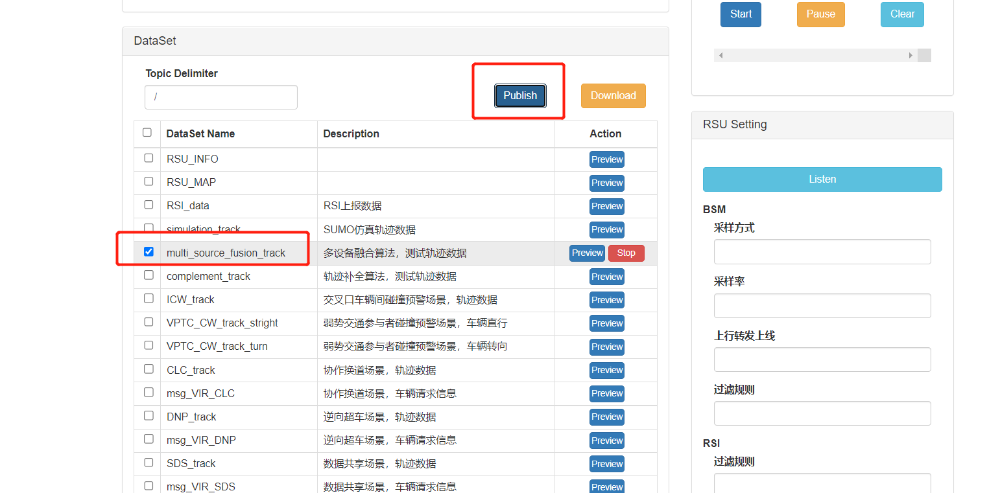
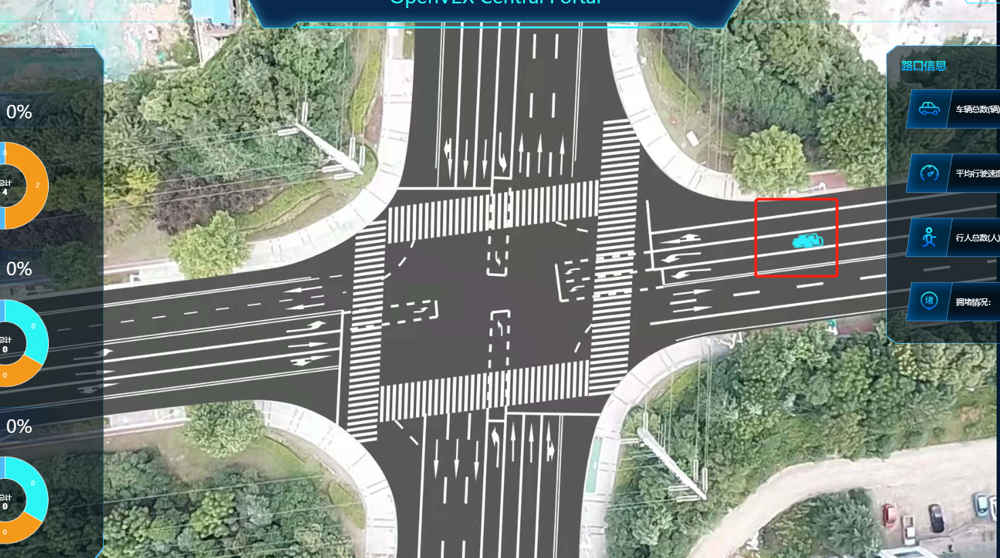
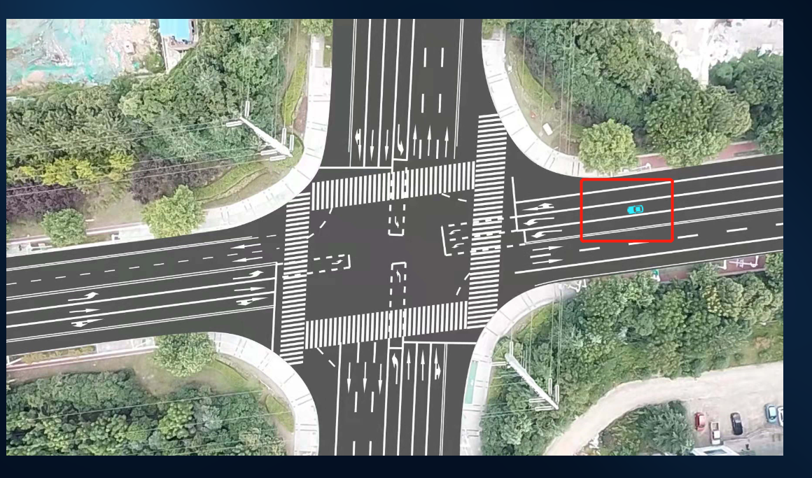

# 多设备融合算法

## 1. 测试工具

RSU模拟器

## 2. 配置

```yaml
Host:  106.15.193.98
Path:  /mqtt
Port:  15675
ClientID:  R328328
Username:  root
Password: abc@1234
Publish1 Topic:  V2X/RSU/R328328/RSI/UP/DAWNLINE
Publish2 Topic:	 V2X/RSU/R328328/PIP/CFG
Subscribe Topic:  V2X/DEVICE/R328328/PARTICIPANT
```

## 3. 测试数据

test_data/multi_source_fusion_track.json

```
Publish2 :
{
"fusion": 1,
"complement": 1,
"smooth":1,
"collision": 1,
"visual": 1
}
```

## 4. 测试过程

    1. 打开 rsu 模拟器，填入配置，点击 connect 连接设备
    2. 填入 Subscribe Topic，点击 Subscribe 按钮，下方出现已连接窗口
    3. 选择多设备融合算法，测试轨迹数据，再点击Publish
    4. 观察Receive Messages 是否收到数据
    5. 观察云控大屏展示效果
    6. 发布开融合配置文件，在执行步骤3
    7. 观察云控大屏展示效果





开融合前：



开融合后：



## 5.返回数据(例)

```
[{"secMark":46500,"ptcType":"motor","x":1051,"y":487,"speed":981,"heading":20992,"global_track_id":"acbd42.0_1","refPos_lat":319348466,"refPos_lon":1188213963,"refPos_ele":null,"lat":319352513,"lon":1188223907,"ele":null,"ptcId":42,"source":4,"lane":1,"width":185,"length":420,"height":30,"timeStamp":46500},{"secMark":46500,"ptcType":"motor","x":1061,"y":480,"speed":981,"heading":20992,"global_track_id":"acbd42.0_2","refPos_lat":319348466,"refPos_lon":1188213963,"refPos_ele":null,"lat":319352463,"lon":1188223994,"ele":null,"ptcId":192,"source":3,"lane":1,"width":185,"length":420,"height":30,"timeStamp":46500},{"secMark":46500,"ptcType":"motor","x":1070,"y":487,"speed":981,"heading":20992,"global_track_id":"acbd42.0_3","refPos_lat":319348467,"refPos_lon":1188213965,"refPos_ele":null,"lat":319352514,"lon":1188224079,"ele":null,"ptcId":342,"source":4,"lane":1,"width":185,"length":420,"height":30,"timeStamp":46500}]
```

## 6. 测试结论

本测试模拟多设备融合，开融合前云控大屏显示多辆车挤在一起，开融合后云控大屏显示只有一辆车，展示效果对比明显，多设备融合功能测试通过。
