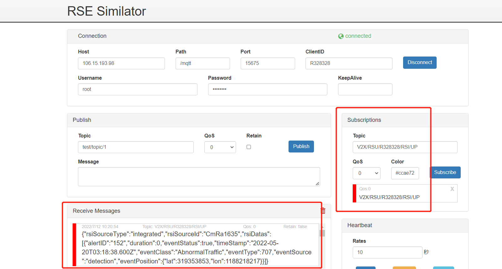
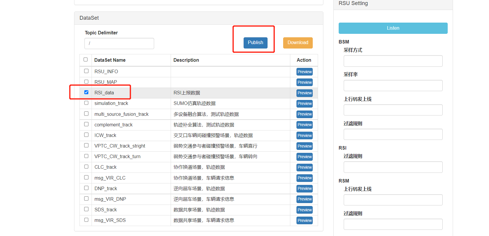

# RSI上报

## 1. 测试工具

RSU模拟器

## 2. 配置

```yaml
Host:  106.15.193.98
Path:  /mqtt
Port:  15675
ClientID:  R328328
Username:  root
Password: abc@1234
Publish Topic:  V2X/RSU/R328328/RSI/UP/DAWNLINE
Subscribe Topic:  V2X/RSU/R328328/RSI/UP
```

## 3. 测试数据

test_data/RSI_data.json

## 4. 测试过程

    1. 打开 rsu 模拟器，填入配置，点击 connect 连接设备
    2. 填入 Subscribe Topic，点击 Subscribe 按钮，下方出现已连接窗口
    3. 选择RSI上报数据，再点击Publish
    4. 观察Receive Messages 是否收到数据





## 5.返回数据(例)

```
{"rsiSourceType":"integrated","rsiSourceId":"CmRa1635","rsiDatas":[{"alertID":"2","duration":0,"eventStatus":true,"timeStamp":"2022-05-20T03:18:23.600Z","eventClass":"AbnormalVehicle","eventType":904,"eventSource":"detection","eventPosition":{"lat":319353853,"lon":1188218217}}]}
```

## 6. 测试结论

本测试RSI上报，发送数据与接收数据一一对应，并且返回的数据是标准的rsi格式数据，RSI上报功能测试通过。
