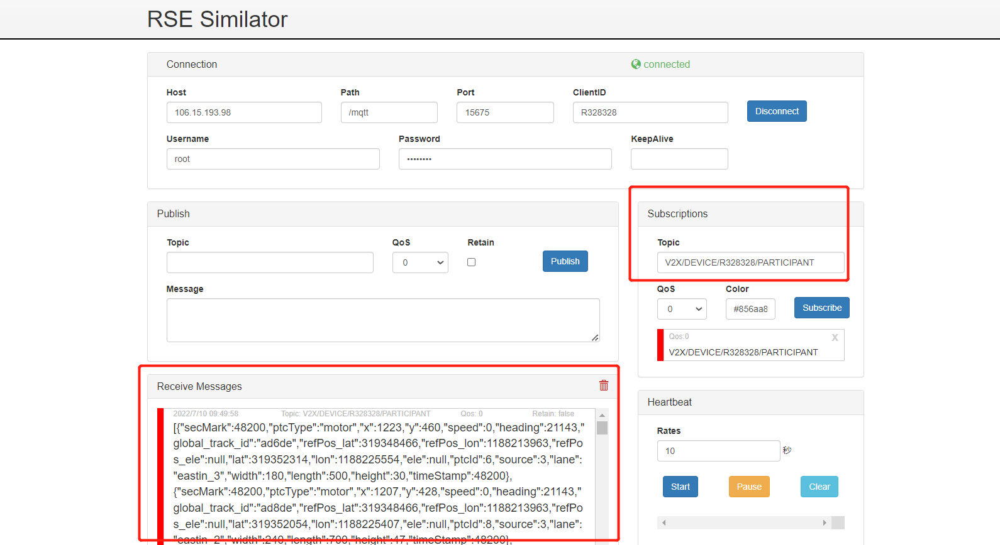
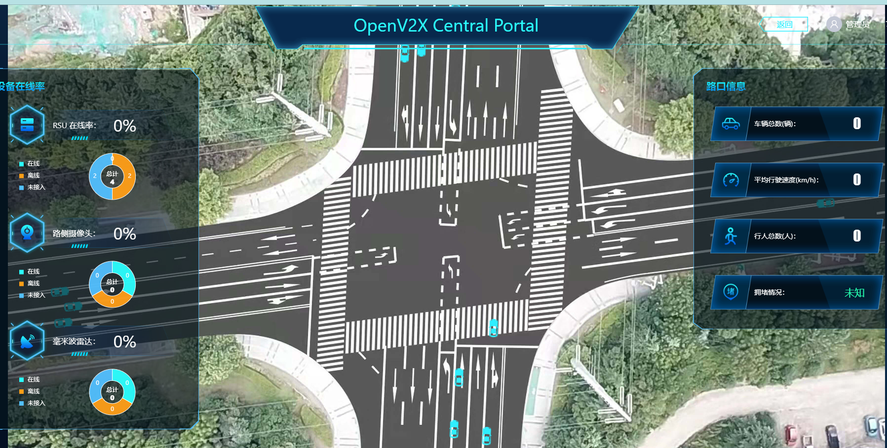

# SUMO仿真轨迹数据

## 1. 测试工具

RSU模拟器

## 2. 配置

```yaml
Host:  106.15.193.98
Path:  /mqtt
Port:  15675
ClientID:  R328328
Username:  root
Password: abc@1234
Publish Topic:  V2X/RSU/R328328/RSM/UP/DAWNLINE
Subscribe Topic:  V2X/DEVICE/R328328/PARTICIPANT
```

## 3. 测试数据

test_data/simulation_track.json

## 4. 测试过程

    1. 打开 rsu 模拟器，填入配置，点击 connect 连接设备
    2. 填入 Subscribe Topic，点击 Subscribe 按钮，下方出现已连接窗口
    3. 选择SUMO仿真轨迹数据，再点击Publish
    4. 观察Receive Messages 是否收到数据
    5. 观察云控大屏效果展示






## 5.返回数据(例)

```
[{"secMark":52000,"ptcType":"motor","x":1223,"y":460,"speed":0,"heading":21143,"global_track_id":"ad6de","refPos_lat":319348466,"refPos_lon":1188213963,"refPos_ele":null,"lat":319352314,"lon":1188225554,"ele":null,"ptcId":6,"source":3,"lane":"eastin_3","width":180,"length":500,"height":30,"timeStamp":52000},{"secMark":52000,"ptcType":"motor","x":1207,"y":428,"speed":0,"heading":21143,"global_track_id":"ad8de","refPos_lat":319348466,"refPos_lon":1188213963,"refPos_ele":null,"lat":319352054,"lon":1188225407,"ele":null,"ptcId":8,"source":3,"lane":"eastin_2","width":240,"length":700,"height":47,"timeStamp":52000},{"secMark":52000,"ptcType":"motor","x":574,"y":640,"speed":0,"heading":6677,"global_track_id":"ad36de","refPos_lat":319348466,"refPos_lon":1188213963,"refPos_ele":null,"lat":319353716,"lon":1188219363,"ele":null,"ptcId":36,"source":3,"lane":"westin_2","width":180,"length":500,"height":30,"timeStamp":52000},{"secMark":52000,"ptcType":"motor","x":576,"y":576,"speed":0,"heading":6677,"global_track_id":"ad37de","refPos_lat":319348466,"refPos_lon":1188213963,"refPos_ele":null,"lat":319353192,"lon":1188219389,"ele":null,"ptcId":37,"source":3,"lane":"westin_4","width":180,"length":500,"height":30,"timeStamp":52000},{"secMark":52000,"ptcType":"motor","x":581,"y":609,"speed":0,"heading":6677,"global_track_id":"ad40de","refPos_lat":319348466,"refPos_lon":1188213963,"refPos_ele":null,"lat":319353460,"lon":1188219437,"ele":null,"ptcId":40,"source":3,"lane":"westin_3","width":240,"length":700,"height":47,"timeStamp":52000},{"secMark":52000,"ptcType":"motor","x":1224,"y":494,"speed":0,"heading":21143,"global_track_id":"ad0de","refPos_lat":319348466,"refPos_lon":1188213963,"refPos_ele":null,"lat":319352585,"lon":1188225568,"ele":null,"ptcId":0,"source":3,"lane":"eastin_4","width":180,"length":500,"height":30,"timeStamp":52000},{"secMark":52000,"ptcType":"motor","x":898,"y":308,"speed":0,"heading":14571,"global_track_id":"ad10de","refPos_lat":319348466,"refPos_lon":1188213963,"refPos_ele":null,"lat":319351052,"lon":1188222483,"ele":null,"ptcId":10,"source":3,"lane":"northin_5","width":180,"length":500,"height":30,"timeStamp":52000},{"secMark":52000,"ptcType":"motor","x":1577,"y":527,"speed":221,"heading":6728,"global_track_id":"ad25de","refPos_lat":319348466,"refPos_lon":1188213963,"refPos_ele":null,"lat":319352886,"lon":1188228965,"ele":null,"ptcId":25,"source":3,"lane":"eastout_2","width":180,"length":500,"height":30,"timeStamp":52000},{"secMark":52000,"ptcType":"motor","x":1656,"y":384,"speed":40,"heading":21144,"global_track_id":"ad5de","refPos_lat":319348466,"refPos_lon":1188213963,"refPos_ele":null,"lat":319351730,"lon":1188229677,"ele":null,"ptcId":5,"source":3,"lane":"eastin_2","width":180,"length":500,"height":30,"timeStamp":52000},{"secMark":52000,"ptcType":"motor","x":882,"y":743,"speed":0,"heading":139,"global_track_id":"ad21de","refPos_lat":319348466,"refPos_lon":1188213963,"refPos_ele":null,"lat":319354577,"lon":1188222287,"ele":null,"ptcId":21,"source":3,"lane":"southin_5","width":180,"length":500,"height":30,"timeStamp":52000},{"secMark":52000,"ptcType":"motor","x":493,"y":585,"speed":0,"heading":6677,"global_track_id":"ad31de","refPos_lat":319348466,"refPos_lon":1188213963,"refPos_ele":null,"lat":319353262,"lon":1188218601,"ele":null,"ptcId":31,"source":3,"lane":"westin_4","width":180,"length":500,"height":30,"timeStamp":52000},{"secMark":52000,"ptcType":"motor","x":1305,"y":452,"speed":0,"heading":21144,"global_track_id":"ad3de","refPos_lat":319348466,"refPos_lon":1188213963,"refPos_ele":null,"lat":319352254,"lon":1188226337,"ele":null,"ptcId":3,"source":3,"lane":"eastin_3","width":240,"length":700,"height":47,"timeStamp":52000},{"secMark":52000,"ptcType":"motor","x":710,"y":460,"speed":77,"heading":18487,"global_track_id":"ad15de","refPos_lat":319348466,"refPos_lon":1188213963,"refPos_ele":null,"lat":319352273,"lon":1188220668,"ele":null,"ptcId":15,"source":3,"lane":":gneJ5_3_0","width":180,"length":500,"height":30,"timeStamp":52000},{"secMark":52000,"ptcType":"motor","x":901,"y":226,"speed":0,"heading":14571,"global_track_id":"ad13de","refPos_lat":319348466,"refPos_lon":1188213963,"refPos_ele":null,"lat":319350381,"lon":1188222521,"ele":null,"ptcId":13,"source":3,"lane":"northin_5","width":240,"length":700,"height":47,"timeStamp":52000},{"secMark":52000,"ptcType":"motor","x":478,"y":620,"speed":0,"heading":6677,"global_track_id":"ad41de","refPos_lat":319348466,"refPos_lon":1188213963,"refPos_ele":null,"lat":319353547,"lon":1188218454,"ele":null,"ptcId":41,"source":3,"lane":"westin_3","width":250,"length":1600,"height":80,"timeStamp":52000},{"secMark":52000,"ptcType":"motor","x":1306,"y":485,"speed":0,"heading":21144,"global_track_id":"ad4de","refPos_lat":319348466,"refPos_lon":1188213963,"refPos_ele":null,"lat":319352525,"lon":1188226346,"ele":null,"ptcId":4,"source":3,"lane":"eastin_4","width":250,"length":1600,"height":80,"timeStamp":52000},{"secMark":52000,"ptcType":"motor","x":335,"y":603,"speed":73,"heading":6677,"global_track_id":"ad34de","refPos_lat":319348466,"refPos_lon":1188213963,"refPos_ele":null,"lat":319353394,"lon":1188217104,"ele":null,"ptcId":34,"source":3,"lane":"westin_4","width":240,"length":700,"height":47,"timeStamp":52000},{"secMark":52000,"ptcType":"motor","x":880,"y":825,"speed":0,"heading":139,"global_track_id":"ad23de","refPos_lat":319348466,"refPos_lon":1188213963,"refPos_ele":null,"lat":319355244,"lon":1188222254,"ele":null,"ptcId":23,"source":3,"lane":"southin_5","width":240,"length":700,"height":47,"timeStamp":52000},{"secMark":52000,"ptcType":"motor","x":1404,"y":409,"speed":61,"heading":21144,"global_track_id":"ad9de","refPos_lat":319348466,"refPos_lon":1188213963,"refPos_ele":null,"lat":319351912,"lon":1188227273,"ele":null,"ptcId":9,"source":3,"lane":"eastin_2","width":250,"length":1600,"height":80,"timeStamp":52000},{"secMark":52000,"ptcType":"motor","x":125,"y":627,"speed":21,"heading":6677,"global_track_id":"ad35de","refPos_lat":319348466,"refPos_lon":1188213963,"refPos_ele":null,"lat":319353571,"lon":1188215100,"ele":null,"ptcId":35,"source":3,"lane":"westin_4","width":250,"length":1600,"height":80,"timeStamp":52000}]
```

## 6. 测试结论

本测试模拟SUMO仿真轨迹，云控页面展示正常，车辆行驶正常，功能测试通过。
