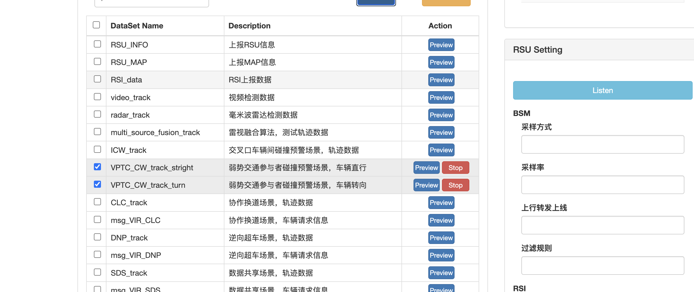
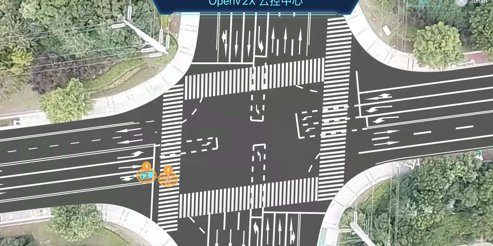

# 弱势交通参与者碰撞预警

## 1. 登录 OpenV2X 云控中心（OpenV2X Central Portal）

OpenV2X 云控中心网址：http://\<ip-address\>:8080/user/login，输入正确的用户名、密码(username: admin password:
dandelion)可登录平台。

## 2. 配置 RSE Similator 连接

打开 RSE Simulator（用于发送有碰撞风险的车辆轨迹数据）http://\<ip-address\>:6688，配置连接参数，点击Connect。

## 3. RSE Simulator 发送数据

在 DataSet 中选择 VPTC_CW_track_stright 和 VPTC_CW_track_turn，点击 Publish 进行发送。

## 4. 查看大屏车辆数据

打开云控中心，选择边缘站点，点击“前往【区域 Edge Portal】”，左上角选择 RSU
设备以及区域，之后点击黄色圆点进入路口场景，最后在大屏上查看弱势参与者碰撞场景下车辆在地图上的行动轨迹，以及碰撞风险的可视化预警。

