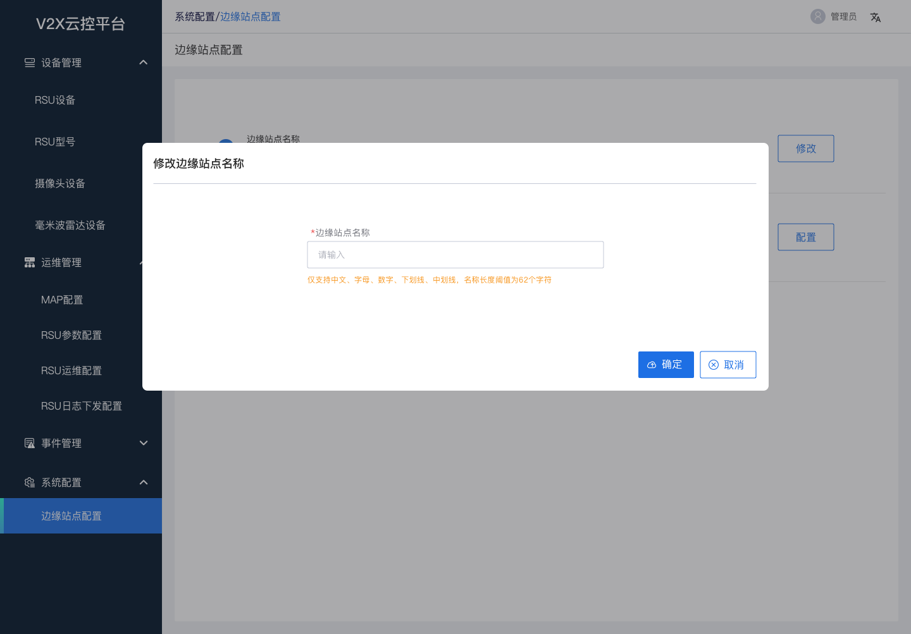
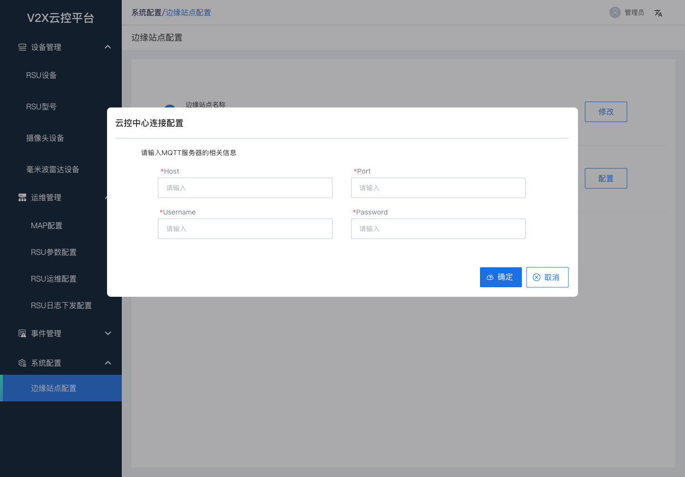
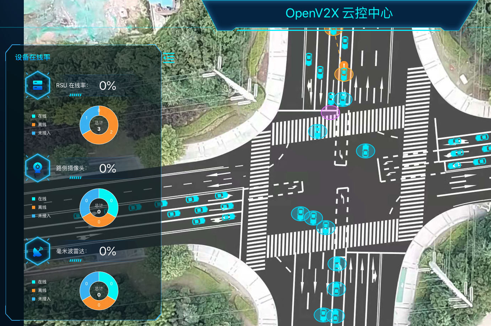
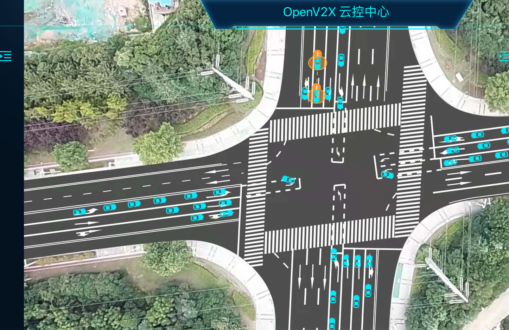
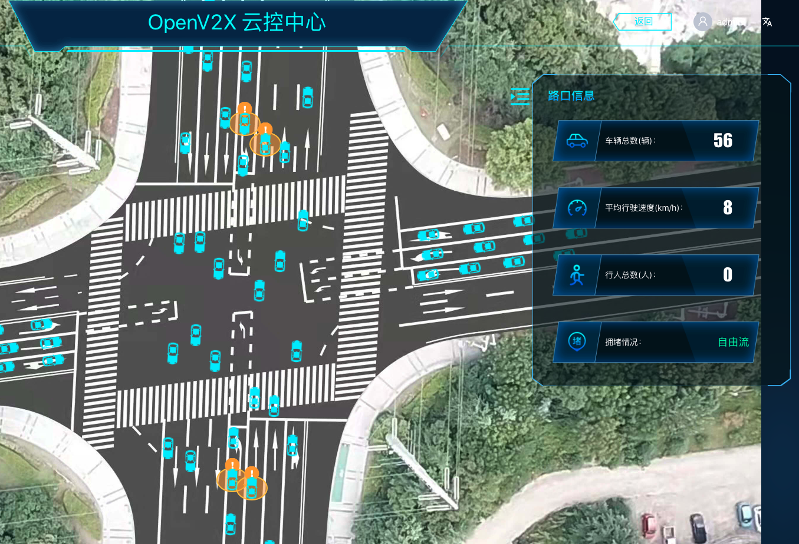
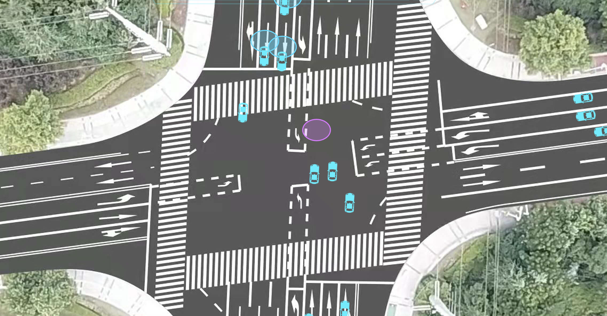

# 查看边缘站点路口场景实况

## 1. 登录 OpenV2X 边缘云控平台（OpenV2X Edge Portal）

OpenV2X 边缘云控平台网址：http://\<ip-address\>:80/user/login，输入正确的用户名、密码(username: admin password:
dandelion)可登录平台。

## 2. 配置边缘站点

在边缘云控平台-系统配置-边缘站点配置页，修改边缘站点名称和云控中心连接配置

修改“边缘站点名称”，输入自定义名称，提交

配置“云控中心连接配置”，“Host” 为部署 MQTT 的地址，“Port” 端口输入 1883，“用户名”输入 root，“密码”是部署时提供的 MQTT root 密码

## 3. 配置 RSE Simulator 连接

打开 RSE Simulator（用于发送有碰撞风险的车辆轨迹数据）http://\<ip-address\>:6688，配置连接参数 “Host” 为部署 MQTT 的地址， “ClientID”
输入“R328328”，“Password” 输入部署时提供的 MQTT root 密码，其他参数不变，点击Connect

## 4. RSE Simulator 发送数据

在 DataSet 中选择 SDS_track 和 msg_VIR_SDS，点击 Publish 进行发送。

## 5. 登录 OpenV2X 云控中心（OpenV2X Central Portal）

OpenV2X 云控中心网址：http://\<ip-address\>:8080/user/login，输入正确的用户名、密码(username: admin password:
dandelion)可登录平台。

## 6. 查看大屏路口信息展示

打开云控中心，选择已配置的边缘站点，点击“前往【区域 Edge Portal】”，左上角选择区域和 RSU 设备 R328328，之后点击黄色圆点进入路口场景

查看左侧设备在线情况：RSU 设备在线率，路测摄像头设备，毫米波雷达设备 点击旁边收缩按钮，可隐藏和打开“设备在线率”展示

 

查看右侧路就信息：车辆总数，平均行驶速度，行人总数，拥堵情况 点击旁边收缩按钮，可隐藏和打开“路口信息”展示

 

查看感知数据共享场景下车辆在地图上的行动轨迹，以及数据共享的可视化展示 
