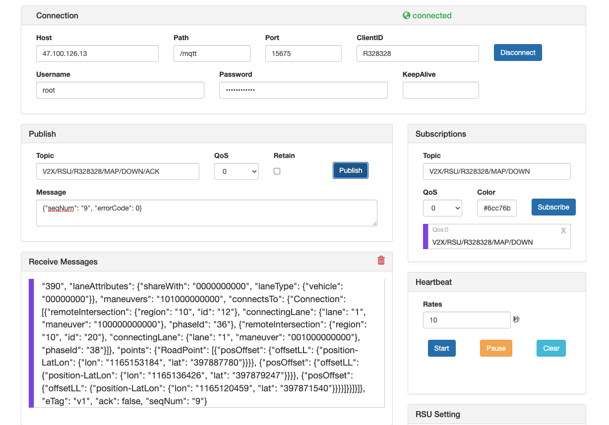
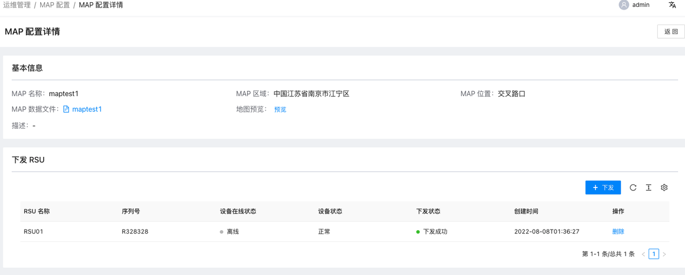

# MAP 下发至 RSU

## 1. 登录 OpenV2X 边缘云控平台（OpenV2X Edge Portal）

OpenV2X 边缘云控平台网址：http://\<ip-address\>:80/user/login，输入正确的用户名、密码(username: admin
password:dandelion)可登录平台。

点击运维管理- Map 配置界面

## 2. 配置 RSE Simulator 建立监听

打开 RSE Similator（用于展示路口RSU收到的MAP消息内容）http://\<ip-address\>:6688，配置 Username、password、clientID 建立连接后在
Subscriptions 中添加监听主题 V2X/RSU/R328328/MAP/DOWN，点击 Subscribe 进行监听

## 3. 界面添加 Map 并下发 RSU

在 MAP 配置界面中点击添加 MAP 按钮，填写必要字段，上传 MAP 数据示例，点击提交

打开 MAP 数据详情，点击下发，选择路口 RSU

## 4. 查看 RSE Simulator 接收数据

在 Receive Messages 中看到接收的结构化数据内容

## 5. RSE Simulator 发送应答数据

添加发送主题：V2X/RSU/R328328/MAP/DOWN/ACK ，并发送{"seqNum": "8", "errorCode": 0}消息确认 

## 6. 查看下发状态

在 MAP 配置详情中查看 RSU 下发状态从“下发中”变为“下发成功” 
