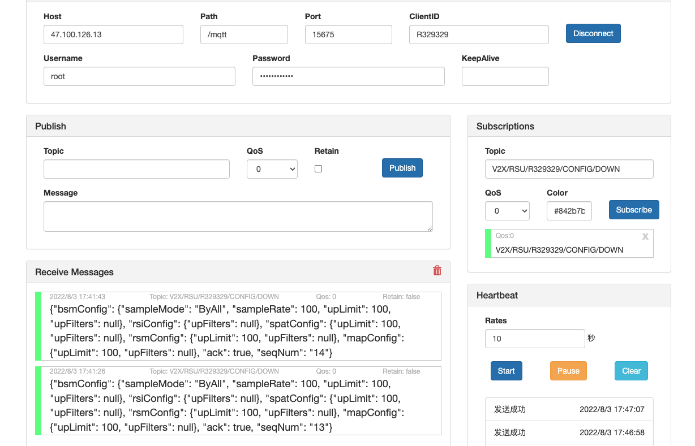

# RSU 业务配置下发

## 1. 登录 OpenV2X 边缘云控平台（OpenV2X Edge Portal）

OpenV2X 边缘云控平台网址：http://\<ip-address\>:80/user/login，输入正确的用户名、密码(username: admin
password:dandelion)可登录平台。 进入运维管理-RSU业务配置界面

## 2. 配置 RSE Simulator 建立监听

打开 RSE Similator（用于展示路口RSU收到的消息内容）http://\<ip-address\>:6688，配置 Username、password、clientID； 建立连接后在
Subscriptions 中添加监听主题V2X/RSU/R329329/CONFIG/DOWN，点击 Subscribe 进行监听

## 3. RSU业务配置

点击添加配置，输入配置名称、参数配置模版、参数配置适用的RSU，点击提交

## 4. RSE Simulator接收数据

在 Receive Messages 中看到接收的 RSU 业务配置下发消息内容

## 5. RSE Simulator发送应答数据

添加发送主题：V2X/RSU/R329329/CONFIG/DOWN/ACK，并发送{"seqNum": "8", "errorCode": 0}消息确认

## 6. 查看下发状态

进入配置详情，参数配置适用的 RSU 中的下发状态从下发中变为下发成功

