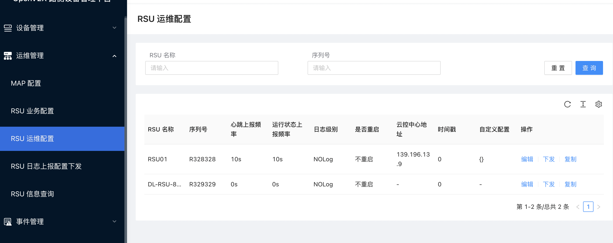
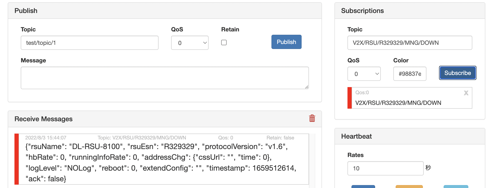

# 下发配置至 RSU 设备

## 1. 登录 OpenV2X 边缘云控平台（OpenV2X Edge Portal）

OpenV2X 边缘云控平台网址：http://\<ip-address\>:80/user/login，输入正确的用户名、密码(username: admin password:
dandelion)可登录平台。

## 2. 配置 RSE Simulator 监听

打开 RSE Simulator（用于展示路口RSU收到的信息）http://\<ip-address\>:6688，在 Subscriptions 中添加监听主题
V2X/RSU/R329329/MNG/DOWN，点击 Subscribe 进行监听。

## 3. 下发配置至 RSU 设备

在边缘云控平台中点击进入“运维管理 - RSU 运维配置”，在 RSU 配置列表中选择一个 RSU 配置点击“下发”

## 4. 查看 RSE Simulator 监听消息

RSE Simulator 监听到边缘云控平台配置的信息，以 json 字符串的形式显示。

