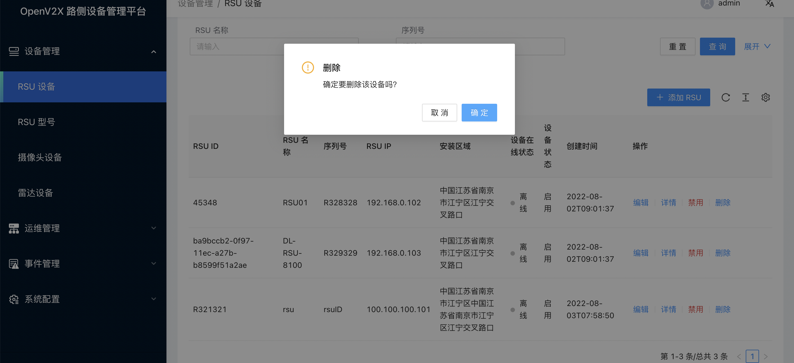

# 操作 RSU 设备

## 1. 登录 OpenV2X 边缘云控平台（OpenV2X Edge Portal）

OpenV2X 边缘云控平台网址：http://\<ip-address\>:80/user/login，输入正确的用户名、密码(username: admin password:
dandelion)可登录平台。

## 2. 新增 RSU 设备

1. 点击进入“设备管理 - RSU 设备”，点击“添加RSU”，填入 RSU 名称、序列号、安装区域、具体位置、RSU ID、RSU IP、RSU 型号以及描述信息，点击“提交”。

2. 点击进入“设备管理 - RSU 设备”，点击“未注册 RSU”，未注册 RSU 列表中选择一个 RSU 设备点击一键注册。

## 3. 编辑 RSU 设备

点击进入“设备管理 - RSU 设备”，在注册 RSU 列表中选择一个 RSU 设备点击“编辑”，修改相关信息，点击“提交”。

## 4. 启用 RSU 设备

点击进入“设备管理 - RSU 设备”，在 RSU 设备列表中点击启用已禁用的 RSU 设备。

## 5. 查看 RSU 设备详情信息

点击进入“设备管理 - RSU 设备”，点击 RSU 设备列表中已启用的 RSU 设备详情，可查看到 RSU 设备的基本信息、运行信息和配置参数。

  

## 6. 删除 RSU 设备

点击进入“设备管理 - RSU 设备”，在 RSU 设备列表中删除 RSU 设备。

## 7. 重启 RSU 设备

点击进入“运维管理 - RSU 运维配置”，在 RSU 运维配置列表中编辑 RSU 设备，在是否重启一栏选择重启并点击“提交”。

