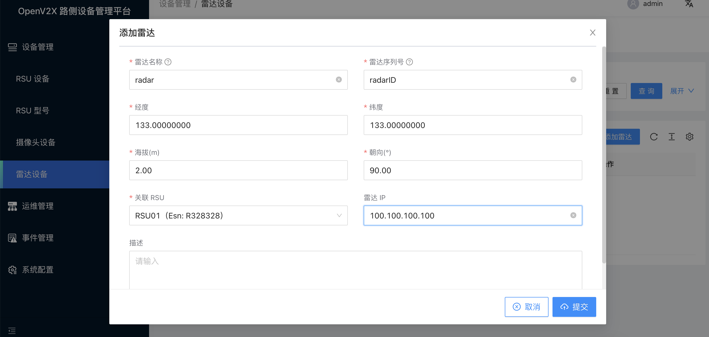
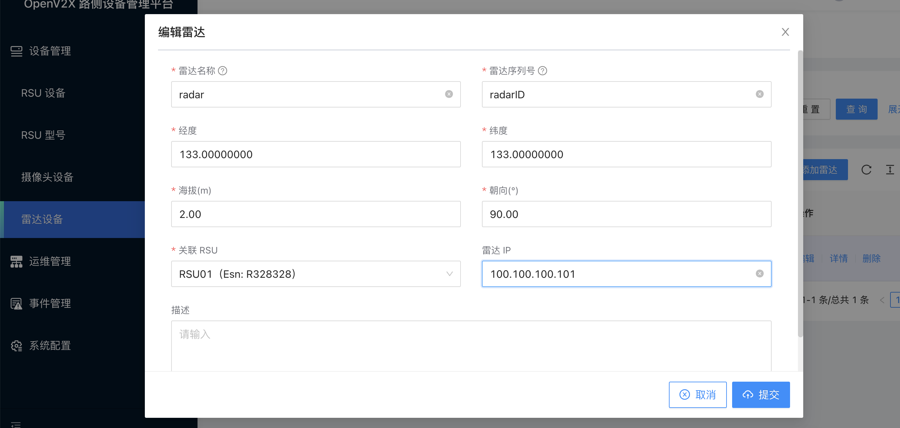
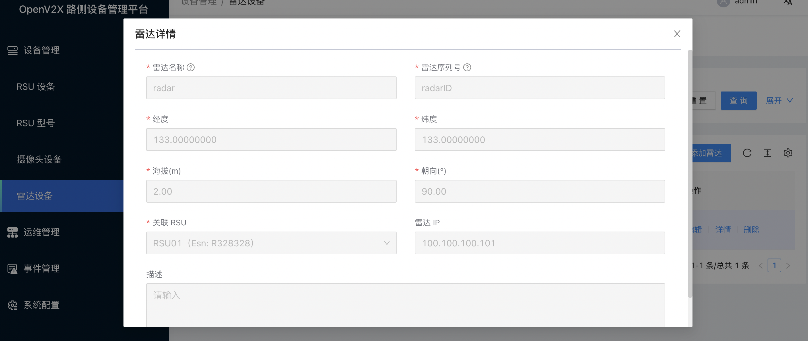
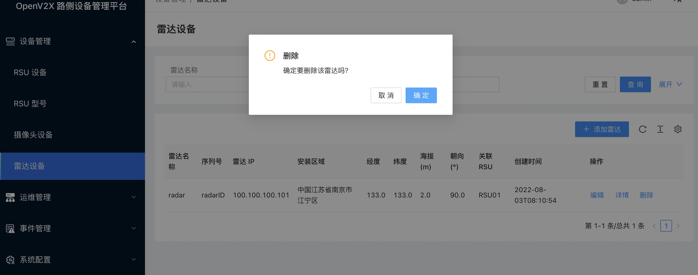

# 操作路侧毫米波雷达设备设备

## 1. 登录 OpenV2X 边缘云控平台（OpenV2X Edge Portal）

OpenV2X 边缘云控平台网址：http://\<ip-address\>:80/user/login，输入正确的用户名、密码(username: admin password:
dandelion)可登录平台。

## 2. 新增雷达设备

点击进入“设备管理 - 雷达设备”，点击“添加雷达”，填入雷达名称、雷达序列号、经度、维度、海拔(m)、朝向(°)、关联 RSU、雷达 IP 以及描述信息，点击“提交”。

## 3. 编辑雷达设备

点击进入“设备管理 - 雷达设备”，在雷达列表中选择一个雷达设备点击“编辑”，修改相关信息，点击“提交”。

## 4. 查看雷达设备详情信息

点击进入“设备管理 - 雷达设备”，点击雷达设备列表中雷达设备详情，可查看到雷达设备的配置详情。

## 5. 删除雷达设备

点击进入“设备管理 - 雷达设备”，在雷达设备列表中点击删除雷达设备。

