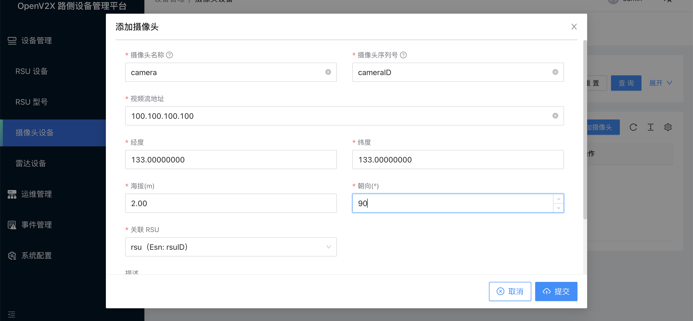
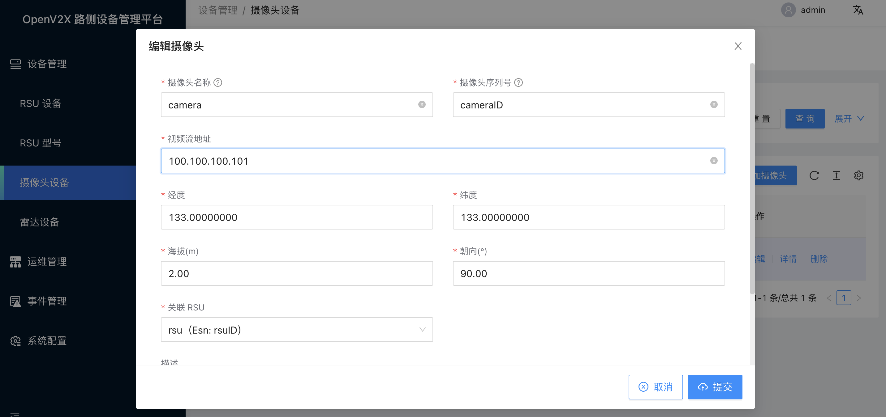
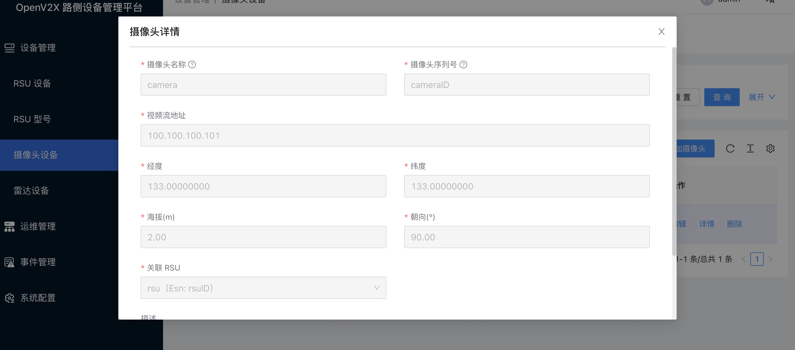
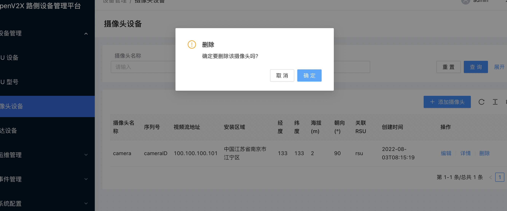

# 操作路侧摄像头

## 1. 登录 OpenV2X 边缘云控平台（OpenV2X Edge Portal）

OpenV2X 边缘云控平台网址：http://\<ip-address\>:80/user/login，输入正确的用户名、密码(username: admin password:
dandelion)可登录平台。

## 2. 新增摄像头设备

点击进入“设备管理 - 摄像头设备”，点击“添加摄像头”，填入摄像头名称、摄像头序列号、视频流地址、经度、维度、海拔(m)、朝向(°)、关联 RSU 以及描述信息，点击“提交”。

## 3. 编辑摄像头设备

点击进入“设备管理 - 摄像头设备”，在雷达列表中选择一个摄像头设备点击“编辑”，修改相关信息，点击“提交”。

## 4. 查看摄像头设备详情信息

点击进入“设备管理 - 摄像头设备”，点击摄像头设备列表中摄像头设备详情，可查看到摄像头设备的配置详情。

## 5. 删除摄像头设备

点击进入“设备管理 - 摄像头设备”，在摄像头设备列表中点击删除摄像头设备。

