# 查看历史数据统计分析结果

## 1. 登录 OpenV2X 边缘云控平台（OpenV2X Edge Portal）

OpenV2X 边缘云控平台网址：http://\<ip-address\>:80/user/login，输入正确的用户名、密码(username: admin password:
dandelion)可登录平台。

## 2. 查看历史数据统计分析结果

1. 点击进入“事件管理-路侧安全消息（RSM）”， 可查看 RSM 消息的历史数据，支持根据“参与者类型”进行过滤查询。

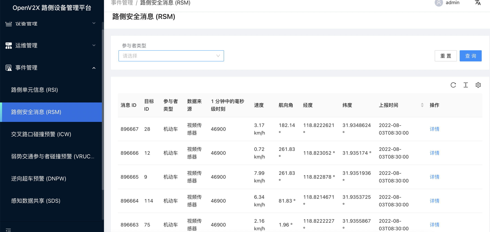 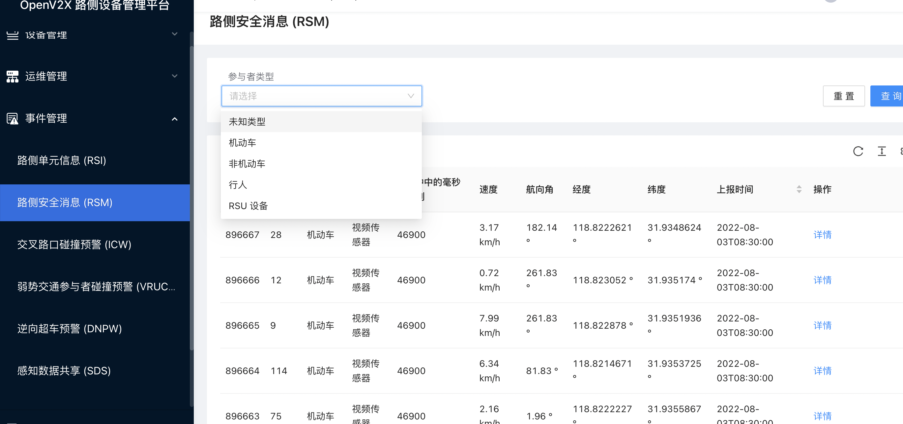

2. 点击进入“事件管理-路侧单元消息（RSI）”， 可查看 RSI 消息的历史数据，支持根据“事件类型”进行过滤查询。

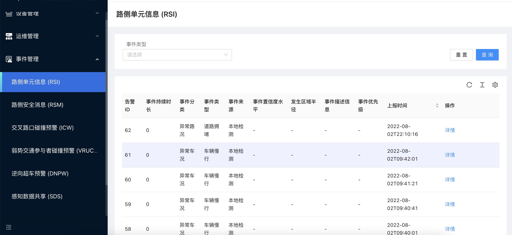 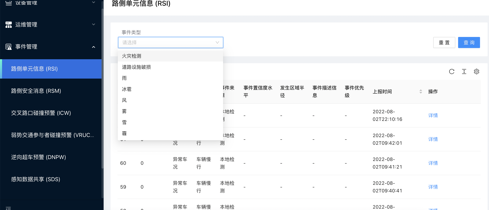

3. 点击进入“交叉路口碰撞预警 (ICW)”，可查看 ICW 消息的历史数据，支持根据“碰撞类型”进行过滤查询。

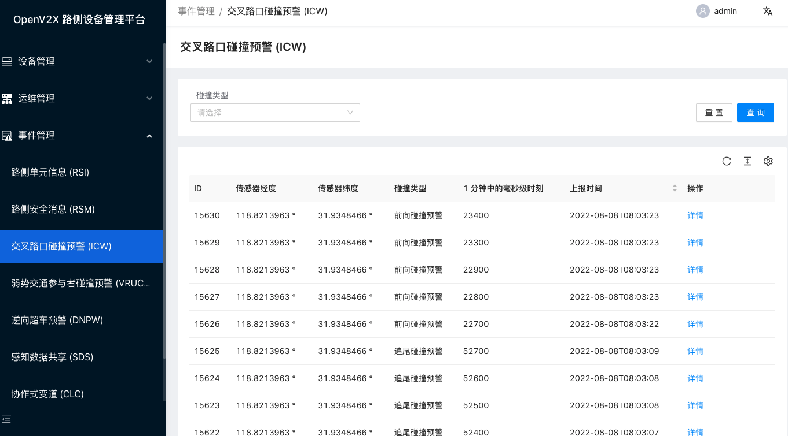 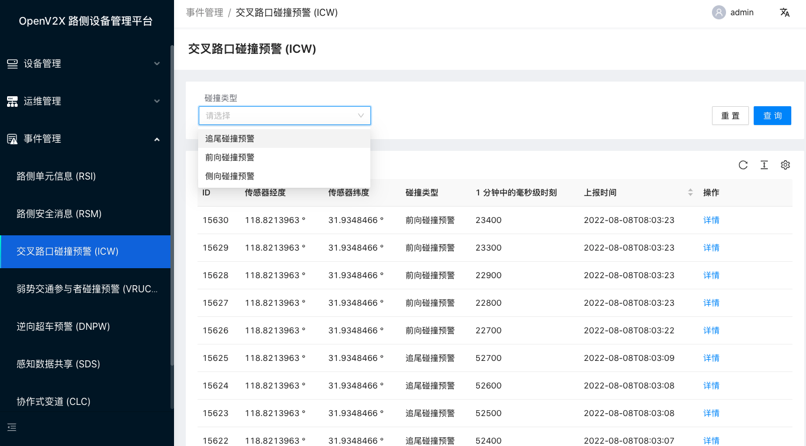

4. 点击进入“弱势交通参与者碰撞预警 (VRUCW)”，可查看 VRUCW 消息的历史数据，支持根据“碰撞类型”进行过滤查询。

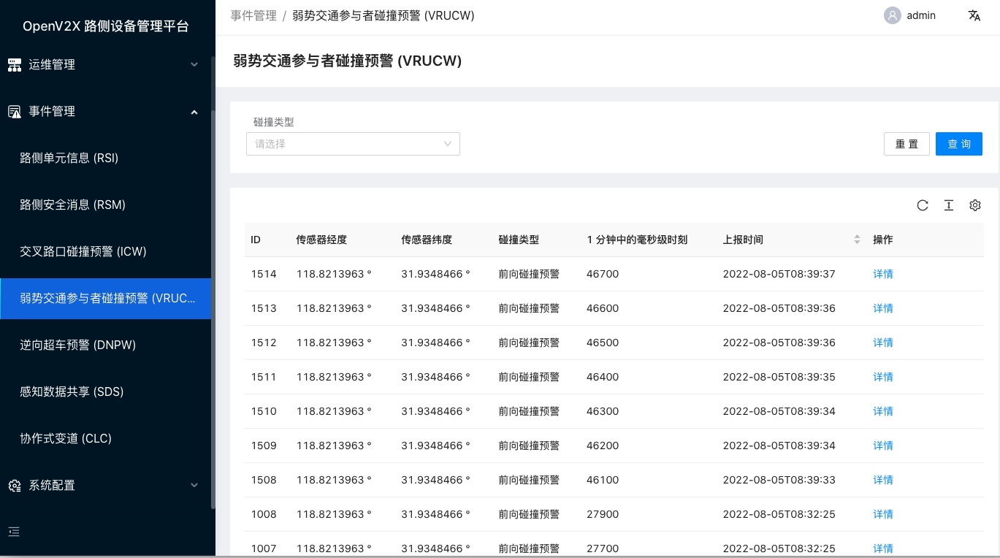 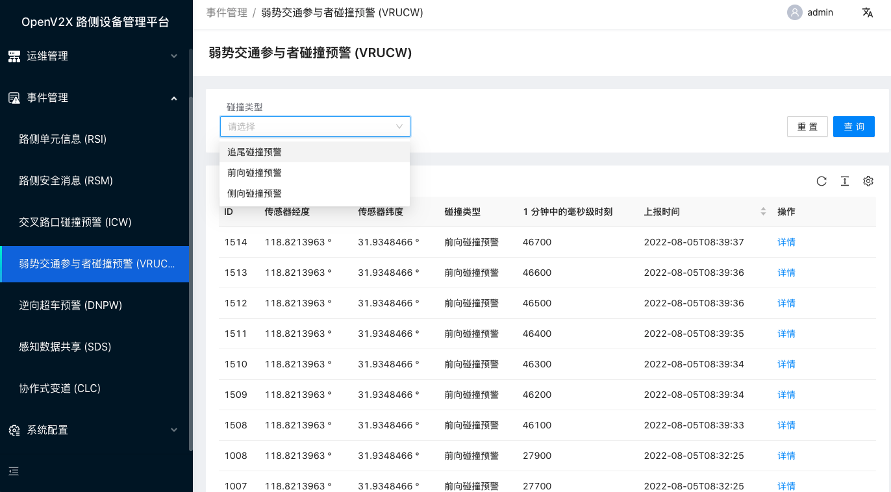

5. 点击进入“逆向超车预警 (DNPW)”，可查看 DNPW 消息的历史数据，支持根据“协调信息类型”进行过滤查询。

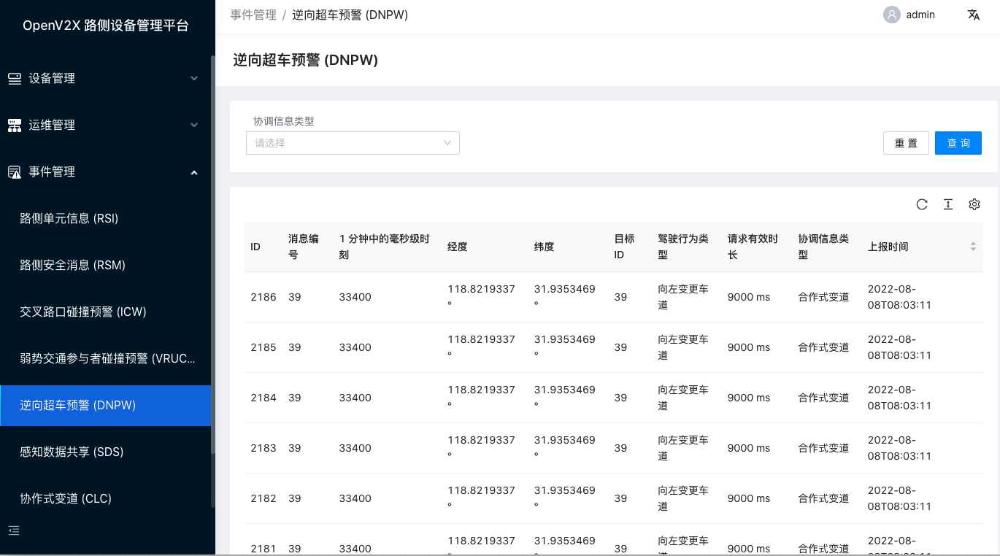 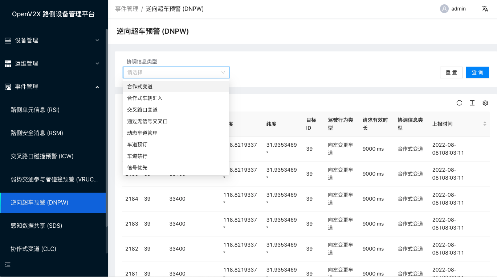

6. 点击进入“感知数据共享 (SDS)”，可查看 SDS 消息的历史数据，支持根据“设备类型”进行过滤查询。

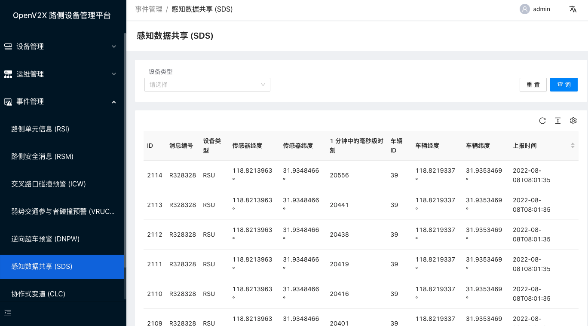 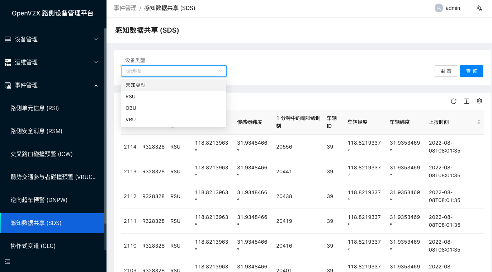

7. 点击进入“协作式变道 (CLC)”，可查看 CLC 消息的历史数据，支持根据“协调信息类型”进行过滤查询。

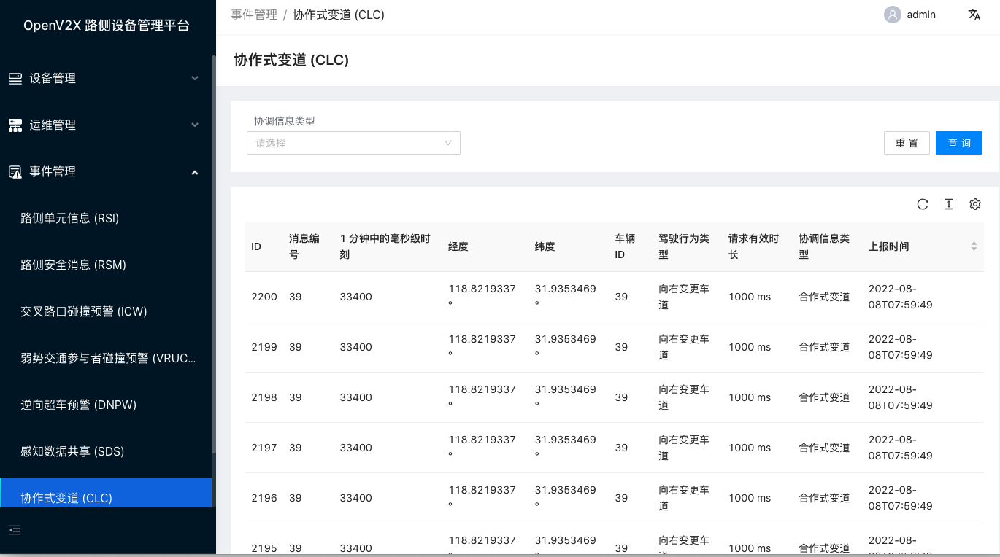 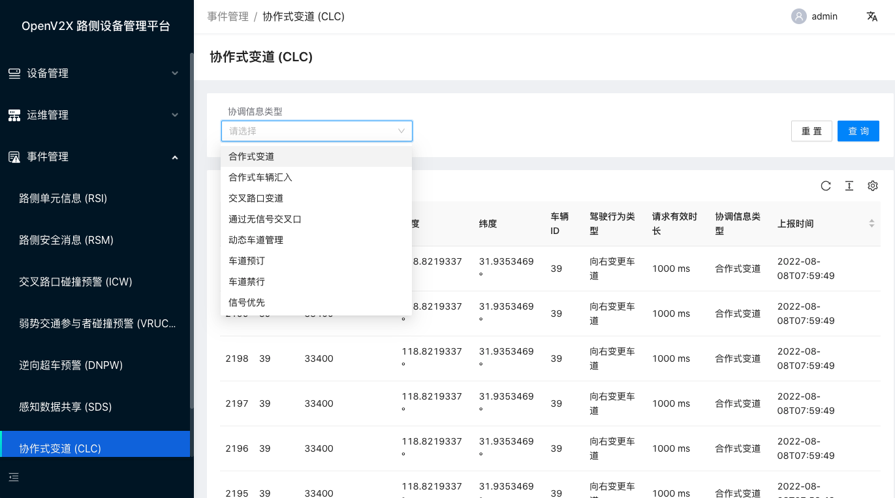
