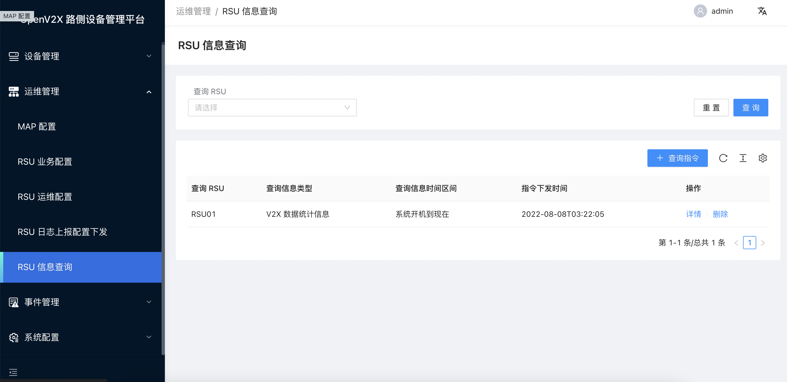

# 查询下发 RSU 设备指令

## 1. 登录 OpenV2X 边缘云控平台（OpenV2X Edge Portal）

OpenV2X 边缘云控平台网址：http://\<ip-address\>:80/user/login，输入正确的用户名、密码(username: admin password:
dandelion)可登录平台。

## 2. 下发 RSU 设备指令查询

点击进入“运维管理 - RSU 信息查询”， 点击“查询指令”，在弹出的界面可选择查询信息类型、查询信息时间区间以及查询 RSU，选择完毕点击“提交”，即可查询 下发 RSU 设备指令。

 
 
