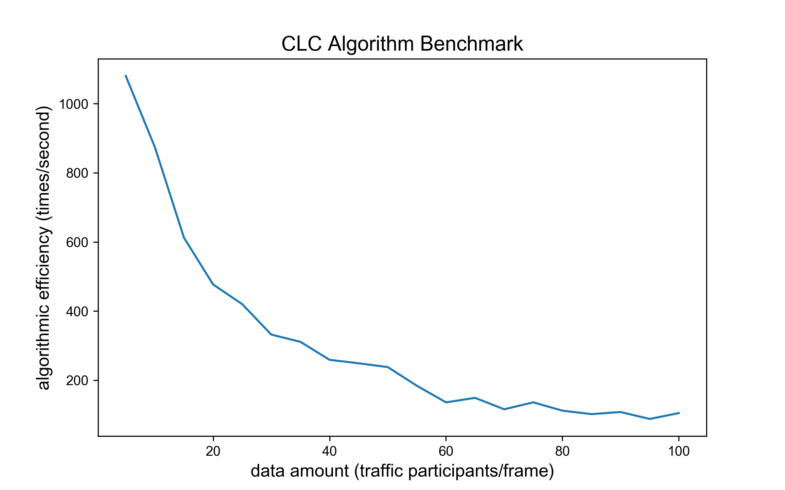
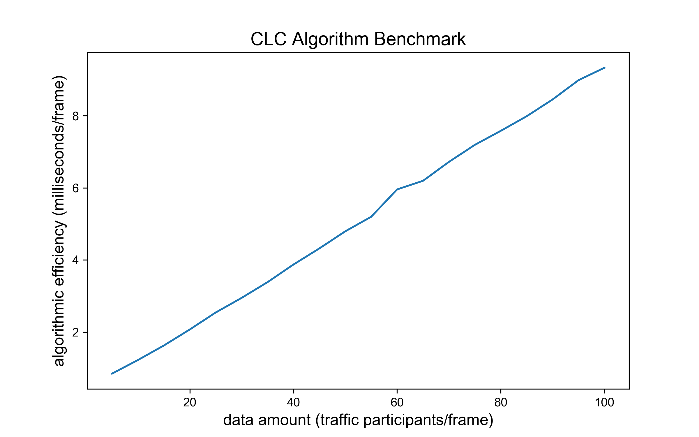

# 车辆协同换道 (Cooperative Lane Change)

## 概览

### _目录_

<!-- @import "[TOC]" {cmd="toc" depthFrom=1 depthTo=6 orderedList=false} -->

<!-- code_chunk_output -->

- [车辆协同换道 (Cooperative Lane Change)](#车辆协同换道-cooperative-lane-change)
  - [概览](#概览)
    - [_目录_](#目录)
    - [难点与挑战](#难点与挑战)
    - [实现概览](#实现概览)
    - [算法 BenchMark](#算法-benchmark)
  - [车辆协同换道代码及其对应版本](#车辆协同换道代码及其对应版本)
    - [继承关系](#继承关系)
    - [调用](#调用)
  - [车辆协同换道代码流程及框架](#车辆协同换道代码流程及框架)
  - [车辆协同换道算法解析](#车辆协同换道算法解析)
    - [1. 车辆协同换道算法实现框架：run 函数](#1-车辆协同换道算法实现框架run-函数)
    - [2. 获取发送换道请求的主车 id: __id_get 函数](#2-获取发送换道请求的主车-id-__id_get-函数)
    - [3. 获取主车相关周边车辆信息: __status_acqu 函数](#3-获取主车相关周边车辆信息-__status_acqu-函数)
    - [4. 对主车驾驶环境进行换道风险研判: __risk_judgment 函数](#4-对主车驾驶环境进行换道风险研判-__risk_judgment-函数)
    - [5. 驾驶建议生成: __suggests_generation 函数](#5-驾驶建议生成-__suggests_generation-函数)
  - [附录](#附录)
    - [参考文献](#参考文献)
    - [Configuration](#configuration)

<!-- /code_chunk_output -->

### 难点与挑战

1. 共享请求车辆的重定位：在具有一定通讯延时与处理延时的情况下，算法需通过请求数据，从检测目标中定位请求车辆。
2. 在线风险判别：算法需仅根据有限的历史数据，在线研判车辆驾驶风险并给出确切的建议路径。

### 实现概览

车辆协同换道指接收 OBU 的协同换道请求，基于请求车辆信息及周围信息，生成合理的换道建议与推荐换道轨迹。

### 算法 BenchMark

测试数据结构：每辆车及其 10 帧历史数据信息

主要影响变量：data amount，每一帧数据包含的车辆数，data amount 由 $1$ 增至 $100$， 算法 $1$ 秒内运算次数由 $1000$ 降至接近
$100$，运行单次算法耗时由 $0$ 毫秒增至 $10$ 毫秒。 算法需要遍历检查与目标车道车辆 TTC，车辆数增多检查增多，从而引起耗时增加速率下降。此算法满足在线要求。

 

## 车辆协同换道代码及其对应版本

### 继承关系

Induction 类集成 Base 类，用于防止类未定义调用情况下的报错。

```python
class Base:
    """Super class of CooperativeLaneChange class."""

    def run(
        self,
        transform_info: list,
        context_frames: dict = {},
        latest_frame: dict = {},
        msg_VIR: dict = {},
    ) -> tuple:
        """External call function."""
        raise NotImplementedError


class Induction(Base)
    ...
```

### 调用

主要描述车辆协同换道如何创建和调用。

① 初始化过程采用初始化函数，创建方式如下

```python
CLC = Induction(unit_conversion)
```

② 调用过程由 `run` 函数执行，调用方式如下

```python
msg_RSC, show_path = CLC.run(transform_info, his_pkg, curr_pkg, msg_VIR)
```

## 车辆协同换道代码流程及框架

**输入**

| 数据类型     | 数据名称           | 数据格式 | 备注                  |
| -------- | -------------- | ---- | ------------------- |
| **外部输入** | his_pkg        | AID  | 历史车辆轨迹信息            |
| **外部输入** | curr_pkg       | AID  | 历史车辆轨迹信息            |
| **外部输入** | msg_VIR        | dict | 车辆驾驶行为请求标准msg_VIR消息 |
| **外部输入** | transform_info | list | 坐标转换所用的原点信息         |

```json
msg_VIR : dict
-------
{
"msgCnt": "1",
"id": "215.0",
"refPos": {"lon": 319353414, "lat": 1188217928, "ele": 100},
"secMark": 49100,
"intAndReq": {
    "currentBehavior": 2,
    "reqs": {"reqID": 1,
                "status": 2,
                "targetRSU": "100001",
                "info": {
                    "laneChange": {
                    "upstreamNode":"",
                    "downstreamNode":"",
                    "targetLane": 2}},
                "lifeTime": 500,
                }
        }
}

transform_info : list
--------------
[
    transformer_obj,
    118000000,
    60000000
]
```

**过程**

1. 根据车辆经纬度位置匹配主车 ID
2. 筛选主车同车道与相邻车道周边车辆 ID
3. 判定是否存在换道风险，若存在则返回风险信息
4. 无风险车辆建议由当前车道前后车限制换道初始速度
5. 由目标车道车辆速度限制换道终止速度
6. 根据当前车辆间距限制车辆转向航向角
7. 综合 4、5、6 生成规划路径，并返回车辆诱导建议

**输出**

| 数据类型   | 数据名称      | 数据格式    | 备注                                 |
| ------ | --------- | ------- | ---------------------------------- |
| **输出** | msg_rsc   | msg_RSC | 协同换道算法返回给 OBU 的路侧协调信息              |
| **输出** | show_path | dict    | 协同换道算法返回给前端展示的事件及位置信息标准 msg_RSC 消息 |

```json
msg_rsc : dict
-------
{
    "msgCnt": ,
    "id": ,
    "secMark": ,
    "refPos": {"lon": 319353414, "lat": 1188217928, "ele": 100},
    "coordinates": {
        "vehId": "1.0",
        "driveSuggestion": {"suggestion": 1, "lifeTime": 500},
        "pathGuidance":[{
            "pos":{"lon":, "lat":, "ele":},
            "speed": ,
            "heading": ,
            "estimatedTime":
            }, ...], # 预留100个点 0.1s一个点
        "info": 0  # cooperativeLaneChanging(0)
    }
}

show_path : dict
---------
{
    "type": "CLC",
    "ego_point": {
        "x": 10.0,
        "y": 10.0,
    },
    "traj_list_for_show":[
        {
            "x": 10.0,
            "y": 10.0,
        },
        {
            "x": 11.0,
            "y": 11.0,
        }, ...
    ]                 
}
```

**调控参数**

| 数据类型     | 数据名称            | 数据格式 | 备注               |
| -------- | --------------- | ---- | ---------------- |
| **调控参数** | unit_conversion | int  | 坐标转换原点比例尺（10**7） |

**算法内部参数设置**

- 融合轨迹最小长度：3 个轨迹点

```python
MIN_TRACK_LENGTH = 3  # 计算速度的历史轨迹点数量
```

- 通用换道时长：3秒

```python
LANE_CHANGE_TIME = 3000  # 换道用时通常为3s = 3000ms
```

- 安全 TTC（饱和车头时距）：2秒

```python
SAFTY_TIME_TTC = 2000  # 安全的TTC，以饱和车头时距计2s = 2000ms
```

- 记录目标车道最小车头时距阈值

```python
min_ttc = 10000  # 用于记录目标车道最小车头时距的值
```

## 车辆协同换道算法解析

### 1. 车辆协同换道算法实现框架：run 函数

- 参数初始化

```python
self._transform_info = transform_info
self._transformer = self._transform_info[0]
self.context_frames = context_frames
self.latest_frame = latest_frame
self.msg_VIR = msg_VIR
```

- 寻找发送换道请求的主车 id

```python
self.vehId = self._id_get()
        valid = self._if_valid()
        if valid is False:
            self.suggestion = -1
            return self._gener_suggests(-1, path=[]), {}
```

- 获取主车相关周边车辆信息

```python
self.suggestion = 14  # 14为未协调初始值，协调后会被更改
self.surround = self._status_acqu()
```

- 对主车驾驶环境进行换道风险研判

```python
# 风险判断
risk = self._risk_judgment()
# 建议生成
return self._suggests_generation(risk)
```

### 2. 获取发送换道请求的主车 id: __id_get 函数

此函数目的是寻找 OBU 发送的 `msg_VIR` 消息的主车在历史轨迹数据中的车辆 ID，算法寻找当前帧里地理位置最接近的机动车作为 ID 匹配的车辆对象。

注：`msg_VIR` 中车辆 ID 字段为二进制车辆 ID，与轨迹数据中车辆 ID 不匹配。

```python
def _id_get(self):
        lon = self.msg_VIR["refPos"]["lon"]
        lat = self.msg_VIR["refPos"]["lat"]
        veh_id = ""
        min_dis = 10**20
        for veh in self.latest_frame:
            if self.latest_frame[veh]["ptcType"] != "motor":
                continue
            dis = np.sqrt(
                (lon - self.latest_frame[veh]["lon"]) ** 2
                + (lat - self.latest_frame[veh]["lat"]) ** 2
            )
            if dis < min_dis:
                min_dis = dis
                veh_id = veh
        return veh_id
```

### 3. 获取主车相关周边车辆信息: __status_acqu 函数

此函数将检查主车当前车道最邻近车辆 `ref_veh`，与目标车道所有车辆，将其组织成为周边车辆列表：`surround`，格式如下：

```json
surround: dict
--------
{
    ref_veh: ["ID1"],
    aim_lane_veh: ["ID2","ID4","ID5"]
}
```

获取 `surround` 信息时采用对当前帧数据遍历检查车道的方式，如果为当前车道则记录目标索引 `key` 和主车距离 `dis`，如果为目标车道则加入
`surround["aim_lane_veh"]`，实现代码如下：

```python
def _status_acqu(self):
        # 把目标车道车辆存入
        # 把发送请求车辆的ID找到
        # 找到一个与当前车同车道的最邻近车，以这个速度作为标准（速度平衡原则
        surround = {"ref_veh": -1, "aim_lane_veh": [], "cut_in_veh": -1}
        veh_lane = self.latest_frame[self.vehId]["lane"]
        nearest = []
        # 判断curr_pkg所有车所在车道
        for key in self.latest_frame:
            if self.latest_frame[key]["ptcType"] != "motor":
                continue
            lane = self._lane_judge(self.latest_frame[key])
            if (
                lane
                == self.msg_VIR["intAndReq"]["reqs"]["info"]["laneChange"][
                    "targetLane"
                ]
            ):
                surround["aim_lane_veh"].append(key)
            elif lane == veh_lane and key != self.vehId:
                dis = self._distance(
                    self.latest_frame[key], self.latest_frame[self.vehId]
                )
                if len(nearest) == 0 or nearest[1] > dis:
                    nearest = [key, dis]
        surround.setdefault("ref_veh", [])
        if len(nearest):
            surround.update({"ref_veh": nearest[0]})
        return surround


def __lane_judge(self, line):
    if "lane" in line:
        return line["lane"]
    return False
```

### 4. 对主车驾驶环境进行换道风险研判: __risk_judgment 函数

- 检查目标车道所有车辆TTC是否具有风险 (risk=True)

```python
def _risk_judgment(self) -> bool:
        risk = False
        for temp_veh in self.surround["aim_lane_veh"]:
            ttc = self._predict_ttc(self.vehId, temp_veh)
            if ttc < self.MinTTC and ttc > 0:
                self.surround.update({"cut_in_veh": temp_veh})
                self.MinTTC = ttc
            if ttc < self.SafeTimeTTC and ttc > 0:
                risk = True
        return risk
```

- 检查 TTC 采用函数 `__ttc_predict` 返回值为 id1 与 id2 车辆的 TTC 毫秒值。具体的，如果 TTC 毫秒值大于 0 则两车为相遇情况，如果 TTC 毫秒值小于 0
  则两车为远离情况。

```python
def _predict_ttc(self, id1: str, id2: str) -> float:
        if_lead = 1
        x1 = self.latest_frame[id1]["x"]
        y1 = self.latest_frame[id1]["y"]
        x2 = self.latest_frame[id2]["x"]
        y2 = self.latest_frame[id2]["y"]
        vect = np.array([x1 - x2, y1 - y2])
        vec0 = np.array([0, -1])
        l_vect = np.sqrt(vect.dot(vect))
        l_vec0 = np.sqrt(vec0.dot(vec0))
        cos_ = (vect.dot(vec0)) / (l_vect * l_vec0)
        angle = np.arccos(cos_) * 180 / np.pi / 0.0125  # type: ignore
        angle0 = self.latest_frame[id1]["heading"]
        d_angle = abs(angle - angle0)
        if d_angle > 90 / 0.0125:  # 如果是锐角
            if_lead = -1
        dis = self._distance(self.latest_frame[id1], self.latest_frame[id2])
        ttc = dis / (self._get_v(id2) - self._get_v(id1)) * (if_lead)
        return ttc * 1000
```

### 5. 驾驶建议生成: __suggests_generation 函数

- 如果存在驾驶风险，将消息时效与空路径直接送入 `__gener_suggests` 生成诱导拒绝消息

```python
def __suggests_generation(self, risk: bool):
    if risk:
        self.suggestion = 0
        effect = int(0.1 * self.LANE_CHANGE_TIME)
        return self.__gener_suggests(effect, [])
    ...
```

- 不存在驾驶风险则研判周边车辆限制生成驾驶建议路径

```python
def __suggests_generation(self, risk: bool):
    ...
     v1, heading = self._ref_veh_lmt()
        v2 = self._aim_lane_lmt()
        # 生成建议
        eff_t = max(self.MinTTC - self.SafeTimeTTC, 1000)
        effect = int(eff_t * 0.1)
        path, g_path = self._plan_path(v1, v2, heading)
        show_path = {
            "type": "CLC",
            "ego_point": g_path[0],
            "traj_list_for_show": g_path,
        }
        msg_RSC = self._gener_suggests(effect, path)
        return msg_RSC, show_path
```

- 研判相同车道形成启动速度和航向角限制: `__ref_veh_lmt` 函数

```python
def _ref_veh_lmt(self):
        # 限制v1，和heading
        if self.surround["ref_veh"] == -1:
            return (
                self.latest_frame[self.vehId]["speed"],
                self.latest_frame[self.vehId]["heading"],
            )
        ref_speed = self._get_v(self.surround["ref_veh"])
        headway = self._headway_predict(self.vehId, self.surround["ref_veh"])
        d_heading = np.arctan(3000 / headway / self._get_v(self.vehId))
        d_heading = d_heading * 180 / np.pi / 0.0125
        if self.msg_VIR["intAndReq"]["currentBehavior"] == 1:
            return (
                ref_speed,
                self.latest_frame[self.vehId]["heading"] - d_heading,
            )
        return ref_speed, self.latest_frame[self.vehId]["heading"] + d_heading
```

- 研判目标车道形成终止速度限制: `__aim_lane_lmt` 函数

```python
def _aim_lane_lmt(self):
        # 限制执行开始t和执行时效t, self.min_headway,用目标车道车辆ID校验建议速度
        if len(self.surround["aim_lane_veh"]) == 0:
            return self.latest_frame[self.vehId]["speed"]
        sum_speed = 0
        for k in self.surround["aim_lane_veh"]:
            sum_speed += self._get_v(k)
        ave_speed = sum_speed / len(self.surround["aim_lane_veh"])
        if self.surround["cut_in_veh"] != -1:
            cut_in_speed = self._get_v(self.surround["cut_in_veh"])
            return (cut_in_speed + ave_speed) / 2
        return ave_speed
```

- 生成 msg_RSC 诱导消息格式: `__gener_suggests` 函数

```python
def _gener_suggests(self, effect: int, path: list):
        if self.suggestion > 0:
            self.suggestion = self.msg_VIR["intAndReq"]["currentBehavior"]
        msg_rsc = {}
        msg_rsc.update(
            {
                "msgCnt": self.msg_VIR["msgCnt"],
                "id": self.msg_VIR["id"],
                "secMark": self.msg_VIR["secMark"],
                "refPos": self.msg_VIR["refPos"],
                "coordinates": {
                    "vehId": self.msg_VIR["id"],
                    "driveSuggestion": {
                        "suggestion": int(self.suggestion),
                        "lifeTime": int(effect),
                    },
                    "pathGuidance": path,
                    "info": 0,
                },
            }
        )
        return msg_rsc
```

## 附录

### 参考文献

- Li T, Wu J, Chan C Y, et al. A cooperative lane change model for connected and automated
  vehicles[J]. IEEE Access, 2020, 8: 54940-54951.

### Configuration

- model name : Intel Core 6 i7 @ 2.6 GHz （x86_64）
- compiler: Python 3.7.4 [Clang 12.0.0 (clang-1200.0.32.29)] on darwin
