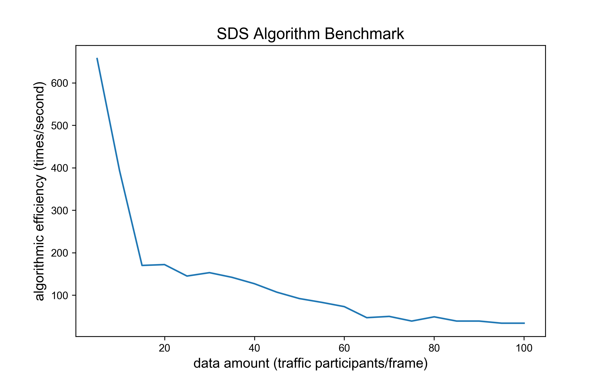
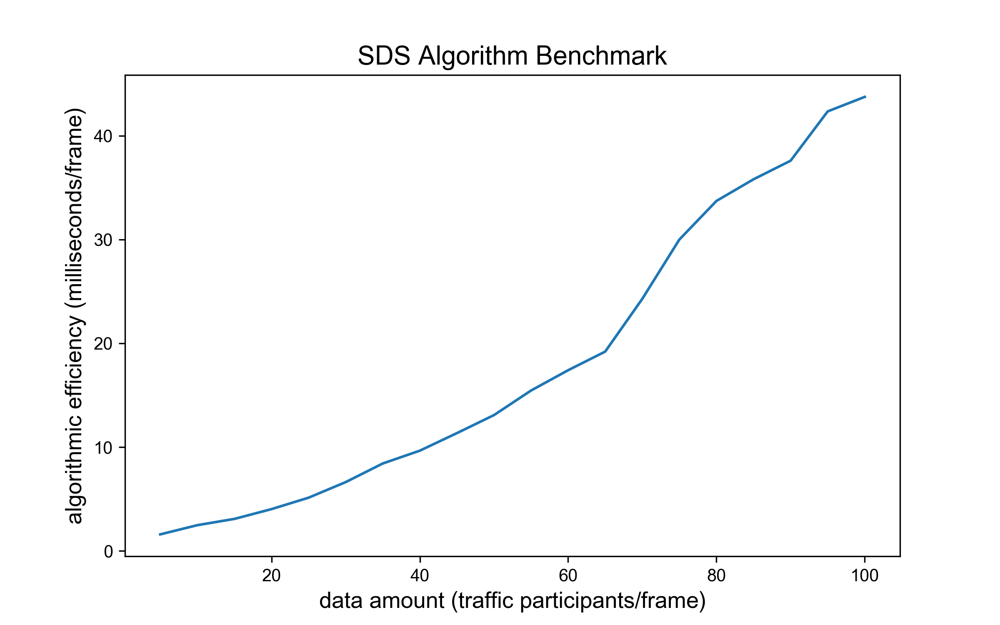

# 感知数据共享算法 (Sensor Data Sharing)

## 概览

### _目录_

<!-- @import "[TOC]" {cmd="toc" depthFrom=1 depthTo=6 orderedList=false} -->

<!-- code_chunk_output -->

- [感知数据共享算法 (Sensor Data Sharing)](#感知数据共享算法-sensor-data-sharing)
  - [概览](#概览)
    - [_目录_](#目录)
    - [难点与挑战](#难点与挑战)
    - [实现概览](#实现概览)
    - [算法BenchMark](#算法benchmark)
  - [感知数据共享代码及其对应版本](#感知数据共享代码及其对应版本)
    - [继承关系](#继承关系)
    - [调用](#调用)
  - [代码流程及框架](#代码流程及框架)
  - [感知数据共享算法解析](#感知数据共享算法解析)
    - [1. 感知数据共享算法实现框架: run 函数](#1-感知数据共享算法实现框架-run-函数)
    - [2. 加入交通参与者信息: _add_participants 函数](#2-加入交通参与者信息-_add_participants-函数)
    - [3. 为交通参与者生成事件信息: _add_obstacles 函数](#3-为交通参与者生成事件信息-_add_obstacles-函数)
  - [附录](#附录)
    - [参考文献](#参考文献)
    - [Configuration](#configuration)

<!-- /code_chunk_output -->

### 难点与挑战

1. 共享请求车辆的重定位：在具有一定通讯延时与处理延时的情况下，算法需通过请求数据，从检测目标中定位请求车辆。
2. 有效交互车辆的筛选：算法不需要仅共享车辆附近的交通目标，还需智能筛选出较远处但未来预期存在交互的交通目标。

### 实现概览

感知数据共享指接收 OBU
的感知数据请求，基于请求车辆信息，自适应筛选与之交互的人、车及障碍物的多种类信息。现有数据共享机制较为简单，以直接返回请求车辆周围所有目标为主，缺少智能化，包含无用信息。**开发的数据共享算法，实现了请求车辆重定位，自适应交互缓冲区构建，交互参与主体智能筛选三大功能**。优势在于：

- 请求车辆重定位，避免了自车数据的返回对车辆的决策判别产生干扰。
- 建立请求车辆的自适应交互区，智能筛选交互主体，减少了无用信息返回的同时，包含了更多有效信息。

### 算法BenchMark

测试数据结构：每辆车及其 10 帧历史数据信息

主要影响变量：data amount，每一帧数据包含的车辆数，data amount 由 $1$ 增至 $100$， 算法 $1$ 秒内运算次数由 $700$ 降至接近 $1$，运行单次算法耗时由
$2$ 毫秒增至 $50$ 毫秒。 导致耗时增加速率下降，主要由于车辆数增多，遍历配对运算数指数增长。 此算法满足在线要求。

 

## 感知数据共享代码及其对应版本

### 继承关系

DataShare 类继承 Base 类，用于防止类未定义调用情况下的报错。

```python
class Base:
    """Super class of SensorDataSharing class."""

    def run(
        self,
        motor_kinematics: dict,
        vptc_kinematics: dict,
        rsi: dict,
        msg_VIR: dict,
        sensor_pos: dict,
        transform_info: list,
    ) -> tuple:
        """External call function."""
        raise NotImplementedError


class DataShare(Base)
    ...
```

### 调用

主要描述感知数据共享算法如何创建和调用。

① 初始化过程直接采用初始化函数，创建方式如下

```python
SDS = SensorDataSharing()
```

② 调用过程由 `run` 函数执行，调用方式如下

```python
SDS.run(motor_kinematics, vptc_kinematics, rsi, msg_VIR, sensor_pos, transform_info)
```

## 代码流程及框架

**输入**

| 数据类型     | 数据名称              | 数据格式    | 备注              |
| -------- | ----------------- | ------- | --------------- |
| **外部输入** | motors_kinematics | dict    | 接收机动车轨迹数据       |
| **外部输入** | vptc_kinematics   | dict    | 弱势交通参与者轨迹       |
| **外部输入** | rsi               | dict    | 交通事件信息          |
| **外部输入** | msg_VIR           | msg_VIR | 车辆 OBU 数据共享请求消息 |
| **外部输入** | sensor_pos        | dict    | 请求消息            |
| **外部输入** | transform_info    | dict    | 坐标转换所用的原点信息     |

**过程**

1. 根据请求车辆的经纬度与预期轨迹，计算其未来轨迹线
2. 建立未来轨迹线的缓冲区
3. 寻找在缓冲区内的交互车辆与弱势交通参与者
4. 获取交互目标的基本信息与历史和未来的轨迹信息
5. 基于 rsi，获取请求车辆附近的障碍物信息
6. 基于参与者信息与障碍物信息，生成 msg_SSM

**输出**

| 数据类型   | 数据名称          | 数据格式 | 备注             |
| ------ | ------------- | ---- | -------------- |
| **输出** | msg_SSM       | dict | 数据共享消息 msg_SSM |
| **输出** | info_for_show | dict | 发送给前端的展示信息     |

```python
info_for_show = {
    "type": "SDS",
    "ego_point": [
        {
            "x": obj_info["x"][-1],
            "y": obj_info["y"][-1],
        }
        ],
    "other_cars": [],
    },
```

## 感知数据共享算法解析

### 1. 感知数据共享算法实现框架: run 函数

- 参数初始化

```python
def run(
        self,
        motor_kinematics: dict,
        vptc_kinematics: dict,
        rsi: dict,
        msg_VIR: dict,
        sensor_pos: dict,
        transform_info: list,
    ) -> tuple:
    self._transform_info = transform_info
    self._transformer = self._transform_info[0]
    self._msg_SSM = {
        "msgCnt": msg_VIR["msgCnt"],
        "id": msg_VIR["intAndReq"]["reqs"]["targetRSU"],
        "equipmentType": 1,
        "sensorPos": sensor_pos,
        "secMark": int(time.time() * 1000 % utils.MaxSecMark),
        "egoPos": msg_VIR["refPos"],
        "egoId": msg_VIR["id"],
        "participants": [],
        "obstacles": [],
    }
    ...
)
```

- 筛选需要共享的机动车辆与行人信息

```python
def run(
        self,
        motor_kinematics: dict,
        vptc_kinematics: dict,
        rsi: dict,
        msg_VIR: dict,
        sensor_pos: dict,
        transform_info: list,
    ) -> tuple:
    ...
    self._add_participants(msg_VIR, motor_kinematics, vptc_kinematics)
```

- 生成和返回需要共享的交通事件信息

```python
def run(
        self,
        motor_kinematics: dict,
        vptc_kinematics: dict,
        rsi: dict,
        msg_VIR: dict,
        sensor_pos: dict,
        transform_info: list,
    ) -> tuple:
    ...
    self._add_obstacles(rsi)
    return self._msg_SSM, self._info_for_show
```

### 2. 加入交通参与者信息: _add_participants 函数

- 通过 `_build_traj_buffer` 函数生成主车未来路径的可能冲突区域

```python
def _add_participants(
    self, msg_VIR: dict, motor_kinematics: dict, vptc_kinematics: dict
):
    traj_buffer = self._build_traj_buffer(msg_VIR)
    ...
```

- 筛选出该冲突区域的所有交通参与者

```python
def _add_participants(
    self, msg_VIR: dict, motor_kinematics: dict, vptc_kinematics: dict
):
    ...
    self.ego_y, self.ego_x = post_process.coordinate_tf(
        msg_VIR["refPos"]["lat"],
        msg_VIR["refPos"]["lon"],
        self._transformer,
    )
    motor_list, motor_show = self._filter_motor(
        motor_kinematics, traj_buffer
    )
    vptc_list, vptc_show = self._filter_vptc(vptc_kinematics, traj_buffer)
    self._msg_SSM["participants"] = motor_list + vptc_list

    self._generate_show_data(motor_show + vptc_show)
```

### 3. 为交通参与者生成事件信息: _add_obstacles 函数

对范围内的交通参与者生成符合 SSM 格式要求的下发信息

```python
def _add_obstacles(self, rsi: dict):
    if len(rsi):
        obstacle_list = self._build_obstacle_info(rsi)
        self._msg_SSM["obstacles"] = obstacle_list
```

## 附录

### 参考文献

- Arun A , Haque M M , Washington S , et al. A Systematic Review of Traffic Conflict-Based Safety
  Measures with a Focus on Application Context[J]. Analytic Methods in Accident Research, 2021,
  32(2):100185.

### Configuration

- model name : Intel Core 6 i7 @ 2.6 GHz （x86_64）
- compiler: Python 3.7.4 [Clang 12.0.0 (clang-1200.0.32.29)] on darwin
