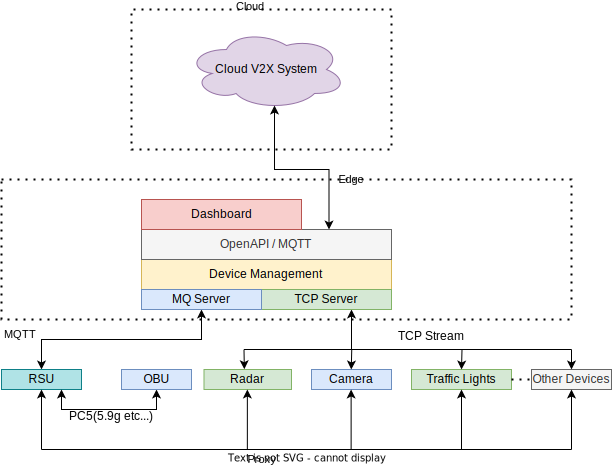

# 架构设计文档

## 1. 设计架构图

总体设计

详细设计

数据处理流程

设备管理

### 1.1 后端(DEMO)推荐硬件

| 名称  |   配置    |
| :-: | :-----: |
| CPU | x64 2核心 |
| 内存  |   4G    |
| 磁盘  |  100G   |

### 1.2 算法(DEMO)推荐硬件

| 名称  |   配置    |
| :-: | :-----: |
| CPU | x64 4核心 |
| 内存  |   8G    |
| 磁盘  |  100G   |

### 1.3 后端(生产)推荐硬件

| 名称  |   配置    |
| :-: | :-----: |
| CPU | x64 4核心 |
| 内存  |   8G    |
| 磁盘  |   1T    |

### 1.4 算法(生产)推荐硬件

| 名称  | 配置  |
| :-: | :-: |
| CPU |  -  |
| 内存  |  -  |
| 磁盘  |  -  |

### 1.5 后端软件要求

- CentOS-7 2009
- MySQL-5.7
- Redis-5.0
- RabbitMQ 3.9 / emqx v4.0.0
