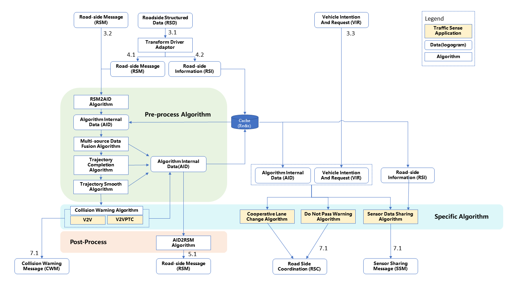
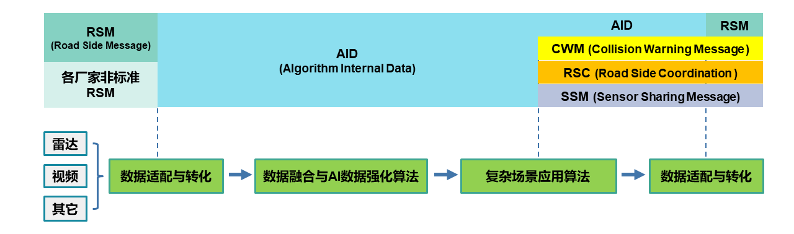

# V2X 算法文档

## 1.算法架构

### 1.1 算法服务架构



### 1.2 算法函数架构


## 2. 算法数据流通

### 2.1 数据流通示意图



### 2.2 各类型数据结构及作用

#### 2.2.1 RSM 与各厂家原始数据

RSM 为算法服务接收的标准新四跨数据格式，样例数据如下：

```python
obj_info_example = {
    "name": "test001",
    "id": "12",
    "content": {
        "rsms": [{
            "refPos": {
                "lat": 401234567,
                "lon": 1161234567,
                "ele": 1000
            },
            "participants": [{
                "ptcType": "motor",
                "ptcId": 3,
                "global_track_id": "ab8756de",
                "source": 1,
                "secMark": 0,
                "pos": {
                    "lat": 401234567,
                    "lon": 1161234567,
                    "ele": 1000
                },
                "speed": 3000,
                "heading": 10000,
                "size": {
                    "width": 200,
                    "length": 3000,
                    "height": 40
                }
            }]
        }]
    }
}
```

各厂家原始数据指多样化非标准新四跨格式交通目标检测数据。算法服务支持非标准 RSM 数据的接入，`v2xai_server.adaptor`提前内置了对应厂家的非标准数据转 RSM
函数，以厂家英文名或中文拼写为函数名。应用时依据接收数据的 mqtt 主题的关键字段，自动匹配内置的适配函数。匹配样例：

```python
from v2xai_server import adaptors
# 非标准RSM发送主题，DAWNLINE为厂家对应英文名
rsm_topic = 'V2X/RSU/R328328/RSM/UP/DAWNLINE'
# 寻找主题关键字的正则表达式
rsm_topic_re = re.compile(r'V2X/RSU/(?P<rsuid>[^/]+)/RSM/UP/(?P<adaptor>[^/]+)')
# 匹配数据对应的适配函数
if not rsm_topic_re.search(rsm_topic_1):
  adaptor = getattr(adaptors, 'std')
else:
  adaptor = getattr(adaptors, m.groupdict()['adaptor'].lower())
```

#### 2.2.2 AID(**Algorithm Internal Data**)

AID 指算法内部流通数据，从存储逻辑的角度可区分为两类：

1. **不参与 Redis 存储的即时数据**：最新帧数据 `latest_frame`，由 RSM
   数据经`v2xai_server.processing`中的数据转化函数`_rsm2frame`得到，可在各算法间传输。是各算法接口中的统一且唯一的外部输入。
2. **参与 Resdis
   存储的历史数据**：如历史数据`context_frames`，`last_timestamp`等，由各算法生成且各自独立存储。在保证了依赖历史数据的算法可正常运行的同时使得各算法高度模块化，可较为容易的实现
   pipline 配置。

经`v2xai_server.processing`中的数据转化函数`_rsm2frame`得到的不参与 Redis 存储的即时数据结构如下：

```python
latest_frame = {
        'ab8756de': 
            {'secMark': 59810,
             'ptcType': 'motor',
             'x': 98,
             'y': 100,
             'speed': 500,
             'heading': 7200
             },
        ab8757de': 
            {'secMark': 59810,
             'ptcType': 'motor',
             'x': 67,
             'y': 35,
             'speed': 330,
             'heading': 4500
             }
       }
```

#### 2.2.3 CWM(**Collision Warning Message** )

CWM 指车辆间碰撞预警及弱势交通参与者碰撞预警算法输出的预警信息。数据结构如下：

```python
msg_CWM = {
            "eventType": 0,
            "collisionType": 0,
            "secMark": 59999,
            "egoInfo": {
                "egoId": "abcd10.0",
                "egoPos": {
                    "lat": 120000,
                    "lon": 80000,
                    "ele": 500,
                },
                "heading": 0,
                "size": 0,
                "kinematicsInfo": {
                    "speed": 0.0,
                    "accelerate": 0.0,
                    "angularSpeed": 0.0,
                },
            },
            "otherInfo": {
                "otherId": "abcd10.0",
                "otherPos": {
                    "lat": 120000,
                    "lon": 80000,
                    "ele": 500,
                },
                "heading": 0,
                "size": 0,
                "kinematicsInfo": {
                    "speed": 0.0,
                    "accelerate": 0.0,
                    "angularSpeed": 0.0,
                },
            },
        }
```

#### 2.2.4 RSC(**Road Side Coordination** )

RSC 指。数据结构如下：

```python
msg_RSC = {
    "msgCnt": 1,
    "id": 1,
    "secMark": 53737,
    "refPos": {
        "lon": 319353414, 
        "lat": 1188217928, 
        "ele": 100
    },
    "coordinates": {
        "vehId": "1.0",
        "driveSuggestion": {
            "suggestion": 1, 
            "lifeTime": 500
        },
        "pathGuidance":[
            {
                "pos":{
                    "lon": 0, 
                    "lat": 0, 
                    "ele": 0
                },
                "speed": 0,
                "heading": 0,
                "estimatedTime": 0
            }
        ],
        "info": 0
    }
}
```

#### 2.2.5 SSM(**Sensor Sharing Message**)

SSM 指。数据结构如下：

```python
msg_SSM = {
    "msgCnt": 1,
    "id" : 'OCTET STRING (SIZE(8))'
    "equipmentType": 1,
    "secMark": 53737,
    "sensorPos": {
        "lon": 319353414, 
        "lat": 1188217928, 
        "ele": 100
    },
    "egoPos": msg["refPos"],
    "egoId": msg["id"],
    "participants": [],
    "obstacles": [],
    "rtes": [],
}
```

## 3.模型介绍

算法模型仅在此概览，具体模型文档点击各部分对应`链接`查看。

### 3.1 多源感知数据融合算法 (Fusion)

[多源感知数据融合算法模型文档](https://github.com/open-v2x/cerebrum/blob/master/docs/pre_process_algorithm_documents/v2x-1.0.0-algorithm-Fusion.md)

多源数据融合指对不同设备的检测结果进行时空判别与匹配，对于不同设备检测到的同一目标，进行定位修正、信息互补、id 重构等工作，实现大范围内的车辆连续检测跟踪。

### 3.2 在线轨迹补全算法 (Complement)

[在线轨迹补全算法模型文档](https://github.com/open-v2x/cerebrum/blob/master/docs/pre_process_algorithm_documents/v2x-1.0.0-algorithm-Complement.md)

在线轨迹补全指对于由车辆遮挡、检测丢失等问题引起的车辆轨迹断续的情况进行修正与填补。本方案提供两种补全算法：①差值补全算法，②基于 LSTM 的 AI 补全算法。两种算法中通过牺牲 3-5
帧(12-20ms)的实时性，获取车辆的历史轨迹点，实现对中间缺失值的差值补全或 LSTM 补全。

### 3.3 在线轨迹平滑算法 (Smooth)

[在线轨迹算法模型文档](https://github.com/open-v2x/cerebrum/blob/master/docs/pre_process_algorithm_documents/v2x-1.0.0-algorithm-Smooth.md)

本方案提供两种平滑算法。

① 迭代类平滑，根据上一时刻平滑后轨迹点以及当前时刻平滑前轨迹点即可计算当前时刻平滑后轨迹点。 ② 拟合类平滑，根据末尾 `point_num` 个轨迹点时空位置进行多项式拟合
`np.polyfit` ，拟合次数由`fitting_times` 定义，拟合后按最后帧时刻取瞬时位置作为平滑后轨迹点。

### 3.4 碰撞预警算法 (Collision Warning)

[碰撞预警算法模型文档](https://github.com/open-v2x/cerebrum/blob/master/docs/scenario_algorithm_documents/v2x-1.0.0-algorithm-Collision-Warning.md)

现有工程类解决方案缺少交通领域的专业应用，如合理的碰撞指标选取与阈值确定；同时缺少灵活的可配置性以及针对不同场景与情况的自适应能力，如轨迹预测模型的自动切换与指标选取的自动切换能力。项目开发了多场景
V2X 碰撞风险研判与预警算法，实现了自适应未来轨迹推演、未来轨迹碰撞冲突检查、碰撞指标与危险度估计以及碰撞指标阈值判别与预警信息生成四大功能。

### 3.5 感知数据共享算法 (Sensor Data Sharing)

[感知数据共享算法模型文档](https://github.com/open-v2x/cerebrum/blob/master/docs/scenario_algorithm_documents/v2x-1.0.0-algorithm-Sensor-Data-Sharing.md)

感知数据共享指接收 OBU
的感知数据请求，基于请求车辆信息，自适应筛选与之交互的人、车及障碍物的多种类信息。**开发的数据共享算法，实现了请求车辆重定位，自适应交互缓冲区构建，交互参与主体智能筛选三大功能**。优势在于：

- 请求车辆重定位，避免了自车数据的返回对车辆的决策判别产生干扰。
- 建立请求车辆的自适应交互区，智能筛选交互主体，减少了无用信息返回的同时，包含了更多有效信息。

### 3.6 车辆协同换道算法 (Cooperative Lane Change)

[车辆协同换道算法模型文档](https://github.com/open-v2x/cerebrum/blob/master/docs/scenario_algorithm_documents/v2x-1.0.0-algorithm-Cooperative-Lane-Change.md)

车辆协同换道指接收 OBU
的协同换道请求，基于请求车辆信息及周围信息，生成合理的换道建议与推荐换道轨迹。开发的车辆协同换道算法，基于车辆历史运动数据和驾驶行为假设研判瞬时计划路径风险，并对请求车辆发布动态的引导路径信息，在线保障车辆驾驶安全。

### 3.7 逆向超车预警算法(Do Not Pass Warning)

[逆向超车预警算法模型文档](https://github.com/open-v2x/cerebrum/blob/master/docs/scenario_algorithm_documents/v2x-1.0.0-algorithm-Do-Not-Pass-Warning.md)

逆向超车预警指接收 OBU 的逆向超车请求，基于请求车辆信息及周围信息，生成合理的逆向超车许可建议。

## 附录

### **Configuration**

- model name : Intel Core 6 i7 @ 2.6 GHz (x86_64)
- compiler: Python 3.7.4 [Clang 12.0.0 (clang-1200.0.32.29)] on darwin
