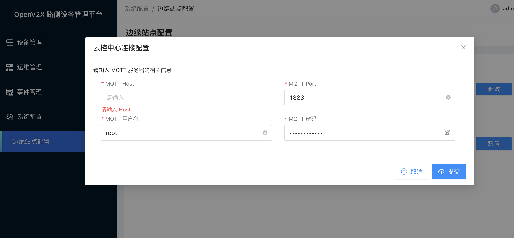
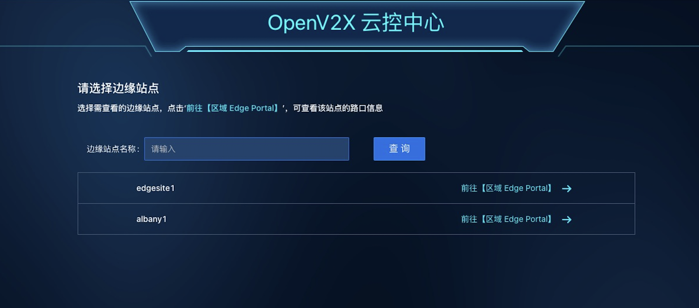

# openv2x 自定义部署文档

## 拓扑图



## 环境配置

### 1. 基本环境

硬件：4Core / 8G / 100G

OS：CentOS7-2009

```console
[root@v2x-release ~]# cat /etc/redhat-release
CentOS Linux release 7.9.2009 (Core)
```

### 2. kernel 升级

```shell
rpm --import https://www.elrepo.org/RPM-GPG-KEY-elrepo.org
yum install -y https://www.elrepo.org/elrepo-release-7.0-4.el7.elrepo.noarch.rpm
yum -y --disablerepo="*" --enablerepo="elrepo-kernel" list available
yum -y --disablerepo=\* --enablerepo=elrepo-kernel install kernel-lt.x86_64

awk -F\' '$1=="menuentry " {print i++ " : " $2}' /etc/grub2.cfg

grub2-set-default 0
# 这里的 0 要根据实际情况来填写

reboot
```

确认 Kernel 已经升级到 5.4

```console
[root@v2x-release ~]# uname -a
Linux v2x-release 5.4.203-1.el7.elrepo.x86_64 #1 SMP Fri Jul 1 09:00:33 EDT 2022 x86_64 x86_64 x86_64 GNU/Linux
```

### 3. docker 升级

```shell
yum remove -y docker docker-client docker-client-latest docker-common docker-latest docker-latest-logrotate docker-logrotate docker-engine
yum install -y yum-utils
yum-config-manager --add-repo https://download.docker.com/linux/centos/docker-ce.repo
yum install -y docker-ce docker-ce-cli containerd.io docker-compose-plugin
systemctl enable docker --now

echo "alias docker-compose='docker compose'" >> /etc/profile && source /etc/profile

docker version
docker-compose version
```

### 4. 下载安装包

```shell
yum install unzip -y
rm -rf albany.zip && wget https://gitee.com/open-v2x/docs/repository/archive/albany.zip
rm -rf docs-albany && unzip albany.zip
cd docs-albany/src/
```

## 单节点手动部署

### 1. openv2x 基础组件安装

#### 1-1. 配置初始化文件

```shell
unalias cp 2>/dev/null || true

rm -rf /data && mkdir -pv /data
#删除并新建 mariadb 镜像挂载文件

cp -rf deploy/mysql /data/
#mariadb 初始化 init.sql，使用时需修改其中 dandelion 用户密码 dandelion123

cp -f deploy/docker-compose-pre.yaml /tmp/pre/docker-compose-pre.yaml
#基础组件 docker-compose 配置文件，使用时需修改 mariadb.MYSQL_PASSWORD、mariadb.MYSQL_ROOT_PASSWORD、emqx.EMQX_AUTH__USER__1__PASSWORD 和 redis.command，其中 mariadb.MYSQL_PASSWORD 为 dandelion 用户密码，mariadb.MYSQL_ROOT_PASSWORD 为 root 用户密码
```

#### 1-2. 安装基础组件

```shell
unalias cp 2>/dev/null || true

mkdir -pv /tmp/pre
docker-compose -f /tmp/pre/docker-compose-pre.yaml up -d

docker exec mariadb mysql -uroot -p{} -e 'show databases;' 2>/dev/null || true
#将命令中 {} 替换成 mariadb root 密码，安装完之后需多次执行这条命令执行后出现 dandelion 才算成功，这条命令是登陆并列出 mariadb 数据库
```

### 2. openv2x后端初始化

#### 2-1. 配置初始化文件

```shell
unalias cp 2>/dev/null || true

cp -rf deploy/dandelion /etc/
#后端服务配置文件，使用时需修改 database.connection 中 dandelion123、mqtt.password 和 redis.connection 中 redis12345，其中database.connection 密码为 dandelion 用户密码

rm -rf /var/log/dandelion && mkdir -p /var/log/dandelion
touch /var/log/dandelion/dandelion.log
#删除并创建后端 log 文件
```

#### 2-2. 后端初始化

```shell
unalias cp 2>/dev/null || true

mkdir -pv /tmp/init
cp -f deploy/docker-compose-init.yaml /tmp/init/docker-compose-init.yaml
docker-compose -f /tmp/init/docker-compose-init.yaml up -d
#启动后端初始化容器

docker ps -a | grep dandelion_bootstrap 2>/dev/null
#查看 dandelion_bootstrap 状态，如果为 Exited (0) 说明初始化成功，然后删除该容器

docker rm dandelion_bootstrap
```

### 3. openv2x服务一键部署

#### 3-1. 配置初始化文件

```shell
unalias cp 2>/dev/null || true

cp -rf deploy/edgeview /etc/ && cp -rf deploy/centerview /etc/
#前端 nginx 配置文件
```

#### 3-2. openv2x服务部署

```shell
unalias cp 2>/dev/null || true

mkdir -pv /tmp/service
cp -f deploy/docker-compose-service.yaml /tmp/service/docker-compose-service.yaml
#openv2x 服务部署 docker-compose 配置文件，使用时需修改 services.dandelion.mysql_password、services.dandelion.emqx_password、services.dandelion.redis_password、services.centerview.MQTT_PASSWORD，其中 services.dandelion.mysql_password 为 root 密码

docker-compose -f /tmp/service/docker-compose-service.yaml up -d
#一键启动服务
```

## openv2x多节点部署

### 1. 部署主站点和分站点

准备多台机器，使用 quick-install 方法分别部署一台主站点和多台分站点，分站点和主站点不同的地方在于分站点不需要 centerview，需要删除该容器

```shell
docker stop centerview && docker rm centerview
#分站点一键部署完需删除 centerview 容器
```

### 2. 主站点添加分站点

在分站点 edgeview 边缘站点配置主站点 mqtt 以连接主站点 

### 3. 主站点查看已连接分站点


