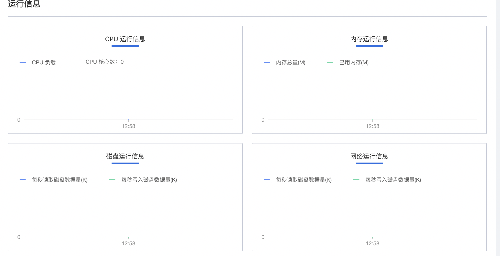
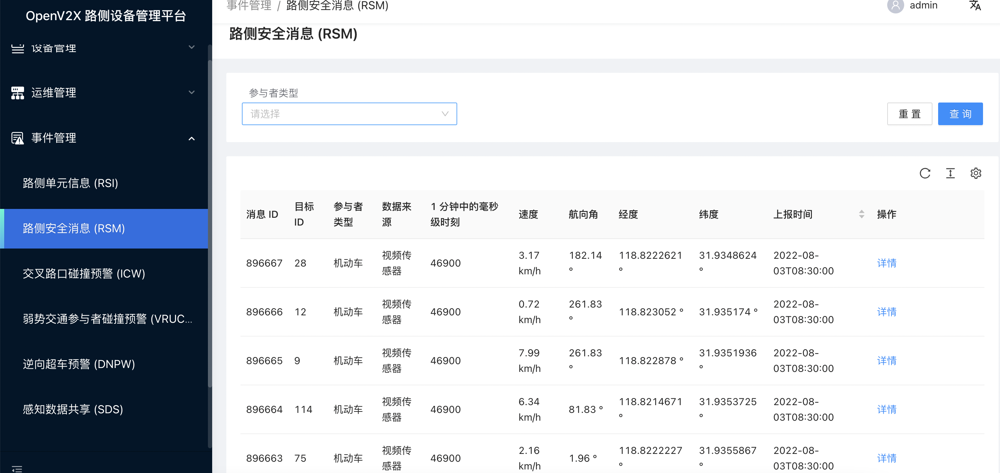
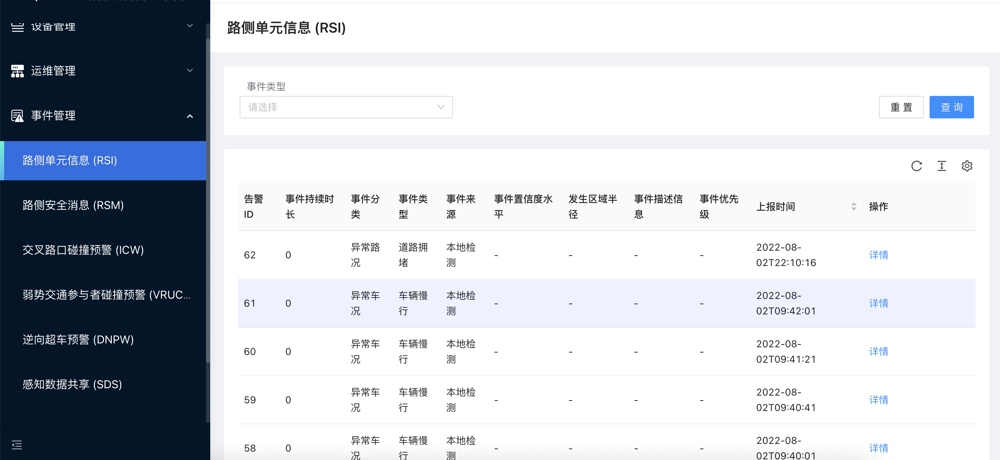
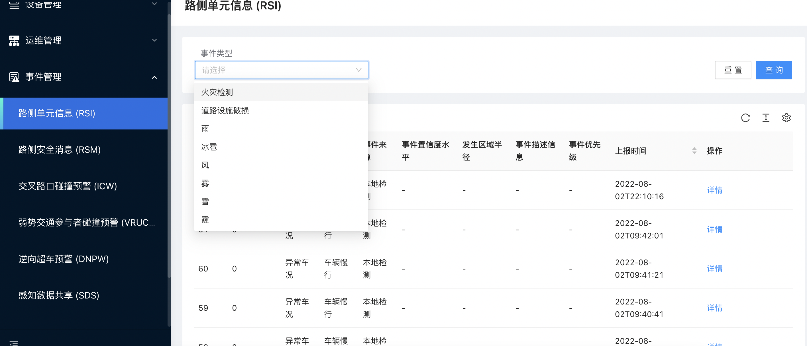
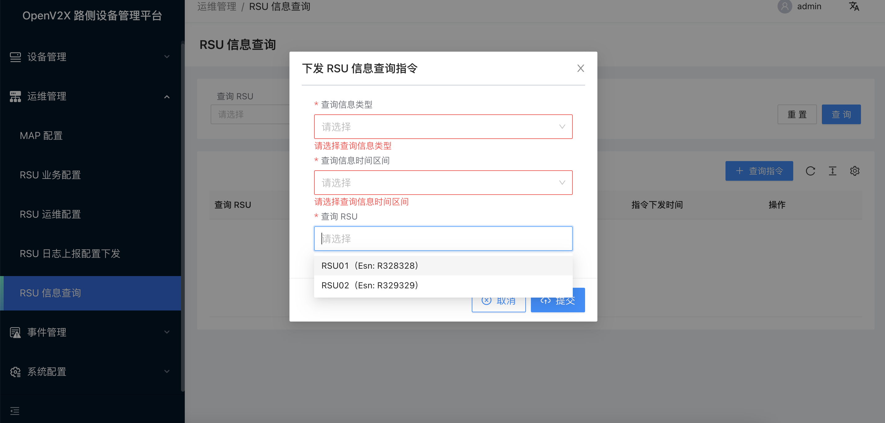
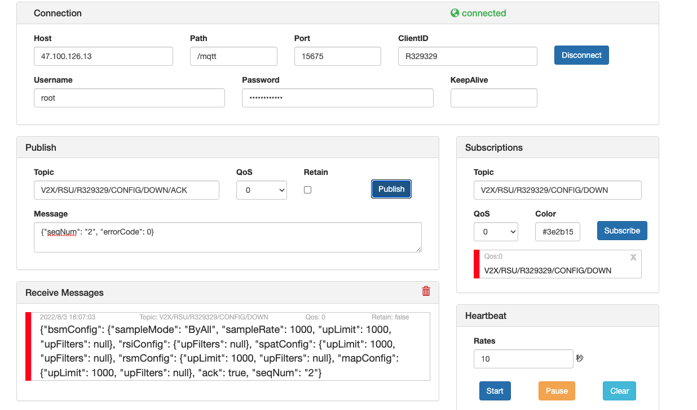
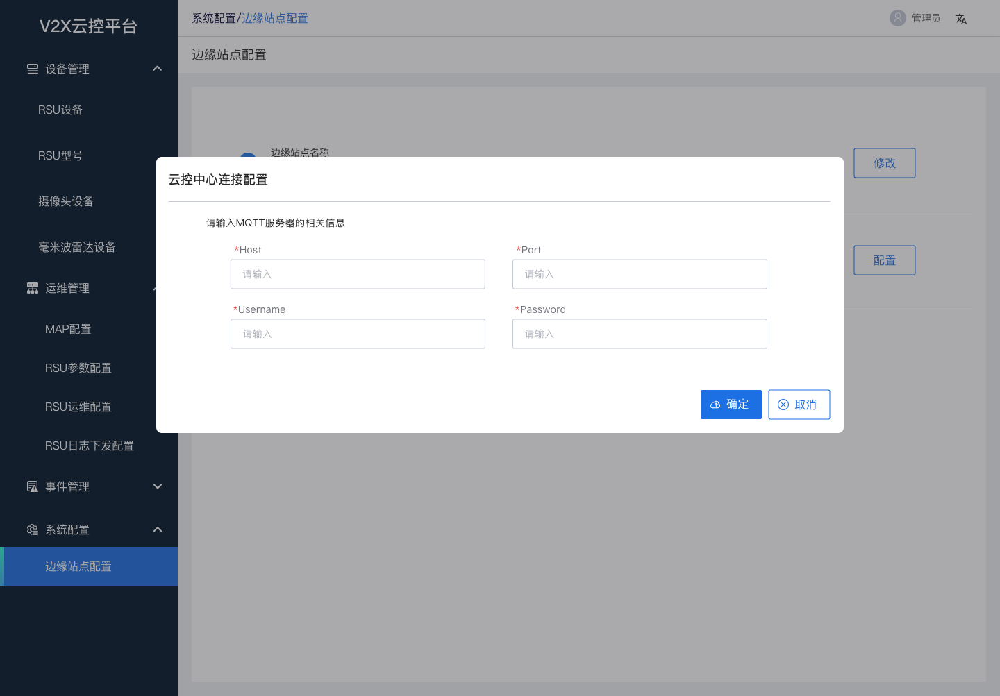
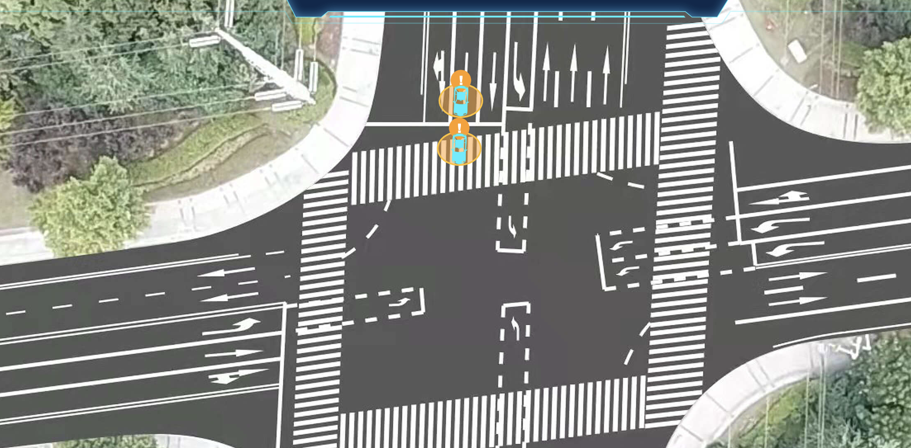

# OpenV2X 用户手册

## 边缘云控平台

### 设备管理

#### 1. 操作 RSU 设备

##### 1.1 登录 OpenV2X 边缘云控平台（OpenV2X Edge Portal）

OpenV2X 边缘云控平台网址：http://\<ip-address\>:80/user/login，输入正确的用户名、密码(username: admin password:
dandelion)可登录平台。

##### 1.2 新增 RSU 设备

1. 点击进入“设备管理 - RSU 设备”，点击“添加RSU”，填入 RSU 名称、序列号、安装区域、具体位置、RSU ID、RSU IP、RSU 型号以及描述信息，点击“提交”。

   

2. 点击进入“设备管理 - RSU 设备”，点击“未注册 RSU”，未注册 RSU 列表中选择一个 RSU 设备点击一键注册。

##### 1.3 编辑 RSU 设备

点击进入“设备管理 - RSU 设备”，在注册 RSU 列表中选择一个 RSU 设备点击“编辑”，修改相关信息，点击“提交”。

##### 1.4 启用 RSU 设备

点击进入“设备管理 - RSU 设备”，在 RSU 设备列表中点击启用已禁用的 RSU 设备。

##### 1.5 查看 RSU 设备详情信息

点击进入“设备管理 - RSU 设备”，点击 RSU 设备列表中已启用的 RSU 设备详情，可查看到 RSU 设备的基本信息、运行信息和配置参数。

 

##### 1.6 删除 RSU 设备

点击进入“设备管理 - RSU 设备”，在 RSU 设备列表中删除 RSU 设备。

##### 1.7 重启 RSU 设备

点击进入“运维管理 - RSU 运维配置”，在 RSU 运维配置列表中编辑 RSU 设备，在是否重启一栏选择重启并点击“提交”。

#### 2. 操作侧毫米波雷达设备

##### 2.1 登录 OpenV2X 边缘云控平台（OpenV2X Edge Portal）

OpenV2X 边缘云控平台网址：http://\<ip-address\>:80/user/login，输入正确的用户名、密码(username: admin password:
dandelion)可登录平台。

##### 2.2 新增雷达设备

点击进入“设备管理 - 雷达设备”，点击“添加雷达”，填入雷达名称、雷达序列号、经度、维度、海拔(m)、朝向(°)、关联 RSU、雷达 IP 以及描述信息，点击“提交”。

##### 2.3 编辑雷达设备

点击进入“设备管理 - 雷达设备”，在雷达列表中选择一个雷达设备点击“编辑”，修改相关信息，点击“提交”。

##### 2.4 查看雷达设备详情信息

点击进入“设备管理 - 雷达设备”，点击雷达设备列表中雷达设备详情，可查看到雷达设备的配置详情。

##### 2.5 删除雷达设备

点击进入“设备管理 - 雷达设备”，在雷达设备列表中点击删除雷达设备。

#### 3. 操作路侧摄像头

##### 3.1 登录 OpenV2X 边缘云控平台（OpenV2X Edge Portal）

OpenV2X 边缘云控平台网址：http://\<ip-address\>:80/user/login，输入正确的用户名、密码(username: admin password:
dandelion)可登录平台。

##### 3.2 新增摄像头设备

点击进入“设备管理 - 摄像头设备”，点击“添加摄像头”，填入摄像头名称、摄像头序列号、视频流地址、经度、维度、海拔(m)、朝向(°)、关联 RSU 以及描述信息，点击“提交”。

##### 3.3 编辑摄像头设备

点击进入“设备管理 - 摄像头设备”，在雷达列表中选择一个摄像头设备点击“编辑”，修改相关信息，点击“提交”。

##### 3.4 查看摄像头设备详情信息

点击进入“设备管理 - 摄像头设备”，点击摄像头设备列表中摄像头设备详情，可查看到摄像头设备的配置详情。

##### 3.5 删除摄像头设备

点击进入“设备管理 - 摄像头设备”，在摄像头设备列表中点击删除摄像头设备。

#### 4. RSU 信息上报

##### 4.1 登录 OpenV2X 边缘云控平台（OpenV2X Edge Portal）

OpenV2X 边缘云控平台网址：http://\<ip-address\>:80/user/login，输入正确的用户名、密码(username: admin
password:dandelion)可登录平台。 进入设备管理-RSU设备界面

##### 4.2 配置 RSE Simulator 建立监听

打开 RSE Similator http://\<ip-address\>:6688，配置Username、password、clientID 建立连接后在 Subscriptions
中添加监听主题 V2X/RSU/INFO/UP，点击 Subscribe 进行监听

##### 4.3 RSE Simulator 发送数据

点击 RSU_INFO 中 preview 查看数据，将数据复制到 publish 的 message 中，修改 rsuEsn 字段，点击 publish 发送数据

##### 4.4 查看边缘云控平台RSU设备

在设备管理页面 RSU 设备中查看，新增未注册 RSU 数据

#### 5. RSU 心跳上报

##### 5.1 登录 OpenV2X 边缘云控平台（OpenV2X Edge Portal）

OpenV2X 边缘云控平台网址：http://\<ip-address\>:80/user/login，输入正确的用户名、密码(username: admin
password:dandelion)可登录平台。

点击设备管理- RSU 设备界面

##### 5.2 RSE Simulator 发送数据

在 Heartbeat 中点击 Start 进行发送

##### 5.3 查看 RSU 设备界面

在RSU 设备界面上看到 RSU 设备在线状态为“在线”

### 事件管理

#### 1. 查看历史数据统计分析结果

##### 1.1 登录 OpenV2X 边缘云控平台（OpenV2X Edge Portal）

OpenV2X 边缘云控平台网址：http://\<ip-address\>:80/user/login，输入正确的用户名、密码(username: admin password:
dandelion)可登录平台。

##### 1.2 查看历史数据统计分析结果

1. 点击进入“事件管理-路侧安全消息（RSM）”， 可查看 RSM 消息的历史数据，支持根据“参与者类型”进行过滤查询。
   

2. 点击进入“事件管理-路侧单元消息（RSI）”， 可查看 RSI 消息的历史数据，支持根据“事件类型”进行过滤查询。
   

3. 点击进入“逆向超车预警 (DNPW)”，可查看 DNPW 消息的历史数据，支持根据“协调信息类型”进行过滤查询。
   

#### 2. RSM 上报云控中心

##### 2.1 登录 OpenV2X 边缘云控平台（OpenV2X Edge Portal）

OpenV2X 边缘云控平台网址：http://\<ip-address\>:80/user/login，输入正确的用户名、密码(username: admin password:
dandelion)可登录平台。

点击事件管理-路侧安全消息（RSM)界面

##### 2.2 配置 RSE Simulator 建立监听

打开 RSE Similator http://\<ip-address\>:6688，配置 Username、password、clientID 建立连接

点击 Subscribe 建立监听

##### 2.3 RSE Simulator 发送数据

在 DataSet 中选择 video_track 或者 radar_track 数据，点击 Publish 进行发送

##### 2.4 查看 RSE Simulator 接收数据及 RSM 界面

在 事件管理-路侧安全消息 (RSM) 界面查看数据

#### 3. RSM 下发 RSU

##### 3.1 配置 RSE Simulator 建立监听

打开 RSE Similator http://\<ip-address\>:6688，配置 Username、password、clientID 建立连接后在 Subscriptions
中添加监听主题 V2X/RSU/R328328/RSM/DOWN，点击 Subscribe 进行监听

##### 3.2 RSE Simulator 发送数据

在 DataSet 中选择 video_track 或者 radar_track 数据，点击 Publish 进行发送

##### 3.3 查看 RSE Simulator 接收数据

在Receive Messages 中看到接收的 RSM 下发的消息内容

### 运维管理

#### 1. 查询下发 RSU 设备指令

##### 1.1 登录 OpenV2X 边缘云控平台（OpenV2X Edge Portal）

OpenV2X 边缘云控平台网址：http://\<ip-address\>:80/user/login，输入正确的用户名、密码(username: admin password:
dandelion)可登录平台。

##### 1.2 下发 RSU 设备指令查询

点击进入“运维管理 - RSU 信息查询”， 点击“查询指令”，在弹出的界面可选择查询信息类型、查询信息时间区间以及查询 RSU，选择完毕点击“提交”，即可查询 下发 RSU 设备指令。

 
 

#### 2. 配置 RSU 设备日志上报地址

##### 2.1 登录 OpenV2X 边缘云控平台（OpenV2X Edge Portal）

OpenV2X 边缘云控平台网址：http://\<ip-address\>:80/user/login，输入正确的用户名、密码(username: admin password:
dandelion)可登录平台。

##### 2.2 配置 RSE Simulator 监听

打开 RSE Simulator（用于展示路口RSU收到的信息）http://\<ip-address\>:6688，在 Subscriptions 中添加监听主题
V2X/RSU/R329329/Log/UP，点击 Subscribe 进行监听。

##### 2.3 配置 RSU 日志上报地址

在边缘云控平台中点击进入“运维管理 -RSU 日志上报配置下发”，点击“添加配置”，填入日志上传地址、日志服务器用户名、日志服务器密码、服务器类型以及 RSU 信息并点击提交。

##### 2.4 查看 RSE Simulator 监听消息

RSE Simulator 监听到边缘云控平台配置的信息，以 json 字符串的形式显示。

#### 3. 下发配置至 RSU 设备

##### 3.1 登录 OpenV2X 边缘云控平台（OpenV2X Edge Portal）

OpenV2X 边缘云控平台网址：http://\<ip-address\>:80/user/login，输入正确的用户名、密码(username: admin password:
dandelion)可登录平台。

##### 3.2 配置 RSE Simulator 监听

打开 RSE Simulator（用于展示路口RSU收到的信息）http://\<ip-address\>:6688，在 Subscriptions 中添加监听主题
V2X/RSU/R329329/MNG/DOWN，点击 Subscribe 进行监听。

##### 3.3 下发配置至 RSU 设备

在边缘云控平台中点击进入“运维管理 - RSU 运维配置”，在 RSU 配置列表中选择一个 RSU 配置点击“下发”

##### 3.4 查看 RSE Simulator 监听消息

RSE Simulator 监听到边缘云控平台配置的信息，以 json 字符串的形式显示。

#### 4. MAP 上报云控中心

##### 4.1 登录 OpenV2X 边缘云控平台（OpenV2X Edge Portal）

OpenV2X 边缘云控平台网址：http://\<ip-address\>:80/user/login，输入正确的用户名、密码(username: admin
password:dandelion)可登录平台。

点击运维管理- MAP 配置界面

##### 4.2 配置 RSE Simulator 建立监听

打开 RSE Similator http://\<ip-address\>:6688，配置 Username、password、clientID 建立连接

点击 Subscribe 建立监听

##### 4.3 RSE Simulator 发送数据

在 DataSet 中选择 RSU_MAP，点击 Publish 进行发送

##### 4.4 查看 RSE Simulator 接收数据及 MAP 配置界面

在 Receive Messages 中看到接收的数据内容，在 MAP 配置界面上看到 RSU 上报的 MAP 数据

#### 5. MAP 下发至 RSU

##### 5.1 登录 OpenV2X 边缘云控平台（OpenV2X Edge Portal）

OpenV2X 边缘云控平台网址：http://\<ip-address\>:80/user/login，输入正确的用户名、密码(username: admin
password:dandelion)可登录平台。

点击运维管理- Map 配置界面

##### 5.2 配置 RSE Simulator 建立监听

打开 RSE Similator（用于展示路口RSU收到的MAP消息内容）http://\<ip-address\>:6688，配置 Username、password、clientID 建立连接后在
Subscriptions 中添加监听主题 V2X/RSU/R328328/MAP/DOWN，点击 Subscribe 进行监听

##### 5.3 界面添加 Map 并下发 RSU

在 MAP 配置界面中点击添加 MAP 按钮，填写必要字段，上传 MAP 数据示例，点击提交

打开 MAP 数据详情，点击下发，选择路口 RSU

##### 5.4 查看 RSE Simulator 接收数据

在 Receive Messages 中看到接收的结构化数据内容

##### 5.5 RSE Simulator 发送应答数据

添加发送主题：V2X/RSU/R328328/MAP/DOWN/ACK ，并发送`{"seqNum": "8", "errorCode": 0}`消息确认

##### 5.6 查看下发状态

在 MAP 配置详情中查看 RSU 下发状态从“下发中”变为“下发成功”

#### 6. RSI 上报云控中心

##### 6.1 登录 OpenV2X 边缘云控平台（OpenV2X Edge Portal）

OpenV2X 边缘云控平台网址：http://\<ip-address\>:80/user/login，输入正确的用户名、密码(username: admin
password:dandelion)可登录平台。

点击事件管理-路侧单元信息（RSI）界面

##### 6.2 配置 RSE Simulator 建立监听

打开 RSE Similator（用于展示结构化数据内容）http://\<ip-address\>:6688，配置 Username、password、clientID 建立连接后在
Subscriptions 中添加监听主题 V2X/RSU/R328328/RSI/UP，点击 Subscribe 进行监听

##### 6.3 RSE Simulator 发送数据

在 DataSet 中选择 RSI_data，点击 Publish 进行发送

##### 6.4 查看 RSE Simulator 接收数据及路侧单元信息（RSI）界面

在 Receive Messages 中看到接收的结构化数据内容，在路侧单元信息（RSI）界面上看到 RSI 上报消息的内容

#### 7. RSI 下发至 RSU

##### 7.1 配置 RSE Simulator 建立监听

打开 RSE Similator（用于展示监听的消息内容和发送特定数据）http://\<ip-address\>:6688，配置 Username、password、clientID 建立连接后在
Subscriptions 中添加监听主题 V2X/RSU/R328328/RSI/DOWN，点击 Subscribe 进行监听

##### 7.2 RSE Simulator 发送数据

在 DataSet 中选择 RSI_data，点击 Publish 进行发送

##### 7.3 查看 RSE Simulator 接收数据

在 Receive Messages 中看到接收的 RSI 信息下发消息内容

#### 8. RSU 业务配置下发

##### 8.1 登录 OpenV2X 边缘云控平台（OpenV2X Edge Portal）

OpenV2X 边缘云控平台网址：http://\<ip-address\>:80/user/login，输入正确的用户名、密码(username: admin
password:dandelion)可登录平台。 进入运维管理-RSU业务配置界面

##### 8.2 配置 RSE Simulator 建立监听

打开 RSE Similator（用于展示路口 RSU 收到的消息内容）http://\<ip-address\>:6688，配置 Username、password、clientID； 建立连接后在
Subscriptions 中添加监听主题 V2X/RSU/R329329/CONFIG/DOWN，点击 Subscribe 进行监听

##### 8.3 RSU 业务配置

点击添加配置，输入配置名称、参数配置模版、参数配置适用的 RSU，点击提交

##### 8.4 RSE Simulator 接收数据

在 Receive Messages 中看到接收的 RSU 业务配置下发消息内容

##### 8.5 RSE Simulator 发送应答数据

添加发送主题：V2X/RSU/R329329/CONFIG/DOWN/ACK，并发送`{"seqNum": "8", "errorCode": 0}`消息确认

##### 8.6 查看下发状态

进入配置详情，参数配置适用的 RSU 中的下发状态从下发中变为下发成功

### 系统配置

#### 1. 添加边缘站点

##### 1.1 登录 OpenV2X 边缘云控平台（OpenV2X Edge Portal）

OpenV2X 边缘云控平台网址：http://\<ip-address\>:80/user/login，输入正确的用户名、密码(username: admin
password:dandelion)可登录平台。

点击系统配置-边缘站点配置，设置边缘站点名称后，设置云控中心连接配置，填写好 Host、Port(1883)、用户名及密码

##### 1.2 登录 OpenV2X 中心云控平台（OpenV2X Edge Portal）

OpenV2X 云控中心网址：http://\<ip-address\>:8080/user/login，输入正确的用户名、密码(username: admin
password:dandelion)可登录平台。

点击对应边缘站点名称的“前往【区域Edge Portal】”,选择对应的 RSU ID，点击区域中黄色圆点可进入路口场景

## 云控平台

### 1. 查看边缘站点路口场景实况

#### 1.1 登录 OpenV2X 边缘云控平台（OpenV2X Edge Portal）

OpenV2X 边缘云控平台网址：http://\<ip-address\>:80/user/login，输入正确的用户名、密码(username: admin password:
dandelion)可登录平台。

#### 1.2 配置边缘站点

在边缘云控平台-系统配置-边缘站点配置页，修改边缘站点名称和云控中心连接配置

修改“边缘站点名称”，输入自定义名称，提交

配置“云控中心连接配置”，“Host” 为部署 MQTT 的地址，“Port” 端口输入 1883，“用户名”输入 root，“密码”是部署时提供的 MQTT root 密码

#### 1.3 配置 RSE Simulator 连接

打开 RSE Simulator（用于发送有碰撞风险的车辆轨迹数据）http://\<ip-address\>:6688，配置连接参数 “Host” 为部署 MQTT 的地址， “ClientID”
输入 “R328328”，“Password” 输入部署时提供的 MQTT root 密码，其他参数不变，点击 ”Connect“ 连接

#### 1.4 RSE Simulator 发送数据

在 DataSet 中选择 SDS_track 和 msg_VIR_SDS，点击 Publish 进行发送。

#### 1.5 登录 OpenV2X 云控中心（OpenV2X Central Portal）

OpenV2X 云控中心网址：http://\<ip-address\>:8080/user/login，输入正确的用户名、密码(username: admin password:
dandelion)可登录平台。

#### 1.6 查看大屏路口信息展示

打开云控中心，选择已配置的边缘站点，点击“前往【区域 Edge Portal】”，左上角选择区域和 RSU 设备 R328328，之后点击黄色圆点进入路口场景

查看左侧设备在线情况：RSU 设备在线率，路测摄像头设备，毫米波雷达设备 点击旁边收缩按钮，可隐藏和打开“设备在线率”展示

 

查看右侧路就信息：车辆总数，平均行驶速度，行人总数，拥堵情况 点击旁边收缩按钮，可隐藏和打开“路口信息”展示

 

查看感知数据共享场景下车辆在地图上的行动轨迹，以及数据共享的可视化展示

### 2. 感知数据共享

#### 2.1 登录 OpenV2X 云控中心（OpenV2X Central Portal）

OpenV2X 云控中心网址：http://\<ip-address\>:8080/user/login，输入正确的用户名、密码(username: admin password:
dandelion)可登录平台。

#### 2.2 配置 RSE Simulator 连接

打开 RSE Simulator（用于发送有碰撞风险的车辆轨迹数据）http://\<ip-address\>:6688，配置连接参数，点击 Connect。

#### 2.3 RSE Simulator 发送数据

在 DataSet 中选择 SDS_track 和 msg_VIR_SDS，点击 Publish 进行发送。

#### 2.4 查看大屏车辆数据

打开云控中心，选择边缘站点，点击“前往【区域 Edge Portal】”，左上角选择 RSU
设备以及区域，之后点击黄色圆点进入路口场景，最后在大屏上查看感知数据共享场景下车辆在地图上的行动轨迹，以及数据共享的可视化展示。

### 3. 交叉路口碰撞预警

#### 3.1 登录 OpenV2X 云控中心（OpenV2X Central Portal）

OpenV2X 云控中心网址：http://\<ip-address\>:8080/user/login，输入正确的用户名、密码(username: admin password:
dandelion)可登录平台。

#### 3.2 配置 RSE Simulator 连接

打开 RSE Simulator（用于发送有碰撞风险的车辆轨迹数据）http://\<ip-address\>:6688，配置连接参数，点击 Connect。

#### 3.3 RSE Simulator 发送数据

在 DataSet 中选择 ICW_track，点击 Publish 进行发送。

#### 3.4 查看大屏车辆数据

打开云控中心，选择边缘站点，点击“前往【区域 Edge Portal】”，左上角选择 RSU
设备以及区域，之后点击黄色圆点进入路口场景，最后在大屏上查看车辆数据在地图上的行动轨迹，以及碰撞风险的可视化预警。

### 4 雷达、摄像头数据融合

#### 4.1 登录 OpenV2X 云控中心（OpenV2X Central Portal）

OpenV2X 云控中心网址：http://\<ip-address\>:8080/user/login，输入正确的用户名、密码(username: admin
password:dandelion)可登录平台。

#### 4.2 配置 RSE Simulator 建立监听

打开 RSE Similator（用于展示结构化数据内容）http://\<ip-address\>:6688，配置 Username、password、clientID； 建立连接后在
Subscriptions 中添加监听主题 V2X/RSU/R328328/RSM/DOWN，点击 Subscribe 进行监听

#### 4.3 RSE Simulator 发送数据

在 DataSet 中选择 multi_source_fusion_track，点击 Publish 进行发送

#### 4.4 查看 RSE Simulator 接收数据及大屏车辆轨迹

在 Receive Messages 中看到接收的结构化数据内容 在大屏上查看摄像头数据车辆行动轨迹

### 5. 雷达数据

#### 5.1 登录 OpenV2X 云控中心（OpenV2X Central Portal）

OpenV2X 云控中心网址：http://\<ip-address\>:8080/user/login，输入正确的用户名、密码(username: admin
password:dandelion)可登录平台。

#### 5.2 配置 RSE Simulator 建立监听

打开 RSE Simulator（用于展示结构化数据内容）http://\<ip-address\>:6688，配置 Username、password、clientID 建立连接后在
Subscriptions 中添加监听主题 V2X/RSU/R328328/RSM/DOWN，点击 Subscribe 进行监听

#### 5.3 RSE Simulator 发送数据

在 DataSet 中选择雷达数据 radar_track，点击 Publish 进行发送

#### 5.4 查看 RSE Simulator 接收数据及大屏车辆轨迹

在 Receive Messages 中看到接收的结构化数据内容 在大屏上查看雷达数据车辆行动轨迹

### 6. 路侧摄像头数据

#### 6.1 登录 OpenV2X 云控中心（OpenV2X Central Portal）

OpenV2X 云控中心网址：http://\<ip-address\>:8080/user/login，输入正确的用户名、密码(username: admin
password:dandelion)可登录平台。

#### 6.2 配置 RSE Simulator 建立监听

打开 RSE Similator（用于展示结构化数据内容）http://\<ip-address\>:6688，配置 Username、password、clientID 建立连接后在
Subscriptions 中添加监听主题 V2X/RSU/R328328/RSM/DOWN，点击 Subscribe 进行监听

#### 6.3 RSE Simulator 发送数据

在 DataSet 中选择 video_track，点击 Publish 进行发送

#### 6.4 查看 RSE Simulator 接收数据及大屏车辆轨迹

在 Receive Messages 中看到接收的结构化数据内容 在大屏上查看摄像头数据车辆行动轨迹

### 7. 逆向超车预警

#### 7.1 登录 OpenV2X 云控中心（OpenV2X Central Portal）

OpenV2X 云控中心网址：http://\<ip-address\>:8080/user/login，输入正确的用户名、密码(username: admin password:
dandelion)可登录平台。

#### 7.2 配置 RSE Simulator 连接

打开 RSE Simulator（用于发送有碰撞风险的车辆轨迹数据）http://\<ip-address\>:6688，配置连接参数，点击Connect。

#### 7.3 RSE Simulator 发送数据

在 DataSet 中选择 DNP_track 和 msg_VIR_DNP，点击Publish 进行发送。

#### 7.4 查看大屏车辆数据

打开云控中心，选择边缘站点，点击“前往【区域 Edge Portal】”，左上角选择 RSU
设备以及区域，之后点击黄色圆点进入路口场景，最后在大屏上查看车辆数据在地图上的行动轨迹，以及逆向超车风险的可视化预警。

### 8. 弱势交通参与者碰撞预警

#### 8.1 登录 OpenV2X 云控中心（OpenV2X Central Portal）

OpenV2X 云控中心网址：http://\<ip-address\>:8080/user/login，输入正确的用户名、密码(username: admin password:
dandelion)可登录平台。

#### 8.2 配置 RSE Similator 连接

打开 RSE Simulator（用于发送有碰撞风险的车辆轨迹数据）http://\<ip-address\>:6688，配置连接参数，点击Connect。

#### 8.3 RSE Simulator 发送数据

在 DataSet 中选择 VPTC_CW_track_stright 和 VPTC_CW_track_turn，点击 Publish 进行发送。

#### 8.4 查看大屏车辆数据

打开云控中心，选择边缘站点，点击“前往【区域 Edge Portal】”，左上角选择 RSU
设备以及区域，之后点击黄色圆点进入路口场景，最后在大屏上查看弱势参与者碰撞场景下车辆在地图上的行动轨迹，以及碰撞风险的可视化预警。

### 9. 协作式变道

#### 9.1 登录 OpenV2X 云控中心（OpenV2X Central Portal）

OpenV2X 云控中心网址：http://\<ip-address\>:8080/user/login，输入正确的用户名、密码(username: admin password:
dandelion)可登录平台。

#### 9.2 配置 RSE Simulator 连接

打开 RSE Simulator（用于发送有碰撞风险的车辆轨迹数据）http://\<ip-address\>:6688，配置连接参数，点击Connect。

#### 9.3 RSE Simulator 发送数据

在 DataSet 中选择 CLC_track 和 msg_VIR_CLC，点击 Publish 进行发送。

#### 9.4 查看大屏车辆数据

打开云控中心，选择边缘站点，点击“前往【区域 Edge Portal】”，左上角选择 RSU
设备以及区域，之后点击黄色圆点进入路口场景，最后在大屏上查看协作变道场景下车辆在地图上的行动轨迹，以及协作车辆变道的可视化引导。

