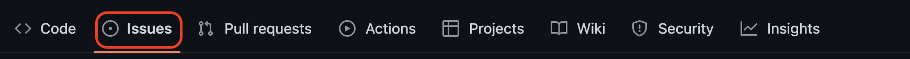
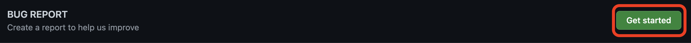
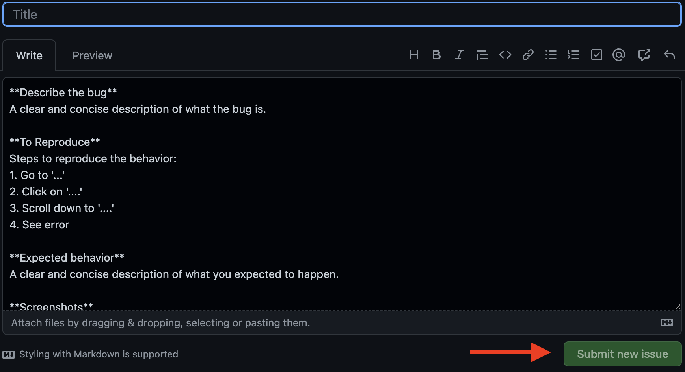
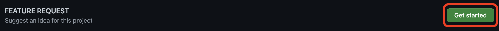
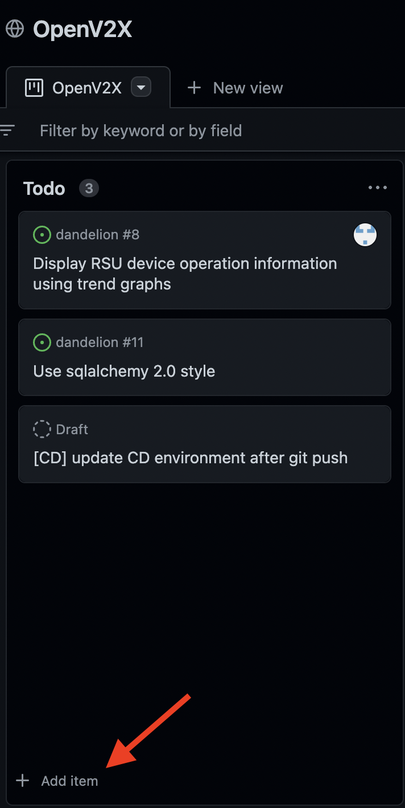
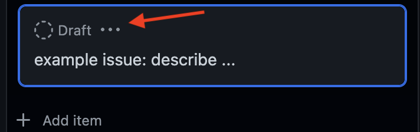
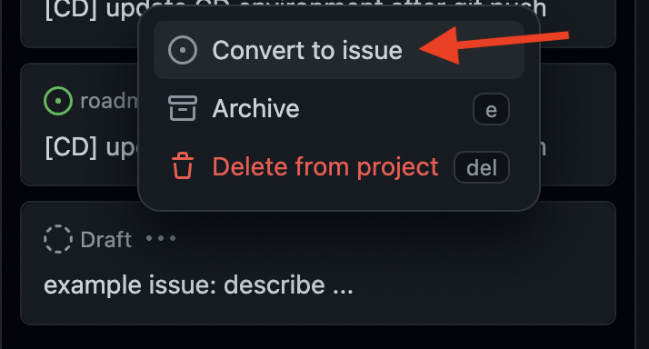
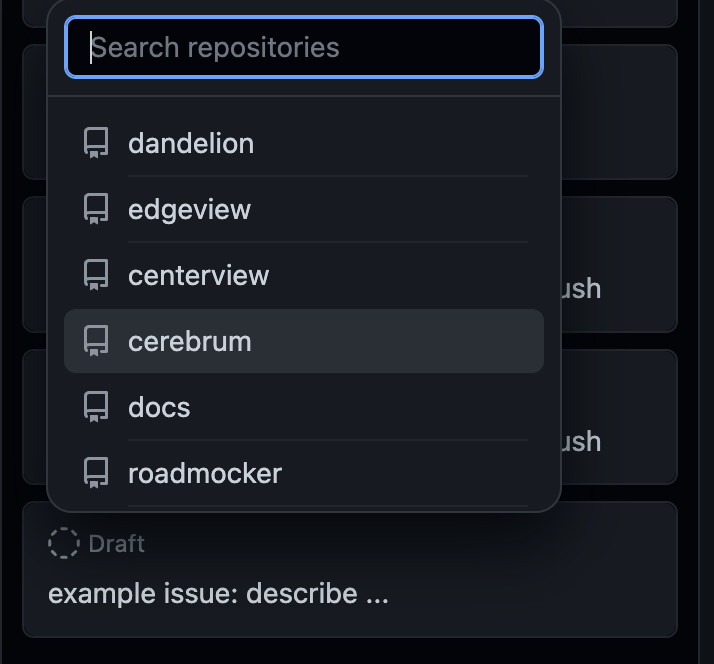
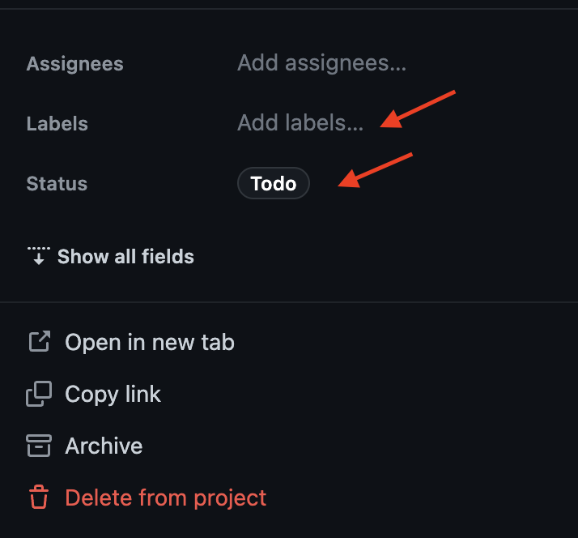

# OpenV2X 代码贡献指南

OpenV2X 团队很乐意接受任何愿意合作的组织和个人的代码贡献。根据参与者的能力的区别，可以有不同的方式为项目做出贡献。本团队将尽可能及时处理相关工作，以便将所有贡献成功集成到 OpenV2X 中。

请阅读本指南，不要犹豫！

- [OpenV2X 代码贡献指南](#openv2x-代码贡献指南)
  - [报告错误](#报告错误)
  - [提出需求](#提出需求)
  - [项目问题看板](#项目问题看板)
  - [贡献代码](#贡献代码)
    - [开始之前](#开始之前)
    - [代码规范](#代码规范)
    - [提交代码](#提交代码)
    - [检查清单](#检查清单)
  - [文档贡献](#文档贡献)

## 报告错误

如果您在 OpenV2X 中发现了 bug，请在 GitHub 上提交一个 `issue`。 针对不同的仓库，它们的 `issues` 链接分别为
[centerview](https://github.com/open-v2x/centerview/issues),
[cerebrum](https://github.com/open-v2x/cerebrum/issues),
[dandelion](https://github.com/open-v2x/dandelion/issues),
[edgeview](https://github.com/open-v2x/edgeview/issues) 和
[roadmocker](https://github.com/open-v2x/roadmocker/issues)。 在报告新错误之前，请确保做如下一些检查。

**1. 检查这个 bug 是否已经被提交过。** 在 GitHub 上的对应仓库的 `issues` 部分中查找它。

**2. 阅读文档。** 确保提出的问题是一个 bug，而不是对 OpenV2X 本身如何运行的误解。

**3. 遵循模板要求提交 bug。** 请按照模板要求 填写必要的信息。 
 

## 提出需求

关于新功能的想法也是参与贡献的好方法。任何可以改善用户体验的建议都可以在相应的 GitHub 部分提交。这些部分与上面提到的 `issues` 部分完全相同。 请点击 **feature
request** 按钮并按照模板要求填写必要的信息  

## 项目问题看板

如果您暂时不清楚想要报告的错误或提出的需求具体属于哪一个模块，您可以选择在[项目问题看板](https://github.com/orgs/open-v2x/projects/3)中的 Todo
列表里先添加错误或需求，等确认模块之后再将此错误或需求转换至对应仓库中的 issue。转换为 issue 后您还可以设置此 issue 的状态 (Todo/In Progress/Done)和标签
(Bug/Feature)。

**转换为 issue 示例:**

**设置状态和标签示例:**

## 贡献代码

在开始动手写代码之前, 请查看 **issue board** 以确认团队目前正在进行的工作, 从而避免重复。 如有疑问请联系我们 (或者发送邮件至 contact@openv2x.org)。

为了顺利地开展您的工作, 首先需要 `fork` **对应的 OpenV2X 仓库**, 并将此 `fork` `clone` 至本地。 记得让您的 `fork`
跟原仓库[保持同步]((https://docs.github.com/en/enterprise/2.13/user/articles/syncing-a-fork))。

### 开始之前

查看[OpenV2X 架构设计文档](v2x-architectural-design.md)，了解组成 OpenV2X
的不同模块。选择最合适的一个来加入新功能。如果在此过程中出现任何问题，请随时与我们的团队联系。

### 代码规范

提交新代码时，请遵循当前的编码标准。

### 提交代码

贡献的代码和新的功能并不会直接合并进 `master` 分支, 而是合并进一个名为 `dev` 的临时分支。 这样的 Git 流程可以让我们更容易维护一个稳定的 `master` 分支。

始终保持您的 `dev` 分支更新到最新修改的版本。在名为 `username/name_of_the_contribution` 的子分支中进行开发。 一旦贡献准备就绪，从您的子分支向 `dev`
分支提交 `pull-request`。请将您的
[`pull-request` 关联到对应的 `issue`](https://docs.github.com/cn/issues/tracking-your-work-with-issues/linking-a-pull-request-to-an-issue)，您可以使用关键词将
`pull-request` 链接到 `issue`，也可以用手动的方式将 `pull-request` 链接到 `issue`。请尽量使用具有描述性的语句来填写 `description`。关于
`pull-request` 的更多详细信息，请参考
[`pull-request` 规范](./v2x_pull_request_standard-zh_CN.md)。请注意，在新代码通过合并之前会有一些检查要求。检查由持续集成系统自动运行。如果检查成功，将出现绿色标记。如果出现红色标记，请相应地更正代码。一旦在
`dev` 分支合并代码后，可以使用其他新功能对其进行测试。等到下一个版本发布时，`dev` 分支将会被合并到 `master` 分支，并将宣布贡献。

### 检查清单

- 您的分支是最新的 `dev` 分支，并使用最新更改进行了测试。
- 如有必要，可以添加 README/documentation 内容。
- 代码编译正确。
- 所有测试通过，使用 `tox` 或 `npm test`。

## 文档贡献

如果某些文档缺失，模糊或不精确，则可以像报告任何其他错误一样 (请阅读之前的部分
[如何提交错误](#报告错误))。此外，用户也可以通过编写文档来做出贡献。要提交文档贡献，请按照上面说明的相同[贡献代码](#贡献代码)工作流程操作。总而言之，贡献是在 `dev`
的子分支中进行的，最终将被合并到 `dev` 分支中。
