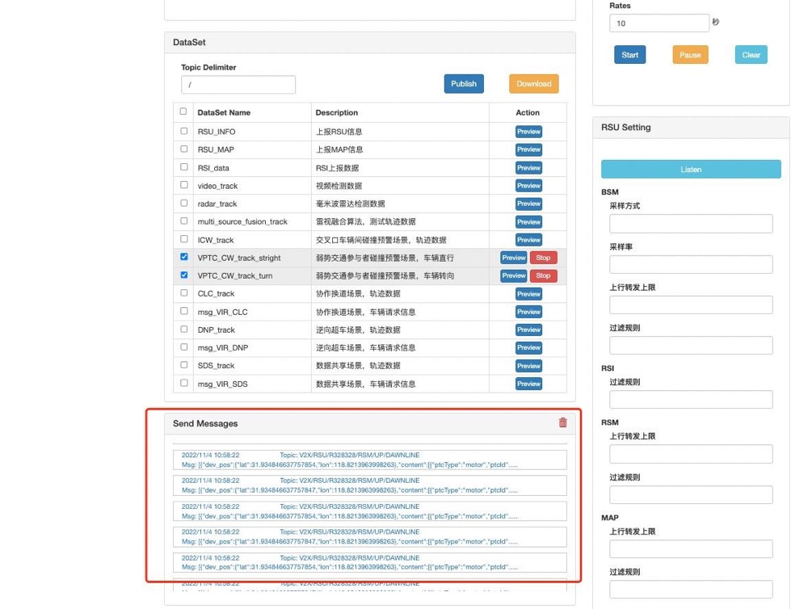
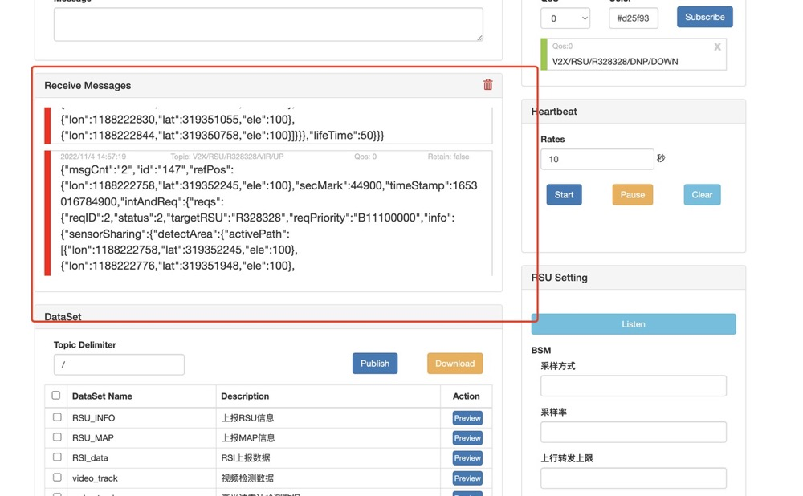

OpenV2x 问题排查文档

# 一、云控中心小车不显示

# 1、问题现象：

在偶然情况下，openv2x 平台 RSE Simulator 发送消息各种交通事件消息，OpenV2X Center Portal
看不到小车的出现，由于该问题不好复现场景，故提供以下思路来排查该问题

# 2、排查思路：

云控中心小车不见，分析思路：

1. 确认 RSE Simulator 是否已经发布 消息？ 问题分析： 若是不能成功发布消息，RSE 模拟器未成功发布消息
2. 确认 cerebrum 是否有接收到 消息？监控对应事件的 topic。 问题分析： 若收到消息，没有发送出去，则是 cerebrum 处理消息失败或者 mqtt 连接失败等问题
3. 确认 centerview 是否有接受到 消息？监控对应事件的 topic 问题分析： 若收到消息，云控中心没有小车的显示，则是 centerview 渲染页面失败

# 3、排查工作详解：

出现云控中心小车等不见的情景，做以下排查：

## (1) 工具：

RSE 模拟器链接：http://<ip-address>:6688 或者 mqtt 客户端 (mqttx)

## (2) 排查流程：

### 1. 查看RSE模拟器，RSE 模拟器和 cerebrum 之间通信

#### 1.1 RSE 模拟器发布消息 见下图标记处

topic: V2X/RSU/<RSU>/VIR/UP 例如：V2X/RSU/R328328/VIR/UP

#### 1.2 cerebrum订阅消息 见下图标记处

碰撞预警 topic：V2X/RSU/<RSU>/CWM/DOW 例如：V2X/RSU/R328328/CWM/DOW 协同换道 topic：V2X/RSU/<RSU>/CLC/DOWN
例如：V2X/RSU/R328328/CLC/DOWN 逆向超车 topic：V2X/RSU/<RSU>/DNP/DOWN 例如：V2X/RSU/R328328/DNP/DOWN 数据共享
topic：V2X/RSU/<RSU>/SDS/DOWN 例如：V2X/RSU/R328328/SDS/DOW

### 2. 若 RSE 模拟器和 cerebrum 之间通信都正常，则继续查看 cerebrum 与 centerview 之间的通信

#### 2.1 cerebrum 发布 topic：

V2X/DEVICE/${esu}/PARTICIPANT/NODE${nodeId} 例如：V2X/DEVICE/R328328/PARTICIPANT/NODE4

#### 2.2 centerview 订阅 topic：

V2X/DEVICE/${esu}/PARTICIPANT/NODE${nodeId} 例如： V2X/DEVICE/R328328/PARTICIPANT/NODE4

变量解释以及获取 esu：R328329等 nodeId (边缘站点ID)： master 环境 dandelion 数据库 system_config 数据表中查看 node_id 字段获取

### 3. 查看 RSE 模拟器 发布的消息是在哪一步骤消失的 问题出现在哪。
